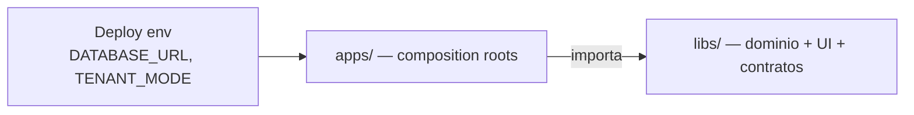

# Documentación — biblia del monorepo

> **Empieza aquí.** Este índice orienta a cualquier desarrollador (o agente IA) sobre qué es el repo, por qué está organizado así, cómo hacer cambios y dónde profundizar.

Este monorepo es el **motor de empresa**: kernel `@base/*` + productos (`@josanz/*`, `@saas/*`) + plantillas `@arquetipos/*`. Default = SPA + monolito; Next / mobile / MF / MS son opt-in ([ADR 0008](./adr/adr-0008-platform-scope-vs-mvp-client.md)).

---

## Lectura obligatoria (orden sugerido)

| # | Documento | Tiempo | Qué aprendes |
|---|-----------|--------|--------------|
| 1 | **[getting-started.md](./getting-started.md)** | 30 min | Instalar, infra, Josanz en local |
| 2 | **[architecture/learning-path.md](./architecture/learning-path.md)** | 10 min | Ruta junior → senior |
| 3 | **[architecture/overview.md](./architecture/overview.md)** | 25 min | Capas, apps vs libs, hex, 4 capas FE |
| 4 | **[architecture/framework-decision-guide.md](./architecture/framework-decision-guide.md)** | 15 min | Nest/Angular/React/Next/RN — cuándo cada uno |
| 5 | **[architecture/platform-vision.md](./architecture/platform-vision.md)** | 15 min | Motor + IA por dominio + SaaS futuro |
| 6 | **[arquetipos/README.md](./arquetipos/README.md)** | 15 min | Plantillas `apps/arquetipos` como modelo |
| 7 | **[guides/README.md](./guides/README.md)** | 5 min | Recetas por tarea |
| 8 | **[backend/README.md](./backend/README.md)** / **[frontend/README.md](./frontend/README.md)** | 20 min | Cómo funciona back/front |
| 9 | **[adr/README.md](./adr/README.md)** | según tema | Decisiones irreversibles |

Deep dives: [domain-lifecycle](./architecture/domain-lifecycle.md),
[backend-deep-dive](./architecture/backend-deep-dive.md),
[frontend-deep-dive](./architecture/frontend-deep-dive.md).

Después: [AGENTS.md](../AGENTS.md) y [SERVICES.md](../SERVICES.md).

## Cómo leer esta biblia

| Nivel | Cuándo | Documentos |
|-------|--------|-----------|
| **Día 1** | Primer día en el repo | [getting-started](./getting-started.md) + [learning-path](./architecture/learning-path.md) L0–L1 + [overview](./architecture/overview.md) |
| **Día 2** | Antes de tocar código | [platform-vision](./architecture/platform-vision.md) + [guides/README](./guides/README.md) + [workspace-packages](./frontend/workspace-packages.md) |
| **Primera feature** | Voy a cambiar un dominio | [domain-lifecycle](./architecture/domain-lifecycle.md) + deep dive FE o BE |
| **Tarea específica** | Voy a hacer X | Guía en [guides/](./guides/) |

Si un plan histórico contradice esta biblia, **prevalece la biblia**. Los planes activos están en [docs/plans/](./plans/).

---

## Qué es este repositorio

Monorepo **Nx + pnpm** que entrega:

| Capa npm | Rol | Ejemplo |
|----------|-----|---------|
| `@base/*` | Kernel compartido | `@base/backend`, `@base/clients-features` |
| `@arquetipos/*` | Plantillas copy-paste | thin shells → `@base/*` |
| `@josanz/*` | Producto cliente Josanz | ERP completo |
| `@saas/*` | Productos SaaS | Verifactu CRM, worker |

**Regla de oro:** las **libs** contienen dominio reutilizable; las **apps** componen módulos, eligen monolito vs microservicio y fijan la base de datos del despliegue.



---

## Mapa del repositorio

```
apps/
├── arquetipos/              # Plantillas: monolito, gateway, clients-ms, SPAs
├── clientes/josanz/         # Producto Josanz (josanz-api + SPA)
└── productos-saas/          # verifactu-crm-api, worker, document-generator…

libs/
├── base/                    # Kernel @base/*
├── arquetipos/              # Thin @arquetipos/*
├── clientes/josanz/         # @josanz/*
└── productos-saas/          # @saas/*, verifactu worker/ledger

docs/                        # ← Estás aquí (biblia operativa)
├── architecture/            # mapa, visión, decisión frameworks
├── arquetipos/              # plantillas apps/arquetipos como modelo
├── backend/ · frontend/     # cómo funciona cada lado
├── guides/ · adr/ · runbooks/
tools/scripts/               # Linters y scaffolding (convenciones en código)
```

Rutas legacy renombradas en F5–F7: [legacy-paths.md](./legacy-paths.md).

---

## Guías por tarea («cómo hago…»)

| Tarea | Guía |
|-------|------|
| Levantar entorno y depurar | [guides/local-development.md](./guides/local-development.md) |
| Nueva pantalla / dominio UI | [guides/add-frontend-domain.md](./guides/add-frontend-domain.md) |
| Nuevo endpoint / módulo API | [guides/add-backend-domain.md](./guides/add-backend-domain.md) |
| Extraer microservicio | [guides/add-microservice.md](./guides/add-microservice.md) |
| Nuevo producto cliente | [guides/new-client-product.md](./guides/new-client-product.md) → [walkthrough E2E](./guides/new-product-e2e-walkthrough.md) |
| Extender kernel `@base` | [guides/extend-kernel-domain.md](./guides/extend-kernel-domain.md) |
| Tests (pirámide / harness) | [guides/testing-pyramid.md](./guides/testing-pyramid.md) |
| UI re-export vs wrapper | [guides/ui-re-export-vs-wrapper.md](./guides/ui-re-export-vs-wrapper.md) |
| Nuevo primitivo UI / Lit SoT | [frontend/ui-strategy.md](./frontend/ui-strategy.md) ([ADR 0010](./adr/adr-0010-native-ui-lit-sot.md)) |
| Storybook UI | [frontend/design-system.md](./frontend/design-system.md) ([ADR 0011](./adr/adr-0011-storybook-native-ui-first.md)) |
| Mobile Ionic / RN | [guides/add-mobile-domain.md](./guides/add-mobile-domain.md) |
| Next.js | [guides/add-next-domain.md](./guides/add-next-domain.md) |
| Module Federation | [guides/module-federation-dev.md](./guides/module-federation-dev.md) |
| Keycloak | [guides/keycloak-setup.md](./guides/keycloak-setup.md) |
| Checklist PR | [guides/pr-checklist.md](./guides/pr-checklist.md) |
| Publicar / versionar libs npm | [guides/npm-publish-and-versioning.md](./guides/npm-publish-and-versioning.md) (canario + workflow F52-A1) |

Índice completo: [guides/README.md](./guides/README.md). Estilo docs: [CONTRIBUTING-DOCS.md](./CONTRIBUTING-DOCS.md).

---

## Referencia por área

### Backend

| Doc | Contenido |
|-----|-----------|
| [backend-domain-convention.md](./backend/backend-domain-convention.md) | Apps vs libs, BD por app, slugs, hex vs Josanz vs SaaS |
| [database-migrations.md](./runbooks/database-migrations.md) | Schemas Prisma, migrate, env por producto |
| [SERVICES.md](../SERVICES.md) | Rutas `/api/*`, eventos, cross-cutting |
| [adr-0001](./adr/adr-0001-hexagonal-architecture.md) | Hexagonal |
| [adr-0002](./adr/adr-0002-prisma-multi-single-tenancy.md) | single vs multi tenant |
| [adr-0009](./adr/adr-0009-cqrs-nest.md) | CQRS Nest en el kernel |

### Frontend

| Doc | Contenido |
|-----|-----------|
| [frontend/README.md](./frontend/README.md) | Índice FE |
| [arquetipos-thin-libs.md](./frontend/arquetipos-thin-libs.md) | Plantillas sin duplicar base |
| [josanz-product-exceptions.md](./frontend/josanz-product-exceptions.md) | UI raíz, audit/users thin |
| [design-system.md](./frontend/design-system.md) | Tokens, Storybook, catálogo, Figma |
| [ui-strategy.md](./frontend/ui-strategy.md) | Lit SoT + freeze framework-only + wrappers |
| [ui-component-catalog.yaml](./frontend/ui-component-catalog.yaml) | Quién posee cada componente |
| [ui-re-export-vs-wrapper.md](./guides/ui-re-export-vs-wrapper.md) | Re-export vs wrapper |
| [adr-0006](./adr/adr-0006-frontend-layering.md) | 4 capas, paridad Angular/React |
| [adr-0010](./adr/adr-0010-native-ui-lit-sot.md) | Lit native-ui = SoT cross-framework |
| [adr-0011](./adr/adr-0011-storybook-native-ui-first.md) | Storybook native-first + serve |
| [workspace-packages.md](./frontend/workspace-packages.md) | Paquetes y paths |
| [testing-pyramid.md](./guides/testing-pyramid.md) | Unit / int / e2e |

### Clientes y SaaS

| Doc | Contenido |
|-----|-----------|
| [nuevo-cliente-checklist.md](./clientes/nuevo-cliente-checklist.md) | Scaffold `@acme/*` |
| [new-product-e2e-walkthrough.md](./guides/new-product-e2e-walkthrough.md) | Narrativa E2E producto |
| [josanz-verifactu-billing-integration.md](./clientes/josanz-verifactu-billing-integration.md) | Billing → Verifactu |
| [productos-saas-extends-base.md](./productos-saas/productos-saas-extends-base.md) | SaaS sobre kernel |
| [apps/productos-saas/README.md](../apps/productos-saas/README.md) | Mapa apps SaaS |

### Operaciones

| Doc | Contenido |
|-----|-----------|
| [runbooks/README.md](./runbooks/README.md) | Índice operativo |
| [deploy.md](./runbooks/deploy.md) | Helm, ArgoCD |
| [secrets.md](./runbooks/secrets.md) | KMS, SealedSecrets |
| [observability.md](./runbooks/observability.md) | Logs, métricas, OTel |
| [kafka-redis-outage.md](./runbooks/kafka-redis-outage.md) | Modo degradado |
| [pnpm-layout.md](./runbooks/pnpm-layout.md) | Workspaces |
| [nx-daemon.md](./runbooks/nx-daemon.md) | Daemon hang / `NX_DAEMON=false` |
| [jest-coverage.md](./runbooks/jest-coverage.md) | Preset Jest, coverage por proyecto + merge global |

### Decisiones de arquitectura (ADRs)

Índice completo: [adr/README.md](./adr/README.md).

---

## Verificación

Ejecuta antes de abrir PR. Prefer Nx affected (`defaultBase: main` en `nx.json`).

```bash
# Gate local — solo proyectos affected
pnpm verify:affected          # lint + typecheck + test
pnpm lint:affected
pnpm typecheck:affected
pnpm test:affected
pnpm build:affected

# Todo el monorepo
pnpm verify:all
pnpm typecheck:all

# Fallback si nx cuelga
npx tsc -p libs/base/backend/tsconfig.lib.json --noEmit
pnpm typecheck:affected:legacy

# Convenciones (CI)
pnpm check:lib-layout
pnpm check:frontend-conventions
pnpm check:ui-ownership
pnpm check:legacy-paths
pnpm check:migration-encoding
```

Última ronda cerrada: **[F55](./plans/rounds/plans-55-fifty-five-round/)**. Ronda activa (lista): **[F56](./plans/rounds/plans-56-fifty-six-round/)** — build/visual apps arquetipos, Jest BE, MockServer FE-only (+ carry Chromatic/Code Connect/remove). Índice: [plans/README.md](./plans/README.md).

Pirámide de tests: [guides/testing-pyramid.md](./guides/testing-pyramid.md) — unit → integration (Postgres) → e2e Playwright. Operativa Jest/coverage: [runbooks/jest-coverage.md](./runbooks/jest-coverage.md).

---

## Cosas que sorprenden (léelo antes de depurar)

| Tema | Qué pasa | Qué hacer |
|------|----------|-----------|
| **Nx daemon** | `nx serve` a veces cuelga | `npx tsc -p … --noEmit`; `pnpm josanz-api:dev` |
| **Dual Prisma schema** | `single` vs `multi` deben estar en paridad | `pnpm check:schema-parity` |
| **Paths wildcard IDE** | Errores fantasma en `*-features/*` | Ignorar si `tsc` pasa |
| **Keycloak** | Backend no emite JWT; valida JWKS | Realm `josanz` vs `arquetipos` — [keycloak-setup.md](./guides/keycloak-setup.md) |
| **Infra opcional** | Sin Redis/Kafka el proceso arranca | No exijas Redis para boot local |
| **Capas ESLint** | `@josanz` no importa `@arquetipos` | `layer:*` tags |
| **RN web blanco** | React 19 raíz + React 18 Expo | Metro pin — [add-mobile-domain.md](./guides/add-mobile-domain.md) |

---

## Planes históricos vs biblia operativa

| Ubicación | Estado |
|-----------|--------|
| `docs/README.md`, `architecture/`, `guides/`, `backend/`, `frontend/`, `runbooks/`, `adr/` | **Fuente de verdad operativa** |
| `AGENTS.md`, `tools/scripts/` | Contrato para CI y agentes |
| `docs/plans/` | Planes (activos + archivo) — [plans/README.md](./plans/README.md) |
| [CONTRIBUTING-DOCS.md](./CONTRIBUTING-DOCS.md) | Cómo escribir docs |

Si un plan histórico contradice esta biblia, **prevalece la biblia**.

---

## Rutas de lectura por rol

### Desarrollador nuevo (día 1)

1. [getting-started.md](./getting-started.md)
2. [architecture/learning-path.md](./architecture/learning-path.md)
3. [architecture/overview.md](./architecture/overview.md) (§0 motor)
4. [guides/local-development.md](./guides/local-development.md)

### Visión / producto / IA

1. [architecture/platform-vision.md](./architecture/platform-vision.md)
2. [architecture/framework-decision-guide.md](./architecture/framework-decision-guide.md)
3. [arquetipos/how-to-use.md](./arquetipos/how-to-use.md)
4. [guides/ai-cqrs-policy.md](./guides/ai-cqrs-policy.md)
5. ADR [0009](./adr/adr-0009-cqrs-nest.md)

### Backend

1. [backend/why-nest.md](./backend/why-nest.md) + [backend/how-it-works.md](./backend/how-it-works.md)
2. [architecture/backend-deep-dive.md](./architecture/backend-deep-dive.md)
3. [architecture/domain-lifecycle.md](./architecture/domain-lifecycle.md)
4. [backend-domain-convention.md](./backend/backend-domain-convention.md)
5. [guides/add-backend-domain.md](./guides/add-backend-domain.md)
6. [testing-pyramid.md](./guides/testing-pyramid.md) + ADRs 0001, 0002, 0009

### Frontend / Design

1. [frontend/how-it-works.md](./frontend/how-it-works.md) + [frontend/ui-strategy.md](./frontend/ui-strategy.md)
2. [architecture/frontend-deep-dive.md](./architecture/frontend-deep-dive.md)
3. [architecture/framework-decision-guide.md](./architecture/framework-decision-guide.md)
4. [frontend/design-system.md](./frontend/design-system.md) + [ui-re-export-vs-wrapper.md](./guides/ui-re-export-vs-wrapper.md)
5. [guides/add-frontend-domain.md](./guides/add-frontend-domain.md)

### Plantillas Arquetipos

1. [arquetipos/README.md](./arquetipos/README.md)
2. [arquetipos/catalog.md](./arquetipos/catalog.md)
3. [arquetipos/how-to-use.md](./arquetipos/how-to-use.md)

### Mobile / Next / MF

1. ADR [0008](./adr/adr-0008-platform-scope-vs-mvp-client.md)
2. [add-mobile-domain.md](./guides/add-mobile-domain.md) / [add-next-domain.md](./guides/add-next-domain.md) / [module-federation-dev.md](./guides/module-federation-dev.md)

### QA

1. [testing-pyramid.md](./guides/testing-pyramid.md)
2. [runbooks/jest-coverage.md](./runbooks/jest-coverage.md)
3. [pr-checklist.md](./guides/pr-checklist.md)
4. [frontend/ci-gates.md](./frontend/ci-gates.md)

### DevOps / SRE

1. [runbooks/README.md](./runbooks/README.md)
2. [database-migrations.md](./runbooks/database-migrations.md)
3. [deploy.md](./runbooks/deploy.md)
4. [observability.md](./runbooks/observability.md)

### Producto nuevo

1. [new-product-e2e-walkthrough.md](./guides/new-product-e2e-walkthrough.md)
2. [nuevo-cliente-checklist.md](./clientes/nuevo-cliente-checklist.md)

---

## Enlaces externos al repo

- [CONTRIBUTING.md](../CONTRIBUTING.md) — contribuir código
- [CONTRIBUTING-DOCS.md](./CONTRIBUTING-DOCS.md) — contribuir documentación
- [Agent config sync](../.opencode/README.md) — Cursor / Copilot / OpenCode / Kilo
- [AGENTS.md](../AGENTS.md) — reglas monorepo para agentes
- [SERVICES.md](../SERVICES.md) — catálogo dominios
- [.github/workflows/ci.yml](../.github/workflows/ci.yml) — pipeline CI

Diagrama interactivo: abre el Canvas **arquetipos-platform-bible** en Cursor (panel Canvas junto al chat).

*Última ampliación biblia: Jest shared + coverage runbook (F55-C3), ADR 0010/0011.
Mantén este índice al añadir runbooks o ADRs.*
