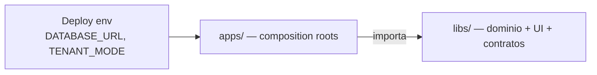

<p align="center">
  
</p>

<h1 align="center">Documentación — biblia del monorepo</h1>

<p align="center">
  <b>Motor de empresa</b> · kernel <code>@base/*</code> · productos · plantillas
</p>

<p align="center">
  <a href="./getting-started.md"></a>
  <a href="./architecture/overview.md"></a>
  <a href="./guides/README.md"></a>
</p>

<p align="center">
  
  
  
  
  
</p>

> **Empieza aquí.** Este índice orienta a cualquier desarrollador (o agente IA) sobre qué es el repo, por qué está organizado así, cómo hacer cambios y dónde profundizar.

Este monorepo es el **motor de empresa**: kernel `@base/*` + productos cliente (`@josanz/*`, `@ideauto/*`) + SaaS (`@saas/*`) + plantillas `@arquetipos/*`. Default = SPA + monolito; Next / mobile / MF / MS son opt-in ([ADR 0008](./adr/adr-0008-platform-scope-vs-mvp-client.md)).

---

<h2 align="center">Lectura obligatoria</h2>

<p align="center"><i>Orden sugerido · ~2 h para el mapa mental completo</i></p>

| # | Documento | Tiempo | Qué aprendes |
|---|-----------|--------|--------------|
| 1 | **[getting-started.md](./getting-started.md)** | 30 min | Instalar, infra, Josanz en local |
| 2 | **[architecture/learning-path.md](./architecture/learning-path.md)** | 10 min | Ruta junior → senior |
| 3 | **[architecture/overview.md](./architecture/overview.md)** | 25 min | Capas, apps vs libs, hex, 4 capas FE |
| 4 | **[architecture/framework-decision-guide.md](./architecture/framework-decision-guide.md)** | 15 min | Nest/Angular/React/Next/RN — cuándo cada uno |
| 5 | **[architecture/platform-as-product.md](./architecture/platform-as-product.md)** | 10 min | Base oficial de empresa (must/should/may) |
| 6 | **[architecture/platform-vision.md](./architecture/platform-vision.md)** | 15 min | Motor + IA por dominio + SaaS |
| 7 | **[arquetipos/README.md](./arquetipos/README.md)** | 15 min | Plantillas `apps/arquetipos` como modelo |
| 8 | **[guides/README.md](./guides/README.md)** | 5 min | Recetas por tarea |
| 9 | **[backend/README.md](./backend/README.md)** / **[frontend/README.md](./frontend/README.md)** | 20 min | Cómo funciona back/front |
| 10 | **[adr/README.md](./adr/README.md)** | según tema | Decisiones irreversibles |

Deep dives: [domain-lifecycle](./architecture/domain-lifecycle.md),
[backend-deep-dive](./architecture/backend-deep-dive.md),
[frontend-deep-dive](./architecture/frontend-deep-dive.md).

Después: [AGENTS.md](../AGENTS.md) y [SERVICES.md](../SERVICES.md).

<details>
<summary><b>Cómo leer esta biblia por día</b></summary>

<br/>

| Nivel | Cuándo | Documentos |
|-------|--------|-----------|
| **Día 1** | Primer día en el repo | [getting-started](./getting-started.md) + [learning-path](./architecture/learning-path.md) L0–L1 + [overview](./architecture/overview.md) |
| **Día 2** | Antes de tocar código | [platform-as-product](./architecture/platform-as-product.md) + [platform-vision](./architecture/platform-vision.md) + [guides/README](./guides/README.md) |
| **Primera feature** | Voy a cambiar un dominio | [domain-lifecycle](./architecture/domain-lifecycle.md) + deep dive FE o BE |
| **Tarea específica** | Voy a hacer X | Guía en [guides/](./guides/) |

Si un plan (activo o cerrado en git) contradice esta biblia, **prevalece la biblia**. Los planes activos viven en [docs/plans/](./plans/); rondas cerradas no se mantienen en el árbol.

</details>

---

<h2 align="center">Qué es este repositorio</h2>

<p align="center">Monorepo <b>Nx + pnpm</b> que entrega cuatro capas npm:</p>

| Capa npm | Rol | Ejemplo |
|----------|-----|---------|
| `@base/*` | Kernel compartido | `@base/backend`, `@base/clients-features` |
| `@arquetipos/*` | Plantillas copy-paste | thin shells → `@base/*` |
| `@josanz/*` | Producto cliente Josanz | ERP completo |
| `@ideauto/*` | Producto cliente Ideauto | Recalls ([migration](./ideauto/migration/)) |
| `@saas/*` | Productos SaaS | Verifactu CRM, worker |

<p align="center">
  <b>Regla de oro:</b> las <b>libs</b> contienen dominio reutilizable;<br/>
  las <b>apps</b> componen módulos y fijan el despliegue.
</p>



---

<h2 align="center">Mapa del repositorio</h2>

```
apps/
├── arquetipos/                    # Plantillas: monolito, gateway, clients-ms, SPAs
├── clientes/
│   ├── josanz/                    # Producto Josanz (josanz-api + SPA)
│   └── ideauto/recalls/           # Ideauto Recalls (api Nest + web Next)
└── productos-saas/                # verifactu-crm-api, worker, document-generator…

libs/
├── base/                          # Kernel @base/*
├── arquetipos/                    # Thin @arquetipos/*
├── clientes/
│   ├── josanz/                    # @josanz/*
│   └── ideauto/                   # @ideauto/* (shared, backend, platform, ui)
└── productos-saas/                # @saas/*, verifactu worker/ledger

docs/                              # ← Estás aquí (biblia operativa)
├── architecture/ · ideauto/       # mapa + doc producto Ideauto
├── arquetipos/ · backend/ · frontend/
├── guides/ · adr/ · runbooks/ · plans/
tools/                             # checks, scaffolds, typecheck, mockserver, …
```

Mapa de scripts: [runbooks/tools-layout.md](./runbooks/tools-layout.md) · [`tools/README.md`](../tools/README.md).  
Rutas legacy (libs) F5–F7: [legacy-paths.md](./legacy-paths.md).

---

<h2 align="center">Guías por tarea</h2>

<p align="center"><i>«¿Cómo hago…?»</i></p>

| Tarea | Guía |
|-------|------|
| Levantar entorno y depurar | [guides/local-development.md](./guides/local-development.md) |
| Nueva pantalla / dominio UI | [guides/add-frontend-domain.md](./guides/add-frontend-domain.md) |
| Nuevo endpoint / módulo API | [guides/add-backend-domain.md](./guides/add-backend-domain.md) |
| Extraer microservicio | [guides/add-microservice.md](./guides/add-microservice.md) |
| Nuevo producto cliente | [guides/new-client-product.md](./guides/new-client-product.md) → [walkthrough E2E](./guides/new-product-e2e-walkthrough.md) |
| Extender kernel `@base` | [guides/extend-kernel-domain.md](./guides/extend-kernel-domain.md) |
| Tests (pirámide / harness) | [guides/testing-pyramid.md](./guides/testing-pyramid.md) |
| UI re-export vs wrapper | [guides/ui-re-export-vs-wrapper.md](./guides/ui-re-export-vs-wrapper.md) |
| Nuevo primitivo UI / Lit SoT | [frontend/ui-strategy.md](./frontend/ui-strategy.md) ([ADR 0010](./adr/adr-0010-native-ui-lit-sot.md)) |
| Storybook UI | [frontend/design-system.md](./frontend/design-system.md) ([ADR 0011](./adr/adr-0011-storybook-native-ui-first.md)) |
| Mobile Ionic / RN | [guides/add-mobile-domain.md](./guides/add-mobile-domain.md) |
| Temas tenant / atmósfera demo | [frontend/tenant-themes-checklist.md](./frontend/tenant-themes-checklist.md) |
| Next.js | [guides/add-next-domain.md](./guides/add-next-domain.md) |
| Module Federation | [guides/module-federation-dev.md](./guides/module-federation-dev.md) |
| Keycloak | [guides/keycloak-setup.md](./guides/keycloak-setup.md) |
| Checklist PR | [guides/pr-checklist.md](./guides/pr-checklist.md) |
| Publicar / versionar libs npm | [guides/npm-publish-and-versioning.md](./guides/npm-publish-and-versioning.md) |
| Migrar Recalls_v2 → monorepo | [ideauto/recalls/](./ideauto/recalls/) (narrativa) · [ideauto/migration/](./ideauto/migration/) (ejecución) · [assessment](./architecture/recalls-v2-assessment.md) |

Índice completo: [guides/README.md](./guides/README.md). Estilo docs: [CONTRIBUTING-DOCS.md](./CONTRIBUTING-DOCS.md).

---

<h2 align="center">Referencia por área</h2>

<details open>
<summary><b>Backend</b></summary>

<br/>

| Doc | Contenido |
|-----|-----------|
| [backend-domain-convention.md](./backend/backend-domain-convention.md) | Apps vs libs, BD por app, slugs, hex vs Josanz vs SaaS |
| [database-migrations.md](./runbooks/database-migrations.md) | Schemas Prisma, migrate, env por producto |
| [SERVICES.md](../SERVICES.md) | Rutas `/api/*`, eventos, cross-cutting |
| [adr-0001](./adr/adr-0001-hexagonal-architecture.md) | Hexagonal |
| [adr-0002](./adr/adr-0002-prisma-multi-single-tenancy.md) | single vs multi tenant |
| [adr-0009](./adr/adr-0009-cqrs-nest.md) | CQRS Nest en el kernel |

</details>

<details open>
<summary><b>Frontend</b></summary>

<br/>

| Doc | Contenido |
|-----|-----------|
| [frontend/README.md](./frontend/README.md) | Índice FE |
| [arquetipos-thin-libs.md](./frontend/arquetipos-thin-libs.md) | Plantillas sin duplicar base |
| [josanz-product-exceptions.md](./frontend/josanz-product-exceptions.md) | UI raíz, audit/users thin |
| [design-system.md](./frontend/design-system.md) | Tokens, Storybook, catálogo, Figma |
| [tenant-themes-checklist.md](./frontend/tenant-themes-checklist.md) | Tenant brand vs atmósfera (multi + Ionic) |
| [ui-strategy.md](./frontend/ui-strategy.md) | Lit SoT + freeze framework-only + wrappers |
| [ui-component-catalog.yaml](./frontend/ui-component-catalog.yaml) | Quién posee cada componente |
| [ui-re-export-vs-wrapper.md](./guides/ui-re-export-vs-wrapper.md) | Re-export vs wrapper |
| [adr-0006](./adr/adr-0006-frontend-layering.md) | 4 capas, paridad Angular/React |
| [adr-0010](./adr/adr-0010-native-ui-lit-sot.md) | Lit native-ui = SoT cross-framework |
| [adr-0011](./adr/adr-0011-storybook-native-ui-first.md) | Storybook native-first + serve |
| [workspace-packages.md](./frontend/workspace-packages.md) | Paquetes y paths |
| [testing-pyramid.md](./guides/testing-pyramid.md) | Unit / int / e2e |

</details>

<details>
<summary><b>Clientes y SaaS</b></summary>

<br/>

| Doc | Contenido |
|-----|-----------|
| [nuevo-cliente-checklist.md](./clientes/nuevo-cliente-checklist.md) | Scaffold `@acme/*` |
| [ideauto/](./ideauto/) | Hub cliente Ideauto |
| [ideauto/migration/](./ideauto/migration/) | Ejecución migración Recalls |
| [ideauto/recalls/](./ideauto/recalls/) | Narrativa Recalls |
| [new-product-e2e-walkthrough.md](./guides/new-product-e2e-walkthrough.md) | Narrativa E2E producto |
| [josanz-verifactu-billing-integration.md](./clientes/josanz-verifactu-billing-integration.md) | Billing → Verifactu |
| [productos-saas-extends-base.md](./productos-saas/productos-saas-extends-base.md) | SaaS sobre kernel |
| [apps/productos-saas/README.md](../apps/productos-saas/README.md) | Mapa apps SaaS |

</details>

<details>
<summary><b>Operaciones</b></summary>

<br/>

| Doc | Contenido |
|-----|-----------|
| [runbooks/README.md](./runbooks/README.md) | Índice operativo |
| [deploy.md](./runbooks/deploy.md) | Helm, ArgoCD |
| [secrets.md](./runbooks/secrets.md) | KMS, SealedSecrets |
| [observability.md](./runbooks/observability.md) | Logs, métricas, OTel |
| [kafka-redis-outage.md](./runbooks/kafka-redis-outage.md) | Modo degradado |
| [pnpm-layout.md](./runbooks/pnpm-layout.md) | Workspaces |
| [nx-daemon.md](./runbooks/nx-daemon.md) | Daemon hang / `NX_DAEMON=false` |
| [jest-coverage.md](./runbooks/jest-coverage.md) | Preset Jest, coverage |
| [mockserver.md](./runbooks/mockserver.md) | FE plantilla sin Nest/Keycloak |
| [tools-layout.md](./runbooks/tools-layout.md) | Dónde vive cada utilidad bajo `tools/` |

</details>

<p align="center">Decisiones irreversibles → <a href="./adr/README.md"><b>ADRs</b></a></p>

---

<h2 align="center">Verificación</h2>

<p align="center">Ejecuta antes de abrir PR. Prefer Nx affected (<code>defaultBase: main</code>).</p>

```bash
# Gate local — solo proyectos affected
pnpm verify:affected          # lint + typecheck + test
pnpm lint:affected
pnpm typecheck:affected
pnpm test:affected
pnpm build:affected

# Todo el monorepo
pnpm verify:all
pnpm typecheck:all

# Fallback si nx cuelga
npx tsc -p libs/base/backend/tsconfig.lib.json --noEmit
pnpm typecheck:affected:legacy

# Convenciones (CI)
pnpm check:lib-layout
pnpm check:frontend-conventions
pnpm check:ui-ownership
pnpm check:legacy-paths
pnpm check:migration-encoding
```

Rondas en el árbol: **[F86](./plans/rounds/plans-86-eighty-six-round/)** (base oficial de empresa / motor). Ideauto: [ideauto/migration/](./ideauto/migration/).  
Rondas cerradas: solo en historial de git. Índice: [plans/README.md](./plans/README.md).  
Recalls (doc producto): [ideauto/recalls/](./ideauto/recalls/). Assessment: [architecture/recalls-v2-assessment.md](./architecture/recalls-v2-assessment.md).

Pirámide de tests: [guides/testing-pyramid.md](./guides/testing-pyramid.md).  
Operativa Jest/coverage: [runbooks/jest-coverage.md](./runbooks/jest-coverage.md).

---

<h2 align="center">Cosas que sorprenden</h2>

<p align="center"><i>Léelo antes de depurar — restricciones actuales, no bugs abiertos</i></p>

| Tema | Qué pasa | Qué hacer |
|------|----------|-----------|
| **Nx daemon** | `nx serve` a veces cuelga en Windows | `npx tsc -p … --noEmit`; `pnpm josanz-api:dev`; [nx-daemon.md](./runbooks/nx-daemon.md) |
| **Dual Prisma schema** | `single` vs `multi` deben estar en paridad | `pnpm check:schema-parity` |
| **Paths wildcard IDE** | Errores fantasma en `*-features/*` | Ignorar si `tsc` / `nx typecheck` pasa |
| **Keycloak** | Backend no emite JWT; valida JWKS | Realm `josanz` vs `arquetipos` — [keycloak-setup.md](./guides/keycloak-setup.md) |
| **Infra opcional** | Sin Redis/Kafka el backend arranca | No exijas Redis para boot local |
| **Capas ESLint** | `@josanz` no importa `@arquetipos` | Tags `layer:*` |
| **React Native / Expo** | Raíz hoist React 19; apps Expo pinnean React 18 vía Metro | Ya cableado (`@arquetipos/expo-metro-config`). Blanco/`$$typeof` solo si se rompe el pin — `--clear` · [add-mobile-domain.md](./guides/add-mobile-domain.md) |
| **DB multi-provider** | Postgres = DX/CI; SQL Server/MySQL vía factory | `@base/backend/prisma` · [database-providers.md](./runbooks/database-providers.md) |

---

<details>
<summary><b>Planes (activos vs cerrados) vs biblia operativa</b></summary>

<br/>

| Ubicación | Estado |
|-----------|--------|
| `docs/README.md`, `architecture/`, `guides/`, `backend/`, `frontend/`, `runbooks/`, `adr/` | **Fuente de verdad operativa** |
| `AGENTS.md`, `tools/` ([mapa](./runbooks/tools-layout.md)) | Contrato para CI y agentes |
| `docs/plans/` | Solo rondas **activas** (F86) — [plans/README.md](./plans/README.md) |
| Rondas cerradas (F41–F85) | **Solo en historial de git** — no recrear carpetas |
| [CONTRIBUTING-DOCS.md](./CONTRIBUTING-DOCS.md) | Cómo escribir docs |

Si un plan cerrado en git contradice esta biblia, **prevalece la biblia**.

</details>

---

<h2 align="center">Rutas de lectura por rol</h2>

<details>
<summary><b>Desarrollador nuevo (día 1)</b></summary>

1. [getting-started.md](./getting-started.md)
2. [architecture/learning-path.md](./architecture/learning-path.md)
3. [architecture/overview.md](./architecture/overview.md) (§0 motor)
4. [guides/local-development.md](./guides/local-development.md)

</details>

<details>
<summary><b>Visión / producto / IA</b></summary>

1. [architecture/platform-vision.md](./architecture/platform-vision.md)
2. [architecture/future-vision.md](./architecture/future-vision.md)
3. [architecture/framework-decision-guide.md](./architecture/framework-decision-guide.md)
4. [arquetipos/how-to-use.md](./arquetipos/how-to-use.md)
5. [guides/ai-cqrs-policy.md](./guides/ai-cqrs-policy.md)
6. ADR [0009](./adr/adr-0009-cqrs-nest.md)

</details>

<details>
<summary><b>Backend</b></summary>

1. [backend/why-nest.md](./backend/why-nest.md) + [backend/how-it-works.md](./backend/how-it-works.md)
2. [architecture/backend-deep-dive.md](./architecture/backend-deep-dive.md)
3. [architecture/domain-lifecycle.md](./architecture/domain-lifecycle.md)
4. [backend-domain-convention.md](./backend/backend-domain-convention.md)
5. [guides/add-backend-domain.md](./guides/add-backend-domain.md)
6. [testing-pyramid.md](./guides/testing-pyramid.md) + ADRs 0001, 0002, 0009

</details>

<details>
<summary><b>Frontend / Design</b></summary>

1. [frontend/how-it-works.md](./frontend/how-it-works.md) + [frontend/ui-strategy.md](./frontend/ui-strategy.md)
2. [architecture/frontend-deep-dive.md](./architecture/frontend-deep-dive.md)
3. [architecture/framework-decision-guide.md](./architecture/framework-decision-guide.md)
4. [frontend/design-system.md](./frontend/design-system.md) + [ui-re-export-vs-wrapper.md](./guides/ui-re-export-vs-wrapper.md)
5. [guides/add-frontend-domain.md](./guides/add-frontend-domain.md)

</details>

<details>
<summary><b>Plantillas · Mobile / Next / MF · QA · DevOps · Producto nuevo</b></summary>

<br/>

**Plantillas Arquetipos**

1. [arquetipos/README.md](./arquetipos/README.md)
2. [arquetipos/catalog.md](./arquetipos/catalog.md)
3. [arquetipos/how-to-use.md](./arquetipos/how-to-use.md)

**Mobile / Next / MF**

1. ADR [0008](./adr/adr-0008-platform-scope-vs-mvp-client.md)
2. [add-mobile-domain.md](./guides/add-mobile-domain.md) / [add-next-domain.md](./guides/add-next-domain.md) / [module-federation-dev.md](./guides/module-federation-dev.md)

**QA**

1. [testing-pyramid.md](./guides/testing-pyramid.md)
2. [runbooks/jest-coverage.md](./runbooks/jest-coverage.md)
3. [pr-checklist.md](./guides/pr-checklist.md)
4. [frontend/ci-gates.md](./frontend/ci-gates.md)

**DevOps / SRE**

1. [runbooks/README.md](./runbooks/README.md)
2. [database-migrations.md](./runbooks/database-migrations.md)
3. [deploy.md](./runbooks/deploy.md)
4. [observability.md](./runbooks/observability.md)

**Producto nuevo**

1. [new-product-e2e-walkthrough.md](./guides/new-product-e2e-walkthrough.md)
2. [nuevo-cliente-checklist.md](./clientes/nuevo-cliente-checklist.md)

</details>

---

<h2 align="center">Enlaces del repo</h2>

<p align="center">
  <a href="../CONTRIBUTING.md">CONTRIBUTING</a> ·
  <a href="./CONTRIBUTING-DOCS.md">CONTRIBUTING-DOCS</a> ·
  <a href="../.opencode/README.md">Agent sync</a> ·
  <a href="../AGENTS.md">AGENTS</a> ·
  <a href="../SERVICES.md">SERVICES</a> ·
  <a href="../.github/workflows/ci.yml">CI</a>
</p>

<p align="center">
  <sub>Diagrama interactivo: Canvas <b>arquetipos-platform-bible</b> en Cursor</sub>
</p>

---

<p align="center">
  
  <br/>
  <sub>Mantén este índice al añadir runbooks o ADRs · planes cerrados solo en git</sub>
</p>
