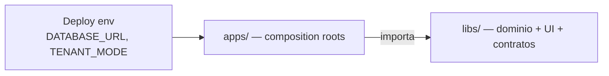

# Documentación — biblia del monorepo

> **Empieza aquí.** Este índice orienta a cualquier desarrollador (o agente IA) sobre qué es el repo, por qué está organizado así, cómo hacer cambios y dónde profundizar.

---

## Lectura obligatoria (orden sugerido)

| # | Documento | Tiempo | Qué aprendes |
|---|-----------|--------|--------------|
| 1 | **[getting-started.md](./getting-started.md)** | 30 min | Instalar, infra, Josanz en local |
| 2 | **[architecture/overview.md](./architecture/overview.md)** | 20 min | Por qué existen `@base`, apps vs libs, BD, hexagonal, 4 capas FE |
| 3 | **[guides/README.md](./guides/README.md)** | 5 min | Recetas por tarea («quiero añadir X») |
| 4 | **[backend/backend-domain-convention.md](./backend/backend-domain-convention.md)** | 15 min | Slugs, empaquetados Nest, matriz BD por app |
| 5 | **[adr/README.md](./adr/README.md)** | según tema | Decisiones irreversibles (auth, Kafka, cifrado…) |

Después: [AGENTS.md](../AGENTS.md) (resumen para herramientas) y [SERVICES.md](../SERVICES.md) (catálogo de dominios HTTP).

## Cómo leer esta biblia

| Nivel | Cuándo | Documentos |
|-------|--------|-----------|
| **Día 1** | Primer día en el repo | [getting-started.md](./getting-started.md) + [architecture/overview.md](./architecture/overview.md) (15 min) |
| **Día 2** | Antes de tocar código | [guides/README.md](./guides/README.md) + [frontend/workspace-packages.md](./frontend/workspace-packages.md) (30 min) |
| **Tarea específica** | Voy a hacer X | Ir directo a la guía correspondiente en [guides/](./guides/) |

Si un plan histórico contradice esta biblia, **prevalece la biblia**. Los planes activos están en [docs/plans/](./plans/).

---

## Qué es este repositorio

Monorepo **Nx + pnpm** que entrega:

| Capa npm | Rol | Ejemplo |
|----------|-----|---------|
| `@base/*` | Kernel compartido | `@base/backend`, `@base/clients-features` |
| `@arquetipos/*` | Plantillas copy-paste | thin shells → `@base/*` |
| `@josanz/*` | Producto cliente Josanz | ERP completo |
| `@saas/*` | Productos SaaS | Verifactu CRM, worker |

**Regla de oro:** las **libs** contienen dominio reutilizable; las **apps** componen módulos, eligen monolito vs microservicio y fijan la base de datos del despliegue.



---

## Mapa del repositorio

```
apps/
├── arquetipos/              # Plantillas: monolito, gateway, clients-ms, SPAs
├── clientes/josanz/         # Producto Josanz (josanz-api + SPA)
└── productos-saas/          # verifactu-crm-api, worker, document-generator…

libs/
├── base/                    # Kernel @base/*
├── arquetipos/              # Thin @arquetipos/*
├── clientes/josanz/         # @josanz/*
└── productos-saas/          # @saas/*, verifactu worker/ledger

docs/                        # ← Estás aquí (biblia operativa)
tools/scripts/               # Linters y scaffolding (convenciones en código)
```

Rutas legacy renombradas en F5–F7: [legacy-paths.md](./legacy-paths.md).

---

## Guías por tarea («cómo hago…»)

| Tarea | Guía |
|-------|------|
| Levantar entorno y depurar | [guides/local-development.md](./guides/local-development.md) |
| Nueva pantalla / dominio UI | [guides/add-frontend-domain.md](./guides/add-frontend-domain.md) |
| Nuevo endpoint / módulo API | [guides/add-backend-domain.md](./guides/add-backend-domain.md) |
| Extraer microservicio | [guides/add-microservice.md](./guides/add-microservice.md) |
| Nuevo producto cliente | [guides/new-client-product.md](./guides/new-client-product.md) → [nuevo-cliente-checklist.md](./clientes/nuevo-cliente-checklist.md) |
| Extender kernel `@base` | [guides/extend-kernel-domain.md](./guides/extend-kernel-domain.md) |

---

## Referencia por área

### Backend

| Doc | Contenido |
|-----|-----------|
| [backend-domain-convention.md](./backend/backend-domain-convention.md) | Apps vs libs, BD por app, slugs, hex vs Josanz vs SaaS |
| [database-migrations.md](./runbooks/database-migrations.md) | Schemas Prisma, migrate, env por producto |
| [SERVICES.md](../SERVICES.md) | Rutas `/api/*`, eventos, cross-cutting |
| [adr-0001](./adr/adr-0001-hexagonal-architecture.md) | Hexagonal |
| [adr-0002](./adr/adr-0002-prisma-multi-single-tenancy.md) | single vs multi tenant |

### Frontend

| Doc | Contenido |
|-----|-----------|
| [arquetipos-thin-libs.md](./frontend/arquetipos-thin-libs.md) | Plantillas sin duplicar base |
| [josanz-product-exceptions.md](./frontend/josanz-product-exceptions.md) | UI raíz, audit/users thin |
| [ui-component-catalog.yaml](./frontend/ui-component-catalog.yaml) | Quién posee cada componente |
| [adr-0006](./adr/adr-0006-frontend-layering.md) | 4 capas, paridad Angular/React |
| [tsconfig-paths-audit.md](./frontend/tsconfig-paths-audit.md) | Paths y wildcards |

### Clientes y SaaS

| Doc | Contenido |
|-----|-----------|
| [nuevo-cliente-checklist.md](./clientes/nuevo-cliente-checklist.md) | Scaffold `@acme/*` |
| [josanz-verifactu-billing-integration.md](./clientes/josanz-verifactu-billing-integration.md) | Billing → Verifactu |
| [productos-saas-extends-base.md](./productos-saas/productos-saas-extends-base.md) | SaaS sobre kernel |
| [apps/productos-saas/README.md](../apps/productos-saas/README.md) | Mapa apps SaaS |

### Operaciones

| Doc | Contenido |
|-----|-----------|
| [runbooks/README.md](./runbooks/README.md) | Índice operativo |
| [deploy.md](./runbooks/deploy.md) | Helm, ArgoCD |
| [secrets.md](./runbooks/secrets.md) | KMS, SealedSecrets |
| [observability.md](./runbooks/observability.md) | Logs, métricas, OTel |
| [kafka-redis-outage.md](./runbooks/kafka-redis-outage.md) | Modo degradado |
| [pnpm-layout.md](./runbooks/pnpm-layout.md) | Workspaces |
| [nx-daemon.md](./runbooks/nx-daemon.md) | Daemon hang / `NX_DAEMON=false` |

### Decisiones de arquitectura (ADRs)

Índice completo: [adr/README.md](./adr/README.md).

---

## Verificación

Ejecuta antes de abrir PR. Prefer Nx affected (`defaultBase: main` en `nx.json`).

```bash
# Gate local — solo proyectos affected
pnpm verify:affected          # lint + typecheck + test
pnpm lint:affected
pnpm typecheck:affected
pnpm test:affected
pnpm build:affected

# Todo el monorepo
pnpm verify:all
pnpm typecheck:all

# Fallback si nx cuelga
npx tsc -p libs/base/backend/tsconfig.lib.json --noEmit
pnpm typecheck:affected:legacy

# Convenciones (CI)
pnpm check:lib-layout
pnpm check:frontend-conventions
pnpm check:ui-ownership
pnpm check:legacy-paths
pnpm check:migration-encoding
```

Pirámide de tests: unit (`libs/**/jest.config.ts`) → integration (`jest.integration.config.ts`, requiere Postgres) → e2e Josanz (`apps/clientes/josanz/backend/jest.config.ts`).

---

## Cosas que sorprenden (léelo antes de depurar)

| Tema | Qué pasa | Qué hacer |
|------|----------|-----------|
| **Nx daemon** | `nx serve` a veces cuelga | `npx tsc -p … --noEmit`; `pnpm josanz-api:dev` |
| **Dual Prisma schema** | `single` vs `multi` deben estar en paridad | `pnpm check:schema-parity` |
| **Paths wildcard IDE** | Errores fantasma en `*-features/*` | Ignorar si `tsc` pasa |
| **Keycloak** | Backend no emite JWT; valida JWKS | Realm `josanz` vs `arquetipos` |
| **Infra opcional** | Sin Redis/Kafka el proceso arranca | No exijas Redis para boot local |
| **Capas ESLint** | `@josanz` no importa `@arquetipos` | `layer:*` tags |

---

## Planes históricos vs biblia operativa

| Ubicación | Estado |
|-----------|--------|
| `docs/README.md`, `architecture/`, `guides/`, `backend/`, `frontend/`, `runbooks/`, `adr/` | **Fuente de verdad operativa** |
| `AGENTS.md`, `tools/scripts/` | Contrato para CI y agentes |
| `docs/plans/` | Planes activos (trabajo en curso) |

Si un plan histórico contradice esta biblia, **prevalece la biblia**.

---

## Rutas de lectura por rol

### Desarrollador nuevo (día 1)

1. [getting-started.md](./getting-started.md)
2. [architecture/overview.md](./architecture/overview.md)
3. [guides/local-development.md](./guides/local-development.md)

### Backend

1. [architecture/overview.md § Backend](./architecture/overview.md#3-backend--hexagonal-por-dominio)
2. [backend-domain-convention.md](./backend/backend-domain-convention.md)
3. [guides/add-backend-domain.md](./guides/add-backend-domain.md)
4. ADRs 0001–0005 según el cambio

### Frontend

1. [architecture/overview.md § Frontend](./architecture/overview.md#4-frontend--cuatro-capas-por-dominio)
2. [arquetipos-thin-libs.md](./frontend/arquetipos-thin-libs.md) o excepciones Josanz
3. [guides/add-frontend-domain.md](./guides/add-frontend-domain.md)
4. [ui-component-catalog.yaml](./frontend/ui-component-catalog.yaml)

### DevOps / SRE

1. [runbooks/README.md](./runbooks/README.md)
2. [database-migrations.md](./runbooks/database-migrations.md)
3. [deploy.md](./runbooks/deploy.md)
4. [observability.md](./runbooks/observability.md)

---

## Enlaces externos al repo

- [CONTRIBUTING.md](../CONTRIBUTING.md) — puerta de entrada para contribuir
- [Agent config sync](../.opencode/README.md) — Cursor / Copilot / OpenCode / Kilo
- [Canvas — mapa visual del monorepo](/Users/amuni/.cursor/projects/c-Users-amuni-Desktop-arquetipos/canvases/arquetipos-platform-bible.canvas.tsx)
- [AGENTS.md](../AGENTS.md) — reglas monorepo para agentes
- [SERVICES.md](../SERVICES.md) — catálogo dominios
- [.github/workflows/ci.yml](../.github/workflows/ci.yml) — pipeline CI

---

Diagrama interactivo del monorepo: [arquetipos-platform-bible.canvas.tsx](/Users/amuni/.cursor/projects/c-Users-amuni-Desktop-arquetipos/canvases/arquetipos-platform-bible.canvas.tsx) (Cursor Canvas).

*Última ampliación biblia: arquitectura app×BD, guías por tarea, getting-started. Mantén este índice al añadir runbooks o ADRs.*
