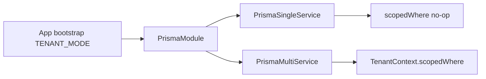

  

<h1 align="center">ADR 0002: Prisma multi/single tenancy</h1>

  
  

- Status: accepted
- Date: 2026-07-08

## Context

Some deployments are multi-tenant (shared DB, `tenantId` column, row-level
scoping); others are single-tenant (one schema, no `tenantId`). We need both
without forking the application code.

## Decision

Maintain two Prisma schemas (`prisma/multi`, `prisma/single`) selected by
`TENANT_MODE` at boot. A single `PrismaModule` resolves `PRISMA_SERVICE` to the
`PrismaMultiService` or `PrismaSingleService` and installs the same
security + audit query extensions on both.

Tenant scoping lives in `TenantContext.scopedWhere`, which is a no-op in
single-tenant mode and ANDs `{ tenantId }` in multi-tenant mode. Repositories
never hardcode the filter, so the same `PrismaRepository` serves both models.

## Consequences

- One application codebase, two deployment shapes.
- The two schemas must stay in parity except for the `tenantId` column (enforced
  by `tools/checks/check-schema-parity.mjs`). Drift here is the top fragility risk.
- Single-tenant deployments drop the tenant filter automatically — verified by
  the tenant-leak suite and `describeAntiFuga` harness.
- **Orthogonal** to “one DB vs DB-per-service”: tenancy mode ≠ database topology.
  Topology is chosen by app `bootstrap-env.ts` + deploy env
  ([backend-domain-convention.md](../backend/backend-domain-convention.md)).

## Examples

| Deploy | `TENANT_MODE` | Schema | Notes |
|--------|---------------|--------|-------|
| Josanz ERP típico | `single` | `prisma/single` | Una org por deploy |
| Plantilla multi / SaaS shared | `multi` | `prisma/multi` | `tenantId` en filas |
| clients-ms aislado | cualquiera | según env | Misma lib; otra `DATABASE_URL` |

## See also

- Schema-parity: `tools/checks/check-schema-parity.mjs` (CI migrations job).
- Integration: `libs/base/backend` `*.int-spec.ts` / `prisma.repository.int-spec.ts`.
- Testing: [testing-pyramid.md](../guides/testing-pyramid.md).
- Auth principal `tenantId`: [ADR 0005](adr-0005-jwt-vs-keycloak.md).
- Back to the [docs hub](../README.md).
