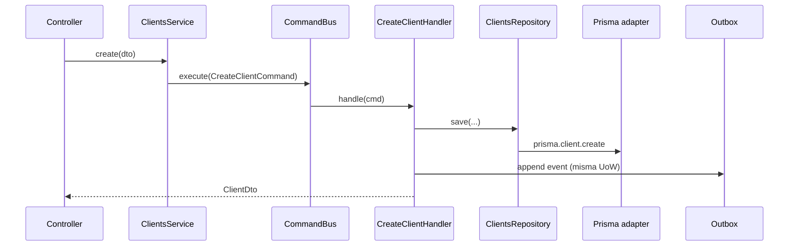

# Backend — deep dive (hexagonal + CQRS)

Cuándo usarla: antes de tocar o crear un dominio Nest en `@base/backend` o producto.
Nivel: junior con L1 hecho → senior que revisa PRs.

Companion: ADR [0001](../adr/adr-0001-hexagonal-architecture.md), [0009](../adr/adr-0009-cqrs-nest.md),
[backend-domain-convention.md](../backend/backend-domain-convention.md).

---

## 1. Idea en lenguaje humano

Imagina un dominio **Clients**:

- El **negocio** dice: “crear cliente exige email único; listar respeta el tenant”.
- Eso **no** debe vivir en el controller HTTP ni en un script de Prisma suelto.
- El núcleo (entidades, reglas, puertos) es estable; lo que cambia es *cómo* llega
  la petición (HTTP, gRPC, job, futuro agente AI).

**Hexagonal** = núcleo en el centro; **adapters** fuera.  
**CQRS** = escrituras (`Command`) y lecturas (`Query`) por caminos distintos,
siempre pasando por buses Nest — así un agente AI puede tener `QueryBus` sin `CommandBus`.

---

## 2. Anatomía de un dominio

```
libs/base/backend/src/lib/domains/clients/
  domain/                 # puro: entidades, errores, mappers DTO↔persistencia
  ports/                  # interfaces (ClientsRepository)
  application/
    commands/             # CreateClientCommand, …
    queries/              # ListClientsQuery, …
    handlers/             # @CommandHandler / @QueryHandler
  adapters/
    persistence/          # ClientsPrismaRepository
    http/                 # ClientsController
  clients.module.ts       # wiring Nest (providers, exports)
```

| Capa | Puede depender de | No puede |
|------|-------------------|----------|
| `domain/` | Nada de Nest/Prisma | Controllers, PrismaClient |
| `ports/` | Tipos de dominio / shared | Adapters concretos |
| `application/handlers` | ports, domain, UoW | Prisma, HTTP Request |
| `adapters/persistence` | ports, Prisma | Controllers |
| `adapters/http` | facade/service (buses) | Reglas de negocio gordas |

Gate: `pnpm check:domain-conventions` (handlers sin Prisma).

---

## 3. Flujo de un write (Command)



1. Controller valida DTO (class-validator) y llama facade.
2. Facade **solo** `commandBus.execute(new CreateClientCommand(...))`.
3. Handler orquesta: puerto repo, políticas, eventos; envuelve writes en UnitOfWork si aplica.
4. Adapter Prisma ejecuta SQL; outbox en la misma transacción (ADR 0004).

**Por qué no CrudService genérico:** rompe el seam AI y esparce writes.

---

## 4. Flujo de un read (Query)

Igual pero `QueryBus` → `@QueryHandler` → repo `findPage` / `findById`.  
Los listados aplican `TenantContext.scopedWhere` (ADR 0002).

---

## 5. Facade / Service — regla de oro

```ts
// ✅ Bien: thin dispatcher
@Injectable()
export class ClientsService {
  constructor(private readonly commands: CommandBus, private readonly queries: QueryBus) {}
  create(dto: CreateClientDto) {
    return this.commands.execute(new CreateClientCommand(dto));
  }
  list(q: ListClientsDto) {
    return this.queries.execute(new ListClientsQuery(q));
  }
}
```

Si el Service tiene `if` de negocio o llama Prisma → **mal**. Mueve eso a domain/handler.

Helpers CRUD repetitivos: `makeCrudCommandHandlers` / `makeCrudQueryHandlers` +
`REPOSITORY_TOKENS` (import desde `@base/backend`, no rutas relativas profundas).

---

## 6. Empaquetados (dónde vive el código)

| Paquete | Quién | Ejemplo |
|---------|-------|---------|
| `@base/backend` | Kernel reutilizable | `clients`, `users`, `audit` |
| `@josanz/backend` | Reglas solo Josanz | `fleet`, `staff` |
| `@saas/*-backend` | CRM Verifactu | facturación fiscal |
| App `*-api` | Composition root | importa módulos + `PrismaModule` + env |

Plantillas Arquetipos: thin re-export — **no** copiar el árbol CQRS.

---

## 7. Cross-cutting que verás en todos los dominios

| Concern | Dónde | Doc |
|---------|-------|-----|
| Auth JWT/JWKS | Guards globales | ADR 0005, keycloak-setup |
| Tenant | `TenantGuard` + `scopedWhere` | ADR 0002 |
| Permissions | `@RequirePermission` | roles-rbac |
| Audit actor | `AuditActorInterceptor` | audit domain |
| PII encrypt | Prisma extension | ADR 0003 |
| Events | Outbox | ADR 0004 |
| AI read | `AI_QUERY_CONTRIBUTION` | ai-cqrs-policy |

---

## 8. Cómo añadir un dominio (resumen)

1. `pnpm exec node tools/scaffolds/new-domain.mjs --name foo` (o guía).
2. Schema Prisma + migrate si hay tabla.
3. DTOs en `@base/shared`.
4. Handlers + tests unit (ports mock).
5. Registrar módulo en la app composition root.
6. Exponer queries AI si el dominio debe ser legible por agentes.
7. `check:domain-conventions` + `nx test base-backend`.

Guía paso a paso: [add-backend-domain.md](../guides/add-backend-domain.md).  
Lifecycle completo FE+BE: [domain-lifecycle.md](./domain-lifecycle.md).

---

## 9. Errores típicos (code review)

| Mal | Bien |
|-----|------|
| Handler importa `PrismaService` | Puerto + adapter |
| Controller con reglas de negocio | Handler / domain service |
| `as any` en producción | Tipos o mapper |
| Import `../../../../shared/...` | `@base/backend` barrel |
| Copiar CQRS a `@josanz` “por si acaso” | Override token / decorar facade |
| Exponer command AI sin allow-list | Solo contribution explícita |

---

## Enlaces

- [testing-pyramid.md](../guides/testing-pyramid.md)
- [backend-uow-jobs-messaging.md](../guides/backend-uow-jobs-messaging.md)
- [SERVICES.md](../../SERVICES.md)
