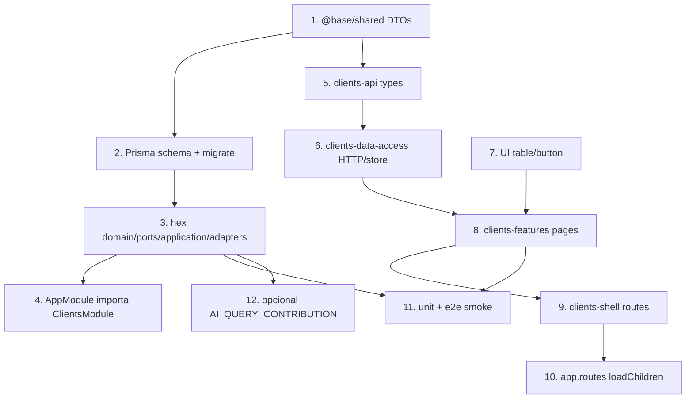

  

<h1 align="center">Lifecycle de un dominio — de la idea al request en producción</h1>

  
  

Cuándo usarla: para ver **todo el camino** de un dominio (ej. `clients`) sin
perderte entre carpetas. Ideal en L2 del [learning-path.md](./learning-path.md).

---

## 1. De negocio a slug

| Concepto de negocio | En el repo |
|---------------------|------------|
| “Gestión de clientes” | Dominio `clients` |
| API HTTP | `/api/clients` |
| Módulo Nest | `ClientsModule` |
| Paquetes FE | `@scope/clients-{api,data-access,features,shell}` |
| Permiso típico | `clients:read` / `clients:write` (matriz RBAC) |

**Regla slug:** mismo nombre en carpeta, controller, ruta y paquetes FE
([backend-domain-convention](../backend/backend-domain-convention.md)).

---

## 2. Capas físicas tocadas (checklist mental)

---

## 3. Request de lectura (detalle)

**Usuario** abre `/clients` en la SPA.

1. **Router** carga `@josanz/clients-shell` → lazy `@josanz/clients-features`.
2. **Page** monta smart list → `ClientsService.load()`.
3. **ApiClient** (`@base/angular-api`) añade Bearer + headers de traza (ADR 0007).
4. **Nest** `GET /api/clients`:
   - Guards: JWT (JWKS Keycloak), Tenant, Roles/Permissions.
   - Controller → `ClientsService.list` → `QueryBus` → `ListClientsHandler`.
   - Handler → `ClientsRepository.findPage` → Prisma + `scopedWhere(tenantId)`.
5. **DTO** vuelve; FE mapea a view model; UI Table renderiza.
6. **Logs** JSON con `requestId`, `tenantId`, `userId` (observability runbook).

---

## 4. Request de escritura (detalle)

**Usuario** crea un cliente.

1. Form UI → smart component → `create(dto)`.
2. `POST /api/clients` + body validado (class-validator).
3. `CommandBus` → `CreateClientHandler`:
   - Reglas de dominio (email único, etc.).
   - `repository.create` dentro de **UnitOfWork** si hay outbox.
   - Evento `ClientCreated` → fila **Outbox** (misma TX).
4. Relay asíncrono publica a Kafka (o in-memory en local sin Kafka).
5. Audit extension / actor interceptor registran quién/dónde.
6. FE invalida cache / recarga lista.

Sin Redis/Kafka el API **sigue arrancando** (modo degradado) — no bloquees el
diseño del dominio por infra opcional.

---

## 5. Variantes de despliegue (mismo dominio)

| Deploy | Qué cambia | Qué no cambia |
|--------|------------|---------------|
| Monolito `josanz-api` | Todo in-process | Hex + DTOs |
| `clients-ms` + gateway | Transporte gRPC/HTTP | `ClientsModule` |
| Multi-tenant | `TENANT_MODE=multi` | Handlers |
| Single-tenant | `scopedWhere` no-op | Handlers |

La **app** elige `DATABASE_URL` / `TENANT_MODE`; la **lib** no hardcodea el producto.

---

## 6. Cómo entra la IA (hoy y mañana)

**Hoy:** `POST /api/ai/query` con nombre `clients.list` → mismo `ListClientsQuery`
que usa el controller humano ([ai-cqrs-policy](../guides/ai-cqrs-policy.md)).

**Mañana (visión):** un modelo especialista “Clients-AI” solo conoce tools de
ese dominio; no escribe salvo allow-list ([platform-vision](./platform-vision.md)).

Por eso el lifecycle exige CQRS uniforme: **el especialista no es un prompt suelto,
es un consumidor más del QueryBus**.

---

## 7. Orden de implementación recomendado (nuevo dominio)

1. Contratos shared + (si aplica) Prisma.
2. Hex backend + tests handler.
3. Montar en app API; smoke curl/Postman.
4. FE api → data-access → features → shell → app route.
5. Permisos + menú navegación.
6. E2E smoke login + ruta.
7. Registrar AI queries si el dominio es candidado a especialista.
8. Actualizar [SERVICES.md](../../SERVICES.md) y catálogo UI si hay componentes nuevos.

Guías: [add-backend-domain](../guides/add-backend-domain.md),
[add-frontend-domain](../guides/add-frontend-domain.md),
[new-product-e2e-walkthrough](../guides/new-product-e2e-walkthrough.md).

---

## 8. Mini glosario del journey

| Paso | Archivo típico (clients) |
|------|--------------------------|
| DTO | `libs/base/shared/.../client.dto.ts` |
| Command | `.../clients/application/commands/create-client.command.ts` |
| Handler | `.../handlers/create-client.handler.ts` |
| Repo port | `.../ports/clients.repository.ts` |
| Prisma | `.../adapters/persistence/clients.prisma.repository.ts` |
| HTTP | `.../adapters/http/clients.controller.ts` |
| Module | `clients.module.ts` |
| FE service | `libs/.../clients/data-access/...` |
| Page | `libs/.../clients/features/.../pages/...` |

---

## Enlaces

- [backend-deep-dive.md](./backend-deep-dive.md)
- [frontend-deep-dive.md](./frontend-deep-dive.md)
- [testing-pyramid.md](../guides/testing-pyramid.md)
- [platform-vision.md](./platform-vision.md)
