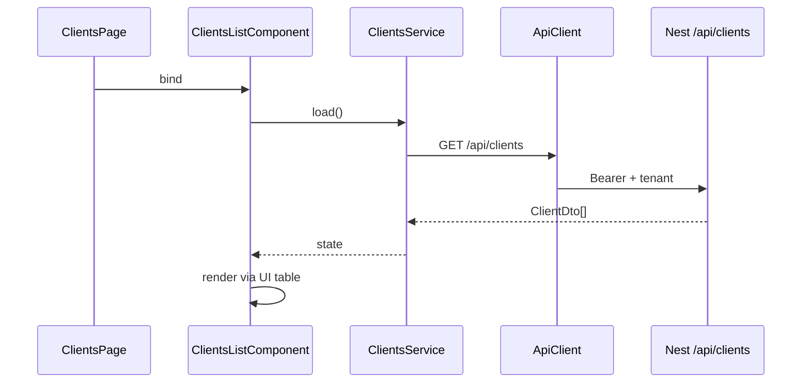

<p align="center">
  
</p>

<h1 align="center">Frontend — deep dive (4 capas)</h1>

<p align="center">
  
  <a href="../README.md"></a>
</p>

Cuándo usarla: antes de crear pantallas o libs `*-api|data-access|features|shell|ui`.
ADR: [0006](../adr/adr-0006-frontend-layering.md).

---

## 1. Idea en lenguaje humano

Una pantalla de “Clientes” no es un único archivo gordo. Se parte para que:

- el **contrato** (tipos) no dependa de Angular vs React,
- el **estado/HTTP** se pueda testear sin DOM,
- la **UI** sea presentacional (Storybook / catálogo),
- el **routing** lazy-loadee features sin arrastrar todo el monorepo.

```
        app.routes
            │
            ▼
         *-shell          ← solo rutas / loadChildren
            │
            ▼
       *-features         ← pages + smart components
         ╱        ╲
 data-access        *-ui  ← HTTP/store     presentacional
        │
      *-api / shared      ← tipos
```

---

## 2. Capas una a una

| Capa | Paquete ejemplo | Contiene | No contiene |
|------|-----------------|----------|-------------|
| **api** | `@josanz/clients-api` | Types, tokens de ruta, contracts | HTTP, componentes |
| **data-access** | `@josanz/clients-data-access` | Services, facades, stores, mappers FE | Templates HTML |
| **features** | `@josanz/clients-features` | `layout/`, `pages/`, `components/` smart | Primitivos HTML crudos |
| **shell** | `@josanz/clients-shell` | `*.routes.ts` → lazy features | Lógica de negocio |
| **ui** | `@josanz/angular-ui` / `@base/angular-ui` | Button, Table, Input… | Llamadas API |

### Features — forma fija

```
features/src/
  layout/       # chrome de la sección
  pages/        # targets de ruta
  components/   # smart: cablean data-access → ui
  *.routes.ts
  index.ts
```

**Regla:** `components/` compone **solo** UI del scope correcto (`@josanz/angular-ui`,
`@base/angular-ui`, `@saas/shared-ui`…). Ver [design-system.md](../frontend/design-system.md)
y [ui-re-export-vs-wrapper.md](../guides/ui-re-export-vs-wrapper.md).

---

## 3. App = composition root FE

```ts
// apps/.../app.routes.ts (simplificado)
{
  path: 'clients',
  loadChildren: () =>
    import('@josanz/clients-shell').then((m) => m.clientsShellRoutes),
}
```

La app **no** implementa la lista de clientes; solo decide qué shells montar
(igual que el backend AppModule elige módulos Nest).

---

## 4. Paridad Angular ↔ React

Misma topología de paquetes; distinta implementación de store (NgRx vs hooks).  
Canario: [dual-stack-clients-parity.md](../frontend/dual-stack-clients-parity.md).

Si cambias un contrato en `@base/shared` / `*-api`, ambos stacks deben compilar
(`pnpm check:exports-paths` + typecheck).

---

## 5. Thin Arquetipos vs producto cliente

| | Arquetipos | Producto (`@josanz/*`, `@ideauto/*`, …) |
|---|------------|--------|
| Objetivo | Plantilla copy-paste | Producto real |
| api/data-access | Thin → `@base` | Propios o extendidos |
| features | Pueden re-exportar o demo UX | UX + reglas producto |
| UI | `@arquetipos/*-ui` | `@josanz/angular-ui`, `@ideauto/angular-ui`, … |

Detalle: [arquetipos-thin-libs.md](../frontend/arquetipos-thin-libs.md),
[josanz-product-exceptions.md](../frontend/josanz-product-exceptions.md),
[ideauto/recalls/](../ideauto/recalls/).

---

## 6. Flujo de datos en una lista



Errores HTTP → handling del kernel (`@base/angular-api` / react-api), no `alert()` en page.

---

## 7. Paths y exports (dolor típico)

Paquetes FE necesitan **`exports` en package.json** y **`paths` en tsconfig.base.json**
alineados o el bundler Angular/Vite falla (“raw TS” / not found).

```bash
pnpm check:exports-paths
```

Doc: [workspace-packages.md](../frontend/workspace-packages.md).

---

## 7bis. Estilos compartidos — 7–1 (`@base/ui-styles`)

Además de las 4 capas de dominio, el CSS compartido de plantillas arquetipos
sigue el patrón **7–1** (Sass): siete carpetas + `main.scss`.

Ver [ui-styles-7-1.md](../frontend/ui-styles-7-1.md). Composiciones canario
(`arq-auth*`, `arq-clients*`) viven en `pages/` para que Angular/React/Next/Ionic
compartan el mismo look.

---

## 8. Opt-in (no el día 1)

| Stack | Guía |
|-------|------|
| Next.js | [add-next-domain.md](../guides/add-next-domain.md) |
| Ionic / RN | [add-mobile-domain.md](../guides/add-mobile-domain.md) |
| Module Federation | [module-federation-dev.md](../guides/module-federation-dev.md) |

Default producto nuevo: **una** SPA ([ADR 0008](../adr/adr-0008-platform-scope-vs-mvp-client.md)).

---

## 9. Errores típicos (code review)

| Mal | Bien |
|-----|------|
| Feature importa `@arquetipos` desde Josanz | Solo `@josanz` / `@base` según capa |
| HTML crudo en features | Componente `*-ui` |
| Wrapper UI “por simetría” | Re-export si no hay marca |
| Lógica de negocio en page | data-access / backend |
| App con componentes de dominio | App solo routes + providers |

---

## Enlaces

- [add-frontend-domain.md](../guides/add-frontend-domain.md)
- [domain-lifecycle.md](./domain-lifecycle.md)
- [ci-gates.md](../frontend/ci-gates.md)
