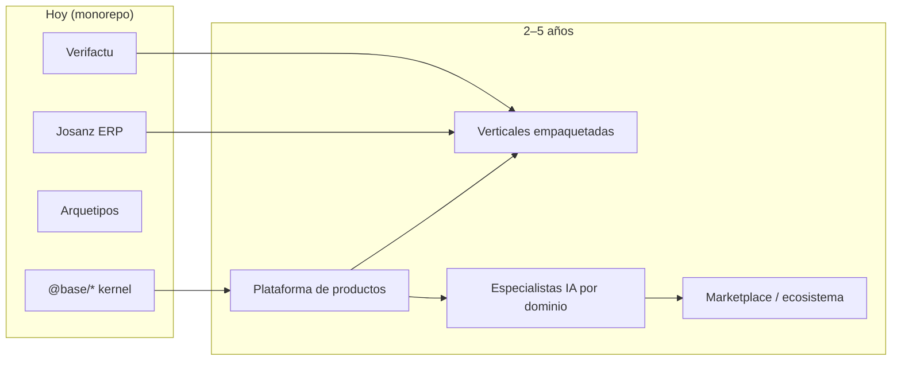

# Visión de futuro — hacia dónde va el motor en 2–5 años

Cuándo leerla: cuando necesitas entender **la apuesta a largo plazo** del motor, los
riesgos estratégicos y por qué se prioriza (o no) cada Fase más allá de F62.

Completa (no sustituye) [platform-vision.md](./platform-vision.md), que cubre fases
A–D y el salto a SaaS por dominios. Aquí respondemos: *¿qué pasa después?* y
*¿cuál es el moat?*

---

## 1. El horizonte en una frase

> Este monorepo deja de ser un ERP y se convierte en una **planta de productos
> empresariales**: dominios kernel estables + especialistas IA por bounded context +
> despliegue multi-tenant/multi-producto sobre una única base de código
> auditable. El negocio deja de vender horas y pasa a vender **productos y modelos
> especialistas** con TTM medido en días, no meses.

---

## 2. La hipótesis central (y por qué es defendible)

**Hipótesis:** la arquitectura correcta (hexagonal + CQRS + capas cerradas FE +
biblia viva) + gates CI automáticos = **el costo de generar un nuevo dominio de
negocio se desploma** — primero para humanos, luego para agentes, luego para
modelos especialistas.

Esto no es optimismo: el repo ya es **económicamente defensible** si:

1. Un equipo construye un nuevo dominio en **1 semana** (vs. 1–3 meses en un ERP
   tradicional).
2. La IA puede iterar sobre dominios conocidos sin romper el kernel.
3. El multi-tenant está resuelto en Prisma (`single` vs `multi`) desde día cero.
4. La biblia + gates elimina la deuda por “¿dónde va esto?”.

**Moat:** no vendemos código, vendemos **semántica + seguridad + multi-tenant +
prompts de dominio**. Esos cuatro bloques tardan 2–5 años en replicarlos bien.

---

## 3. Fases del horizonte (más allá de platform-vision)

Donde `platform-vision.md` cubre Fases A–D (ahora → SaaS por dominios), este
documento describe **Fase E+**.

| Fase | Horizonte | Objetivo | Activo clave |
|------|-----------|----------|--------------|
| **E** | 6–18 meses | Dominios kernel 100% cubiertos + AI eval suite rutinaria | `@base/*` + especialistas pilot |
| **F** | 12–30 meses | Multi-producto real: Josanz + 1 cliente nuevo sin reescribir kernel | `@acme/*` thin sobre `@base/*` |
| **G** | 24–48 meses | SaaS B2B ejecutable: pricing por dominio, tenant aislado, onboarding en horas | Platform license + Domain AI |
| **H** | 36–60 meses | Ecosistema: terceros crean dominios sobre `@base` + marketplace de especialistas | Registry público + SDK dominio |

### Fase E — Dominios kernel cerrados + IA confiable (6–18 meses)

Hoy faltan dominios kernel (`inventory`, `billing` completo, `staff`, …). Terminar
esa oleada y **congelar contratos estables** (DTOs, CQRS buses) es requisito previo.

Criterios de salida:
- [ ] 100% dominios kernel cubiertos.
- [ ] `@base/*` publicable con semver (F51–F52).
- [ ] Cada dominio tiene ≥2 queries AI registradas + eval suite mínima.
- [ ] `check:exports-paths` verde en CI permanente.

### Fase F — Multi-producto real (12–30 meses)

La prueba de fuego: agregar un **segundo cliente** (p. ej. `@acme/*`) sin tocar
`@base/*`, `@josanz/*`, ni `@arquetipos/*`. Solo thin wrappers y branding.

Cuando F es real, el monorepo deja de ser “el ERP de Josanz con saas al lado” y se
convierte en **una plataforma con dos productos en producción**.

### Fase G — SaaS B2B (24–48 meses)

Modelo de revenue:
1. **Platform license** — self-host o managed, acceso a `@base/*`.
2. **Domain AI add-on** — `/api/ai/query` por dominio, pricing por tenant.
3. **Vertical pack** — eventos, flota, servicios; dominio + modelo + plantilla FE.

El KPI que importa: *Tiempo desde “necesito un dominio X” hasta “está en producción
multi-tenant”* → objetivo < 1 semana con plataforma, > 3 meses sin ella.

### Fase H — Ecosistema / marketplace (36–60 meses)

Si F y G funcionan:
- Publicar un **SDK de dominio** (`@base/sdk-domain`) para que terceros construyan
  dominios custom sobre el kernel sin tocar `libs/`.
- **Registry público** de especialistas IA: la comunidad entrena modelos sobre
  `clients.*`, `billing.*`, etc., y los publica.
- La empresa pasa de vender licencias a vender **infraestructura de dominio
  empresarial** (similar a cómo AWS vende infra, Shopify vende comercio).

Riesgo: si no se alcanza masa crítica de dominios kernel en Fase E, el marketplace
no despega. Por eso Fase E es el cuello de botella.

---

## 4. Principios que escalan (no se negocian en Fase E+)

1. **Kernel > feature** — nadie toca `@base/*` sin ADR + consenso platform.
2. **Contrato antes que modelo** — DTOs y CQRS buses son la API pública; el modelo
   IA se adapta a ellos, no al revés.
3. **Multi-tenant por defecto** — ningún dominio nuevo se diseña single-tenant sin
   justificación explícita.
4. **Fail-closed IA** — si el especialista no sabe, dice “no sé”, no inventa.
5. **Biblia > moda** — frameworks vienen y van; la arquitectura hexagonal + capas
   cerradas es posture agnóstico.
6. **Open-core con núcleo productivo** — kernel abierto a inspección, especialistas y
   verticales como producto sellable.

---

## 5. Riesgos estratégicos y mitigaciones

| Riesgo | Probabilidad | Impacto | Mitigación |
|--------|--------------|---------|------------|
| Buscar revenue SaaS antes de cerrar kernel | Alta | Alto | Fase E primero; G empieza solo con 1 vertical sellable |
| Especialistas IA son caros o impredecibles | Media | Alto | Fail-closed + eval suite + allow-list commands |
| Complejidad multi-producto degrada DX | Media | Alto | Linter boundaries + `check:lib-layout` siempre verde |
| Mercado prefiere soluciones existentes | Baja | Crítico | Moat = semántica + seguridad + tiempo-a-mercado |
| Equipo crece y la biblia se deja de leer | Media | Alto | Gates CI son la biblia ejecutable; docs son complemento |

---

## 6. Señales de avance (checklist del futuro)

- [ ] Josanz y al menos un segundo producto comparten `@base/*` sin forks.
- [ ] Nuevo dominio kernel: 1 semana desde “lo necesito” hasta producción.
- [ ] Especialista IA pilot responde consultas complejas sin alucinar.
- [ ] `@base/*` tiene semver, changelog y consumidores externos.
- [ ] 3+ dominios kernel con AI eval suite rutinaria.
- [ ] Pricing por dominio/tentant definido y al menos un cliente SaaS.
- [ ] SDK dominio publicado y documentado para terceros.

Cuando tengas 4 o más checks verdes, el moat es real.

---

## 7. Filosofía operativa

> El código es commodity. La **arquitectura** + la **documentación viva** + los
> **contracts estables** son lo que hace que una empresa pueda construir software
> empresarial a velocidad alta sin hundirse en deuda técnica.

Si en 5 años el repo es solo código, fracasamos. Si en 5 años el repo es una
**planta** que produce productos y modelos especialistas, ganamos.

---

## Enlaces

- [platform-vision.md](./platform-vision.md) — Fases A–D (ahora → SaaS dominios)
- [overview.md](./overview.md) — mapa mental + lifecycle de dominio
- [domain-lifecycle.md](./domain-lifecycle.md) — punta a punta
- [guides/ai-cqrs-policy.md](../guides/ai-cqrs-policy.md) — gate AI técnico
- [guides/npm-publish-and-versioning.md](../guides/npm-publish-and-versioning.md) — F51–F52 kernel publicable
- [docs/README.md](../README.md) — hub biblia
