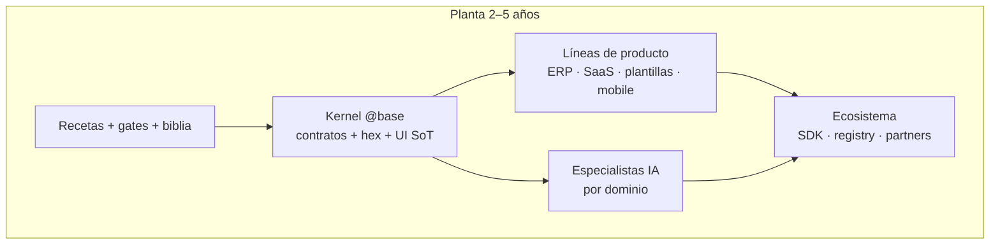

  

<h1 align="center">Visión de futuro — la planta de productos empresariales</h1>

  
  

Cuándo leerla: cuando necesitas la **apuesta a 2–5 años**, el moat, los riesgos y
por qué cada ronda (más allá de F63) importa o no.

No sustituye [platform-vision.md](./platform-vision.md) (fases A–D: motor →
especialistas IA → SaaS). Este documento responde: *¿qué somos al final?* y
*¿cómo ganamos?*

---

## 1. La imagen que debe quedarse

Hoy el monorepo parece “un ERP + plantillas + un SaaS”. Eso es el **scaffolding**.

En 2–5 años es una **planta**:

| Hoy se ve como | Mañana es |
|----------------|-----------|
| Código de Josanz / Verifactu / Arquetipos | **Líneas de producto** sobre un kernel único |
| Docs y gates CI | **Sistema operativo de ingeniería** (humanos + agentes) |
| CQRS + AI query gate | **Fábrica de especialistas** por bounded context |
| Angular / React / Next / Ionic / RN | **Una semántica, N superficies** (mismo dominio, mismo contrato) |
| Semanas de feature work | **Días** de composición + branding |

**Una frase:**

> Dejamos de vender proyectos a medida. Vendemos **productos, verticales y
> modelos de dominio** fabricados sobre una base auditable que humanos y agentes
> saben extender sin romper el motor.

---

## 2. Hipótesis central (el porqué económico)

**Hipótesis:** si los contratos (DTOs, CQRS, capas FE, layout de libs, ownership
UI) son **rígidos y comprobables**, el coste marginal de un dominio nuevo cae
órdenes de magnitud — primero para el equipo, luego para agentes, luego para
clientes que solo componen.

Eso solo es verdad si se mantienen cuatro pilares:

1. **Semántica única** — un `Client`, un `Permission`, un outbox; no cinco clones.
2. **Superficies gemelas** — web SPA, Next, Ionic desktop y móvil/RN exponen la
   **misma IA de producto** (`TEMPLATE_NAV` y dominios canónicos); el chrome puede
   adaptarse (shell SPA vs `@base/mobile-chrome`), el dominio no.
3. **Fail-closed** — authz, multi-tenant Prisma, IA que dice “no sé”.
4. **Biblia ejecutable** — lo que no pasa el gate no entra a `main`.

**Moat (lo que tarda años en copiar):**

| Capa del moat | Qué es en la práctica |
|---------------|------------------------|
| Semántica | Dominios hex + DTOs + permisos + eventos |
| Seguridad | Tenancy, Keycloak, cifrado, audit trail |
| Tiempo-a-mercado | Scaffold + arquetipos + gates + agentes |
| Especialistas | Modelos/RAG atados a queries CQRS reales, no chat genérico |

No competimos siendo “otro ERP open source”. Competimos siendo la **planta que
fabrica ERPs y SaaS correctos más rápido que el mercado**.

---

## 3. Norte de producto (qué se siente usar esto)

### Para un cliente final

- Un producto (Josanz, Verifactu, el siguiente) **coherente en todas las
  pantallas**: desktop, tablet, móvil.
- Datos multi-tenant seguros; cambios trazables.
- Asistentes que **leen y actúan solo** sobre el dominio que conocen.

### Para un product team interno

- Nuevo cliente `@acme/*`: thin wrappers, branding, composición en `apps/` —
  **sin fork del kernel**.
- Nuevo dominio: checklist + scaffold + typecheck/test — **días**, no un
  quarter.

### Para un agente / modelo

- Un sitio correcto para cada archivo (layout + boundaries).
- Contratos estables para razonar (`clients.FindMany`, no SQL libre).
- Eval suite que castiga alucinaciones.

### Para un partner (Fase H)

- SDK de dominio + registry: construyen encima de `@base` sin tocar el corazón.

---

## 4. Fases E–H (después de platform-vision A–D)

| Fase | Horizonte | Éxito medible |
|------|-----------|---------------|
| **E** | 6–18 m | Kernel “cerrado” + especialistas con eval; UI/runtime parity canónica |
| **F** | 12–30 m | Segundo producto cliente en prod sin reescribir `@base` |
| **G** | 24–48 m | Revenue: license + Domain AI + vertical pack; TTM dominio &lt; 1 semana |
| **H** | 36–60 m | SDK + marketplace; terceros publican dominios/especialistas |

### Fase E — Motor maduro (cuello de botella)

Sin E no hay F/G/H creíbles.

Prioridades:

- Completar y **congelar** dominios kernel (contratos semver-ready).
- Paridad de **producto** entre runtimes (ya iniciada F60–F63: native-ui,
  `ui-styles`, shell dual Ionic, `TEMPLATE_NAV` en mobile).
- AI: ≥2 queries registradas por dominio crítico + eval mínima rutinaria.
- Publicación interna/controlada de `@base/*` (ver guía npm / F51–F52).

Criterios de salida:

- [ ] Dominios kernel objetivo cubiertos o explícitamente deferidos con ADR.
- [ ] Canario arquetipos: mismas features en Angular/React (+ Ionic/RN core).
- [ ] `@base/*` versionable; changelog de contratos.
- [ ] Eval AI en CI soft → strict para dominios piloto.

### Fase F — Prueba multi-producto

Un segundo cliente (`@acme/*` o similar) en producción:

- Solo importa `@base/*` (+ selectivo producto si aplica).
- Cero fork de Josanz; branding y reglas en wrappers.
- Misma planta de features; distinta marca y policies.

Cuando F es real, el monorepo **deja de ser “el ERP de Josanz”** y pasa a ser
**plataforma con N productos**.

### Fase G — Negocio SaaS B2B

Tres motores de ingreso (combinables):

1. **Platform license** — self-host o managed del kernel + ops.
2. **Domain AI** — especialistas por dominio, metering por tenant.
3. **Vertical pack** — dominio + FE + modelo (eventos, flota, facturación…).

KPI norte: *días desde “necesito dominio X” hasta multi-tenant en prod*.

### Fase H — Ecosistema

- `@base/sdk-domain` + plantilla de dominio certificada.
- Registry de especialistas (versión atada a contrato CQRS).
- Partners fabrican verticales; la empresa opera la planta y el trust layer.

Riesgo: H sin masa crítica en E = marketplace vacío. **E primero.**

---

## 5. Principios no negociables (E+)

1. **Kernel > feature** — cambios en `@base/*` con ADR y coste consciente.
2. **Contrato antes que modelo** — la IA se adapta al bus; el bus no se tuerce
   por el prompt.
3. **Una semántica, N skins** — paridad de features entre runtimes; chrome
   responsive/móvil compartido donde aplica; sin “otra app” disfrazada.
4. **Multi-tenant por defecto** — single-tenant solo con justificación.
5. **Fail-closed** — authz, tenancy, IA.
6. **Gates = biblia ejecutable** — docs explican; CI impone.
7. **Open-core sano** — kernel inspeccionable; verticales y especialistas como
   producto.

---

## 6. Riesgos y mitigaciones

| Riesgo | Mitigación |
|--------|------------|
| Monetizar SaaS antes de cerrar kernel | E obligatorio; G solo con 1 vertical sellable |
| IA cara / alucinógena | Fail-closed + eval + allow-list de commands |
| N productos → DX insoportable | Boundaries Nx/ESLint + `check:lib-layout` + arquetipos |
| Cada runtime es un producto distinto | Paridad canónica (manifest + e2e smoke) F54–F63 |
| Biblia abandonada al crecer el equipo | Gates como fuente de verdad; docs como narrativa |
| Mercado “ya tiene ERP” | Competir en TTM + semántica + especialistas, no en features genéricas |

---

## 7. Señales de que el moat es real

Marca cuando sea verdad en producción, no en slides:

- [ ] ≥2 productos cliente comparten `@base/*` sin forks.
- [ ] Dominio kernel nuevo: ≤ 1 semana a prod multi-tenant.
- [ ] Especialista piloto supera eval (cero alucinación en suite).
- [ ] `@base/*` con semver y consumidores fuera del monorepo (o path claro).
- [ ] 3+ dominios con AI eval en pipeline.
- [ ] Pricing por dominio/tenant y ≥1 cliente SaaS de pago.
- [ ] SDK dominio usable por un equipo externo en un spike de 2 días.
- [ ] Arquetipos: misma matriz de features en web + mobile (core).

**Regla práctica:** ≥4 checks verdes → la planta ya genera ventaja competitiva
medible.

---

## 8. Filosofía operativa

> El código es commodity. La **arquitectura**, los **contratos**, la **biblia
> ejecutable** y los **especialistas atados a dominio** son el activo.

Si en cinco años esto es “mucho código mantenido a pulso”, fracasamos.

Si en cinco años es una **planta** que produce productos, verticales y modelos
especialistas con TTM de días — y los runtimes son superficies del mismo
producto, no islas — ganamos.

---

## Enlaces

| Documento | Rol |
|-----------|-----|
| [platform-vision.md](./platform-vision.md) | Fases A–D (ahora → SaaS) |
| [overview.md](./overview.md) | Mapa mental del monorepo |
| [domain-lifecycle.md](./domain-lifecycle.md) | Ciclo de un dominio |
| [../arquetipos/parity.md](../arquetipos/parity.md) | Paridad multi-runtime |
| [../guides/ai-cqrs-policy.md](../guides/ai-cqrs-policy.md) | Gate AI |
| [../guides/npm-publish-and-versioning.md](../guides/npm-publish-and-versioning.md) | Kernel publicable |
| [../README.md](../README.md) | Hub de la biblia |
