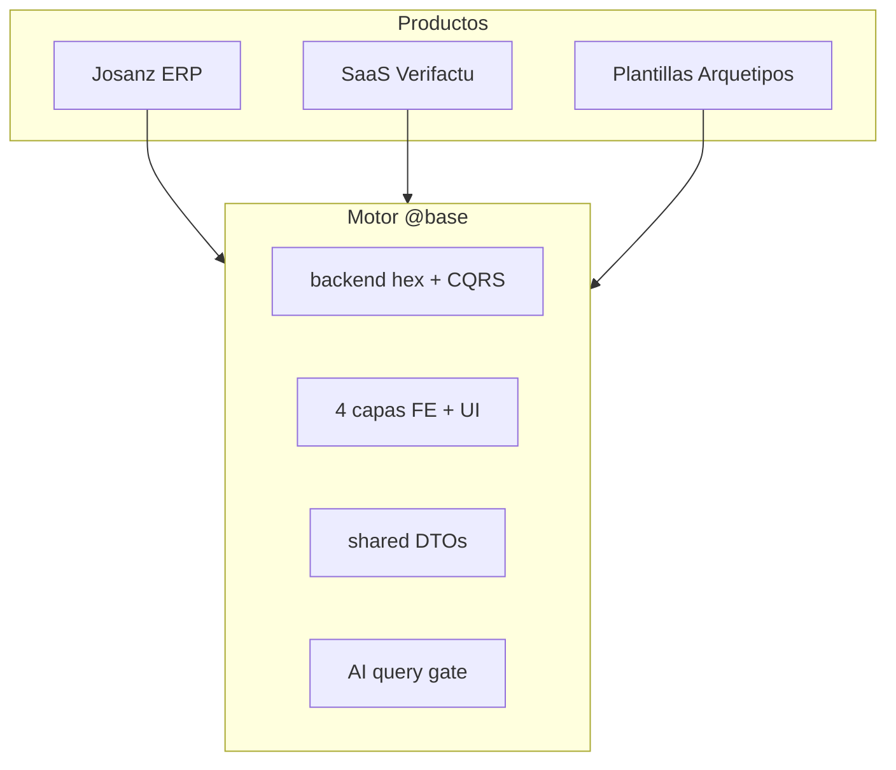
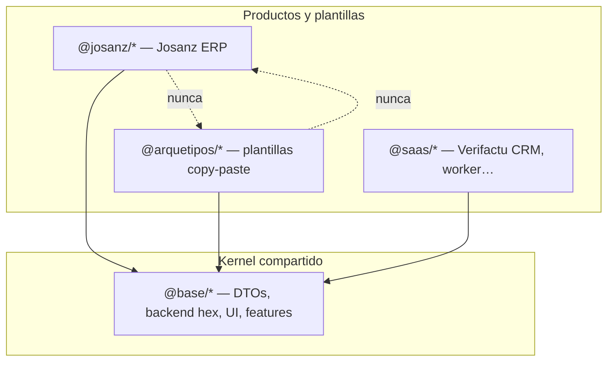
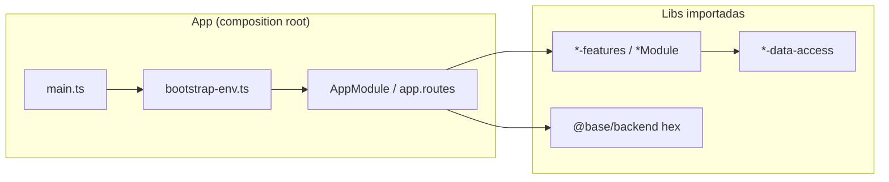
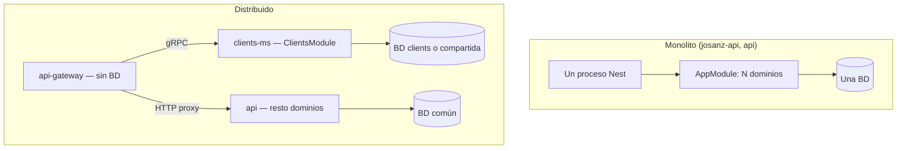

# Arquitectura — mapa mental

Documento de referencia para entender **de dónde viene cada pieza** y **por qué**
está organizada así. Si acabas de llegar:

1. [getting-started.md](../getting-started.md) — instalar  
2. [learning-path.md](./learning-path.md) — ruta junior → senior  
3. Este overview (mapa)  
4. Deep dives cuando toques código  

Visión de negocio / IA por dominio: [platform-vision.md](./platform-vision.md).  
Decisión de frameworks: [framework-decision-guide.md](./framework-decision-guide.md).  
Plantillas: [../arquetipos/README.md](../arquetipos/README.md).

---

## 0. Este monorepo como motor de empresa

No es un solo producto: es una **plataforma** para fabricar ERP, plantillas y SaaS
reutilizando el mismo kernel (`@base/*`). La biblia + CQRS permiten que **humanos e IA**
generen dominios correctos; el horizonte es **modelos especialistas por dominio**
vendidos como SaaS ([platform-vision.md](./platform-vision.md)).

| Rol | Quién | Responsabilidad |
|-----|-------|-----------------|
| **Platform** | Equipo kernel | `@base/*`, ADRs, gates CI, Prisma dual, auth Keycloak, seams AI |
| **Product** | Equipo cliente / SaaS | `@josanz/*`, `@saas/*`, branding, composición en `apps/` |
| **Template** | Platform + DX | `@arquetipos/*` thin — copy-paste seguro sin acoplar productos |

**Default (ADR 0008):** SPA web + monolito Nest. Opt-in: Next, Ionic, React Native,
Module Federation, microservicios.



Lifecycle de un dominio (resumen):

1. DTO en `@scope/shared`
2. Schema Prisma (+ migrate) si persiste
3. Hex: ports → handlers CQRS → adapters HTTP/Prisma
4. FE: api → data-access → features ← ui; shell lazy
5. Authz permissions + eventos outbox si aplica
6. Tests unit (+ harness) y smoke e2e
7. (Opcional) registrar queries en AI registry del dominio

**Detalle narrado:** [domain-lifecycle.md](./domain-lifecycle.md).  
Guías: [new-product-e2e-walkthrough.md](../guides/new-product-e2e-walkthrough.md),
[testing-pyramid.md](../guides/testing-pyramid.md).  
ADRs: [0009 CQRS](../adr/adr-0009-cqrs-nest.md), [ai-cqrs-policy](../guides/ai-cqrs-policy.md).

---

## 1. La pregunta que responde este repo

> ¿Cómo construir varios productos (ERP, plantillas, SaaS) reutilizando el mismo dominio sin copiar código ni mezclar marcas?

**Respuesta en tres capas de dependencia:**



| Capa | Alias npm | Puede importar | No puede importar |
|------|-----------|----------------|-------------------|
| Kernel | `@base/*` | otros `@base/*` | `@arquetipos/*`, `@josanz/*`, `@saas/*` |
| Plantilla | `@arquetipos/*` | `@base/*` | `@josanz/*` |
| Producto cliente | `@josanz/*` | `@base/*` | `@arquetipos/*` |
| SaaS | `@saas/*` | `@base/*`, partes `@josanz/*` donde aplique | `@arquetipos/*` |

Enforced por tags Nx (`layer:base`, `layer:arquetipos`, `layer:clientes`, `layer:productos-saas`) y ESLint `@nx/enforce-module-boundaries`.

**Por qué:** un producto cliente no debe depender de una plantilla de ejemplo. El kernel es la única fuente de verdad compartida.

---

## 2. Apps vs libs — quién decide qué

| | **Libs** | **Apps** |
|---|----------|----------|
| **Qué son** | Código reutilizable empaquetado (Nx project) | Procesos desplegables (Nest, Vite, Angular CLI) |
| **Dónde** | `libs/{scope}/…` | `apps/{grupo}/…` |
| **Responsabilidad** | Dominio, UI, contratos, adaptadores | Routing global, bootstrap, **composición** de módulos |
| **Base de datos** | Puertos + adaptadores Prisma; **no** eligen URL | `bootstrap-env.ts` → env del deploy → `DATABASE_URL` |
| **Forma de despliegue** | Agnóstico | Monolito, microservicio, gateway, SPA |



**Ejemplo Josanz:** `apps/clientes/josanz/backend/src/app/app.module.ts` importa `ClientsModule` (base), `JosanzFleetModule` (producto), `PrismaModule` (infra). La app no implementa lógica de fleet — solo **elige** qué dominios están activos en este despliegue.

---

## 3. Backend — hexagonal por dominio

Cada dominio de negocio (`clients`, `billing`, `fleet`, …) sigue **ports & adapters**:

```
domains/<x>/
  domain/              # entidad, errores, mappers
  ports/               # puerto Repository
  application/         # CQRS (solo dependen de puertos)
  adapters/
    persistence/       # adaptador Prisma
    http/              # controller Nest
  <x>.module.ts
```

**Por qué hexagonal:** el mismo `ClientsModule` corre en el monolito (`api`) y en el microservicio (`clients-ms`). Solo cambia el transporte (HTTP in-process vs gRPC) y el bootstrap de BD.

| Empaquetado | Path | Cuándo |
|-------------|------|--------|
| `@base/backend` | `libs/base/backend/src/lib/domains/` | Dominios kernel (clients, users, audit, …) |
| `@josanz/backend` | `libs/clientes/josanz/backend/src/lib/{domain}/` | Reglas de producto (fleet, staff, catalog, …) |
| `@saas/{domain}-backend` | `libs/productos-saas/crm/backend/{domain}/` | Dominios CRM Verifactu |
| `@arquetipos/arquetipos-backend` | thin re-export | Plantillas; sin dominio propio |

Convención completa: [backend/backend-domain-convention.md](../backend/backend-domain-convention.md).  
**Deep dive (junior→senior):** [backend-deep-dive.md](./backend-deep-dive.md).  
ADR: [adr-0001](../adr/adr-0001-hexagonal-architecture.md), [adr-0009](../adr/adr-0009-cqrs-nest.md).

---

## 4. Frontend — cuatro capas por dominio

Patrón **cerrado** (migración four-round completada):

```
api → data-access → features ← ui
         ↑
       shell (lazy-load features)
```

| Capa | Rol | Importa |
|------|-----|---------|
| `{domain}-api` | Tipos, contratos | `@scope/shared` |
| `{domain}-data-access` | HTTP, store NgRx/RTK | `*-api`, `@base/angular-api` |
| `{domain}-features` | `layout/`, `pages/`, `components/` | `*-data-access`, `*-ui` |
| `{domain}-shell` | Rutas lazy | `*-features` |
| `*-ui` | Componentes presentacionales | solo primitivos / DTOs |

**Apps frontend** son shells delgados: `app.routes.ts` hace `loadChildren` → `@josanz/{domain}-shell` o `@arquetipos/angular-{domain}-shell`.

**Por qué 4 capas:** separar contrato, estado, UI tonta y routing permite lazy loading, tests por capa y paridad Angular ↔ React.

ADR: [adr-0006](../adr/adr-0006-frontend-layering.md).  
**Deep dive:** [frontend-deep-dive.md](./frontend-deep-dive.md).

### Plantillas thin (Arquetipos)

Arquetipos **no duplica** api/data-access — solo `shell` + `features` que re-exportan `@base/*`:

[frontend/arquetipos-thin-libs.md](../frontend/arquetipos-thin-libs.md)

### Producto (Josanz)

4 capas completas por dominio + `platform/` (chrome app) + `@josanz/angular-ui` (marca).

Excepciones documentadas: [frontend/josanz-product-exceptions.md](../frontend/josanz-product-exceptions.md).

---

## 5. Base de datos — la app elige la topología

Las libs hablan con `PrismaModule` vía puertos. **Qué Postgres** usa cada proceso lo decide el **bootstrap de la app**:

| Topología | Caso | Cómo |
|-----------|------|------|
| **BD común** | Monolito Josanz | `JOSANZ_DATABASE_URL` o `DATABASE_URL` → una BD para todos los módulos |
| **BD común** | Monolito + `clients-ms` compartiendo esquema | Misma URL en ambos deploys |
| **BD por servicio** | Microservicio aislado | `CLIENTS_MS_DATABASE_URL` distinta del monolito |
| **Sin BD** | Gateway | No importa `PrismaModule` |

Matriz app × env: [backend/backend-domain-convention.md § BD](../backend/backend-domain-convention.md#base-de-datos-por-app-contrato).

**Por qué no hardcodear por producto en libs:** el mismo `ClientsModule` debe poder vivir en monolito o microservicio; solo cambia la env en el deploy.

Tenancy (`TENANT_MODE=single|multi`) es **ortogonal** a la topología de BD — dos esquemas Prisma (`prisma/single`, `prisma/multi`). ADR: [adr-0002](../adr/adr-0002-prisma-multi-single-tenancy.md).

---

## 6. Formas de despliegue (misma lib, distinto proceso)



| App Nx | Tipo | Libs típicas |
|--------|------|--------------|
| `josanz-api` | Monolito producto | `@josanz/backend` + `@base/backend` |
| `api` / `api-single` | Monolito plantilla | `@arquetipos/arquetipos-backend` |
| `clients-ms` | Microservicio | `ClientsModule` + Kafka |
| `api-gateway` | Gateway | proxy + auth, sin Prisma |
| `josanz` | SPA Angular | lazy `@josanz/*-shell` |

---

## 7. Árbol físico de libs (dónde poner código nuevo)

| Categoría | Path canónico | Ejemplo |
|-----------|---------------|---------|
| DTOs isomórficos | `libs/{scope}/shared/` | `@base/shared`, `@josanz/shared` |
| Backend Nest | `libs/{scope}/backend/` | `@base/backend`, `@josanz/backend` |
| Frontend Angular dominio | `libs/clientes/{p}/angular/{domain}/` | `@josanz/events-features` |
| Frontend Angular UI marca | `libs/clientes/{p}/angular-ui/` | `@josanz/angular-ui` |
| Frontend React | `libs/base/frontend/react/{domain}/` | `@base/clients-features` |
| Kernel HTTP/estado FE | `…/frontend/{angular\|react}/shared/` | `@base/angular-api` |

Scopes: `base/`, `arquetipos/`, `clientes/{producto}/`, `productos-saas/{producto}/`.

Rutas antiguas: [legacy-paths.md](../legacy-paths.md).

---

## 8. Cross-cutting — leer antes de tocar

| Tema | ADR / doc | Regla rápida |
|------|-----------|--------------|
| Auth | [adr-0005](../adr/adr-0005-jwt-vs-keycloak.md) + [keycloak-setup.md](../guides/keycloak-setup.md) | Keycloak OIDC; backend valida JWKS, no emite JWT |
| Eventos | [adr-0004](../adr/adr-0004-kafka-outbox.md) | Outbox transaccional → Kafka at-least-once |
| Cifrado PII | [adr-0003](../adr/adr-0003-aes-256-gcm-vs-kms.md) | AES-256-GCM en app layer |
| Trazas HTTP | [adr-0007](../adr/adr-0007-http-trace-context.md) | W3C traceparent |
| Observabilidad | [runbooks/observability.md](../runbooks/observability.md) | Logs JSON, `/metrics`, OTel opcional |
| CQRS Nest | [adr-0009](../adr/adr-0009-cqrs-nest.md) | Commands/Queries; facades solo dispatch |
| Testing | [testing-pyramid.md](../guides/testing-pyramid.md) | Unit → int → e2e; harnesses |
| UI wrap | [ui-re-export-vs-wrapper.md](../guides/ui-re-export-vs-wrapper.md) | Re-export vs wrapper |
| Design system | [design-system.md](../frontend/design-system.md) | Catálogo + Storybook |
| Mobile / Next / MF | [add-mobile](../guides/add-mobile-domain.md) / [add-next](../guides/add-next-domain.md) / [MF](../guides/module-federation-dev.md) | Opt-in ADR 0008 |

---

## 9. Árbol de decisión — «¿Dónde va mi cambio?»

```
¿Es lógica de negocio reutilizable?
├─ Sí → libs/ (¿kernel, producto o SaaS?)
│        ├─ Sirve a todos → @base/*
│        ├─ Solo un cliente → @josanz/* o @acme/*
│        └─ SaaS CRM → @saas/*
└─ No → apps/ (wiring, rutas globales, bootstrap, health de app)

¿Es UI?
├─ Genérico → @base/angular-ui o @base/react-shared
├─ Marca cliente → @josanz/angular-ui
└─ Plantilla demo → @arquetipos/*-ui

¿Toca Postgres?
├─ Puerto/adaptador → lib infrastructure/
└─ URL de conexión → app bootstrap-env.ts + deploy env

¿Es solo documentación de plan histórico?
└─ Reconstruir desde git si hace falta; no es fuente de verdad operativa.
```

---

## 10. Fuentes de verdad vs archivo histórico

| Tipo | Dónde | Uso |
|------|-------|-----|
| **Operativa (biblia)** | `docs/README.md`, `docs/architecture/`, `docs/guides/`, `docs/backend/`, `docs/frontend/`, `docs/runbooks/`, `docs/adr/` | Decisiones actuales |
| **Agentes / CI** | `AGENTS.md`, scripts en `tools/scripts/` | Automatización |
| **Catálogo vivo** | `SERVICES.md`, `ui-component-catalog.yaml` | Inventario dominios/UI |
| **Planes activos** | `docs/plans/` | Trabajo en curso |

Si un plan histórico contradice `docs/backend/` o `AGENTS.md`, **gana la biblia operativa**.

---

## Enlaces

| Doc | Para qué |
|-----|----------|
| [learning-path.md](./learning-path.md) | Onboarding por niveles |
| [platform-vision.md](./platform-vision.md) | Motor + IA por dominio + SaaS |
| [domain-lifecycle.md](./domain-lifecycle.md) | Request E2E de un dominio |
| [backend-deep-dive.md](./backend-deep-dive.md) | Hex + CQRS al detalle |
| [frontend-deep-dive.md](./frontend-deep-dive.md) | 4 capas al detalle |
| [README.md](../README.md) | Hub biblia |
| [guides/README.md](../guides/README.md) | Recetas |
| [backend-domain-convention.md](../backend/backend-domain-convention.md) | Slugs / BD |
| [AGENTS.md](../../AGENTS.md) | Contrato agentes |
