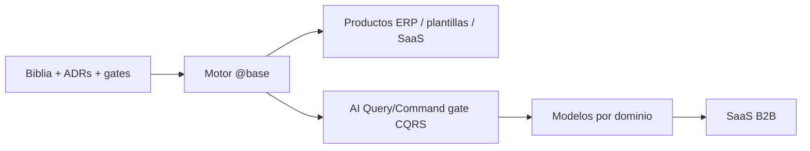

  

<h1 align="center">Visión de plataforma — motor, IA por dominio y SaaS</h1>

  
  

Cuándo leerla: para entender **hacia dónde va** este monorepo más allá del ERP
actual, y cómo la biblia + CQRS permiten que humanos e IA construyan rápido y bien.

No sustituye ADRs ni guías operativas: es la **historia de producto** del motor.

---

## 1. La apuesta en una frase

> Construimos un **motor de software empresarial** (dominios hexagonales + capas FE +
> gates CI) tan claro y documentado que **personas e IA** pueden generar productos
> correctos a velocidad alta. Ya hay productos cliente y **SaaS** sobre `@base/*`;
> el siguiente paso es **modelos especialistas por dominio** y más productos
> vendibles sobre el mismo motor.

---

## 2. Por qué el monorepo es el activo (no solo el código)

| Activo | Qué es | Por qué importa para IA y negocio |
|--------|--------|-----------------------------------|
| **Kernel `@base/*`** | Dominios, UI, auth, Prisma, outbox | Una sola semántica de negocio reutilizable |
| **Capas cerradas** | Hex + CQRS + 4 capas FE | La IA no “inventa” carpetas: hay un sitio correcto |
| **Gates CI** | `check:lib-layout`, conventions, UI ownership | La IA puede iterar; CI rechaza basura estructural |
| **Biblia** | `docs/` + ADRs | Contexto estable para juniors, seniors y agentes |
| **AI seam (hoy)** | `AiQueryGateway` / registries CQRS | Lectura estructurada; escrituras allow-list vacía |

Sin estructura, la IA acelera el caos. Con estructura, acelera el **producto**.

Detalle técnico del gate AI: [ai-cqrs-policy.md](../guides/ai-cqrs-policy.md), ADR [0009](../adr/adr-0009-cqrs-nest.md).

---

## 3. Fases (de ahora a “hacernos ricos con especialistas”)

### Fase A — Ahora (infraestructura confiable)

- Motor usable: Josanz, Arquetipos, Verifactu como prueba de fuego.
- Biblia al detalle (este directorio `architecture/` + guías).
- Humanos + IA de desarrollo (Cursor, etc.) generan dominios siguiendo recetas.
- Trabajo humano: **pulir infraestructura**, ADRs, gates, DX — no reinventar cada ERP.

### Fase B — IA de desarrollo como multiplicador

- La biblia es el prompt de sistema del equipo: “pon el código aquí, testa así”.
- Scaffold (`new-domain`, `scaffold-josanz-domain`, checklists) + agentes.
- El equipo revisa PRs con [pr-checklist.md](../guides/pr-checklist.md); la IA
  propone, CI valida, humanos aprueban reglas de negocio delicadas.

### Fase C — Modelos especialistas por dominio (producto)

Cada dominio del motor (`clients`, `billing`, `inventory`, `audit`, …) tiene:

1. **Contrato estable** — DTOs en `@base/shared`, commands/queries nombrados.
2. **Seam AI** — queries (y commands allow-list) vía registries Nest.
3. **Política** — fail-closed, permisos, auditoría (ya alineado con hex).

Eso permite entrenar / fine-tune / RAG **especialistas**:

| Especialista | Entrena / razona sobre | Consume |
|--------------|------------------------|---------|
| Clients-AI | altas, búsqueda, políticas de campo | `clients.*` queries |
| Billing-AI | facturación, estados, Verifactu hooks | `billing.*` + SaaS |
| Audit-AI | trail, compliance, “quién hizo qué” | `audit.*` |
| Ops-AI | outbox, jobs, health | runbooks + métricas |

No es “un ChatGPT genérico sobre el ERP”: es **un modelo (o agente) por bounded context**,
con herramientas acotadas al Command/Query Bus de ese dominio.

### Fase D — Vender como SaaS B2B

Empaquetar para terceros:

| Oferta | Qué compra el cliente |
|--------|------------------------|
| **Platform license** | Motor + plantillas (como hoy, self-host o managed) |
| **Domain AI add-on** | Especialista Clients / Billing / … vía API (`/api/ai/query`, futuro command) |
| **Vertical pack** | ERP vertical (p. ej. eventos, flota) + modelos de ese vertical |
| **Bring-your-model** | Ellos aportan LLM; nosotros aportamos **tools + políticas + dominio** |

El valor no es solo el LLM: es el **grafo de dominio + seguridad + multi-tenant**
que ya pagaste construir en `@base`.

---

## 4. Principios que no se negocian (para no romper el sueño)

1. **IA read-only por defecto** — writes solo allow-list explícita ([ai-cqrs-policy](../guides/ai-cqrs-policy.md)).
2. **Un dominio = un slug = un módulo = un especialista** — sin dios monolito de prompts.
3. **Biblia > chat** — si el agente contradice `docs/`, gana `docs/`.
4. **Producto ≠ plantilla** — `@josanz` / `@ideauto` no importan `@arquetipos` (capas npm).
5. **MVP primero** — SPA + monolito; Next/mobile/MF opt-in ([ADR 0008](../adr/adr-0008-platform-scope-vs-mvp-client.md)).
6. **Gates antes que fe** — typecheck, conventions, UI ownership en CI.

---

## 5. Qué implica para el día a día del equipo

| Rol | Qué hace | Qué no hace |
|-----|----------|-------------|
| Junior | Sigue learning path + guías; deja que la IA proponga diffs pequeños | Inventar capas nuevas |
| Senior | Diseña ADRs, revisa seams AI, pulir kernel | Copiar-pegar entre productos |
| Platform | `@base`, Prisma, auth, gates, biblia | Features de marca de un solo cliente |
| Producto | Wrappers UI, reglas Josanz/Ideauto/SaaS, composición apps | Forkear hex “porque sí” |
| Futuro ML | Datasets por dominio, evals, allow-lists command | Bypass de CQRS / tenant |

---

## 6. Roadmap documental (cómo medir “listo para IA”)

Una plataforma está “lista para multiplicar con IA” cuando:

- [x] Capas npm y FE/BE documentadas (overview + deep dives).
- [x] CQRS + AI gate documentados.
- [x] Pirámide de tests y harnesses documentados.
- [ ] Oleada canario de libs `@base/*` publicables + semver (F51-E1 / F52-A1 —
      ver [npm-publish-and-versioning.md](../guides/npm-publish-and-versioning.md)).
- [ ] Cada dominio kernel tiene queries AI registradas y ejemplos de payload.
- [ ] Eval suite mínima (“¿el agente inventó un path ilegal?”).
- [ ] Playbook “añadir especialista de dominio” (datos, tools, permisos, pricing).

Los ítems abiertos son trabajo de producto / platform; el motor y la biblia son el cimiento.

---

## Enlaces

- [overview.md](./overview.md) — mapa mental
- [learning-path.md](./learning-path.md) — junior → senior
- [backend-deep-dive.md](./backend-deep-dive.md) / [frontend-deep-dive.md](./frontend-deep-dive.md)
- [domain-lifecycle.md](./domain-lifecycle.md) — request de punta a punta
- [guides/ai-cqrs-policy.md](../guides/ai-cqrs-policy.md)
- [guides/npm-publish-and-versioning.md](../guides/npm-publish-and-versioning.md) — kernel como paquete (en construcción)
- Hub: [docs/README.md](../README.md)
