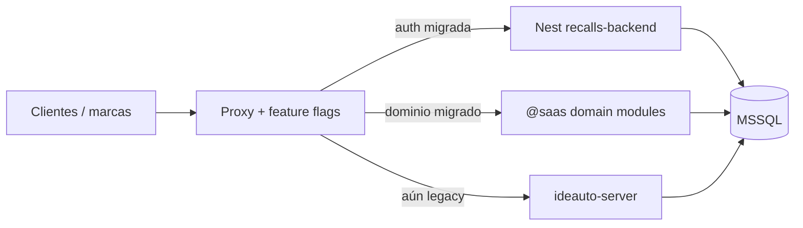

  

<h1 align="center">Recalls — strategy de migración (strangler)</h1>

  <b>Cómo salir del legacy sin apagar el negocio</b>

  
  
  

Cuándo usarla: planificar releases de migración, diseñar el proxy/feature flags, o decidir entre big-bang y strangler.

Complementa el [assessment](./recalls-v2-assessment.md) (el *por qué*) con el *cómo*.

---

## Decisión

**Strangler fig** por slices verticales (API + FE + tests), con MSSQL compartido durante la transición (habilitado por [F83](../plans/rounds/plans-83-eighty-three-round/)).  
Registrada en [ADR 0013](../adr/adr-0013-recalls-strangler-migration.md).

Big-bang se **descarta** mientras existan DGT SOAP, paridad documental y rutas de ficheros legacy.

---

## Flujo objetivo

### Reglas del strangler

1. Un dominio migrado = path(s) enrutados al nuevo backend **y** pantallas Next nuevas (o adaptadas) consumiendo `@saas/*-data-access`.
2. El legacy no recibe features nuevas (solo hotfixes).
3. No migraciones destructivas en tablas compartidas sin dual-write o freeze.
4. Rollback = flag de proxy, no “arreglar en caliente el Nest a medias”.

---

## Fases

| Fase | Slice | Criterio de salida |
|------|-------|--------------------|
| F1 | Auth / users / profiles | Sin endpoints usuarios anónimos; login E2E |
| F2 | Campaigns / waves / VINs | CRUD + upload + oleadas en staging |
| F3 | Budgets / invoices / PDF | Paridad visual firmada |
| F4 | DGT / addresses | Parallel-run sin divergencia golden |
| F5 | Reports / admin / workers | Jobs fuera del proceso API |
| F6 | Cutover | 100% tráfico nuevo; legacy off |

Milestones técnicos M0–M6: [runbooks/recalls-migration.md](../runbooks/recalls-migration.md).

---

## Riesgos

| Riesgo | Mitigación |
|--------|------------|
| DGT no mockeable en prod | Parallel-run + contract tests XML |
| Prisma/MSSQL edge cases | Smoke F83 antes de M2 |
| Doble mantenimiento largo | Ventana acotada; board semanal de cutover |
| Drift de permisos | Matriz authguard → RBAC antes de F1 |

---

## Enlaces

- [recalls-domain-mapping.md](./recalls-domain-mapping.md)
- [F84-B1](../plans/rounds/plans-84-eighty-four-round/1764000021000-f84-migration-strategy.md)
- [nuevo producto e2e](../guides/new-product-e2e-walkthrough.md)
