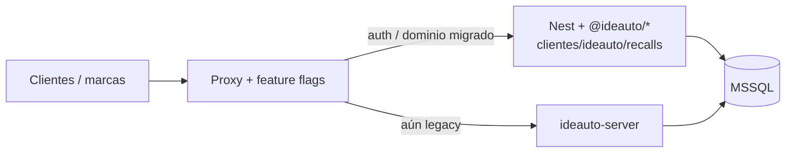

  

<h1 align="center">Recalls — strategy de migración (strangler)</h1>

  <b>Cómo salir del legacy</b> · producto <code>@ideauto/*</code>

  
  
  

Cuándo usarla: releases de migración Ideauto Recalls, proxy/flags, strangler vs big-bang.

---

## Decisión

**Strangler fig** por slices verticales hacia `apps/clientes/ideauto/recalls` + `libs/clientes/ideauto` (`@ideauto/*`). MSSQL compartido durante transición (F83).  
[ADR 0013](../adr/adr-0013-recalls-strangler-migration.md).

Big-bang descartado mientras DGT / PDF / ficheros legacy sigan vivos.

---

## Flujo

### Reglas

1. Slice = API Nest Ideauto + FE Next consumiendo `@ideauto/*-data-access`.
2. Legacy: solo hotfixes.
3. Sin migraciones destructivas en tablas compartidas sin dual-write/freeze.
4. Rollback = flag de proxy.

### Fases

| Fase | Slice |
|------|-------|
| F1 | Auth / users |
| F2 | Campaigns / waves / VINs |
| F3 | Budgets / invoices / PDF |
| F4 | DGT / addresses |
| F5 | Reports / admin / workers |
| F6 | Cutover |

Milestones: [runbooks/recalls-migration.md](../runbooks/recalls-migration.md).

---

## Enlaces

- [recalls-domain-mapping.md](./recalls-domain-mapping.md)
- [nuevo-cliente-checklist.md](../clientes/nuevo-cliente-checklist.md)
