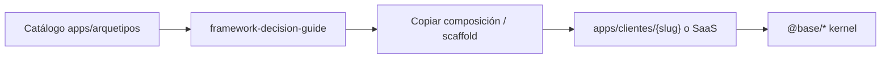

# Arquetipos — plantillas del motor

Cuándo usarla: vas a **crear un producto nuevo** o a **elegir stack** y necesitas
un modelo vivo bajo `apps/arquetipos/`.

> Los arquetipos **no son productos de cliente**. Son demos cableadas sobre `@base/*`
> (libs thin `@arquetipos/*`) para copiar el patrón correcto.



---

## Documentos de esta carpeta

| Doc | Contenido |
|-----|-----------|
| [how-to-use.md](./how-to-use.md) | Cómo usar un arquetipo como modelo de app nueva |
| [catalog.md](./catalog.md) | Inventario apps Nx + puertos + comandos |
| [backend-apps.md](./backend-apps.md) | Monolito, gateway, clients-ms |
| [frontend-apps.md](./frontend-apps.md) | Angular, React, Next, MF |
| [mobile-apps.md](./mobile-apps.md) | Ionic + React Native Expo |
| [parity.md](./parity.md) *(F54-B4)* | Paridad multi-framework + tooling — doc se crea al ejecutar el plan |

Libs thin: [../frontend/arquetipos-thin-libs.md](../frontend/arquetipos-thin-libs.md).  
Decisión de stack: [../architecture/framework-decision-guide.md](../architecture/framework-decision-guide.md).  
Paridad plantillas (plan): [F54-B4](../plans/rounds/plans-54-fifty-four-round/1750000104500-f54-arquetipos-cross-framework-parity.md).

---

## Reglas de oro

1. **Un producto nuevo ≠ clonar todo `apps/arquetipos`.** Elige **un** FE + **un** BE (ADR 0008).
2. Copia **composición** (AppModule / routes / env), no forks del kernel.
3. Overrides en `@arquetipos/*` o en `@acme/*` — nunca edites `@base` “para la demo”.
4. Si el arquetipo falla, **arregla el arquetipo** (es el contrato de calidad del motor).

---

## Árbol físico

```
apps/arquetipos/
├── backend/
│   ├── monolith/api          # multi-tenant demo
│   ├── monolith/api-single   # single-tenant demo
│   ├── gateway/api-gateway
│   └── microservices/clients-ms
├── frontend/
│   ├── angular/{single,multi}-tenant/
│   ├── react/{single,multi}-tenant/
│   ├── nextjs/{next-single,next-multi}/
│   └── angular/microfederation/ + react/microfederation/
└── mobile/
    ├── ionic-{single,multi}/
    └── react-native-{single,multi}/
```

---

## Enlaces

- Hub: [../README.md](../README.md)
- Visión motor + IA: [../architecture/platform-vision.md](../architecture/platform-vision.md)
- Nuevo cliente: [../clientes/nuevo-cliente-checklist.md](../clientes/nuevo-cliente-checklist.md)
