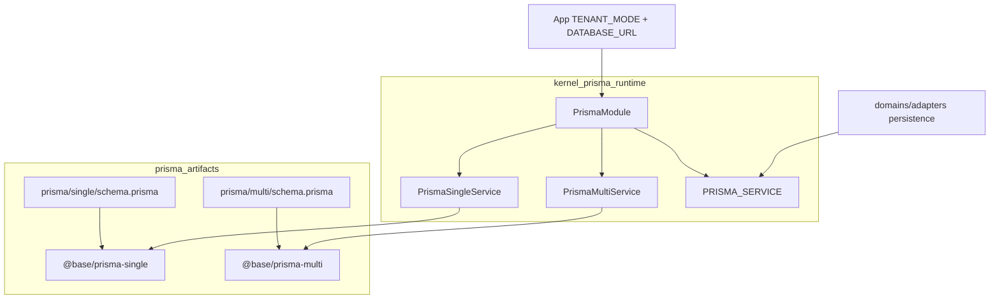
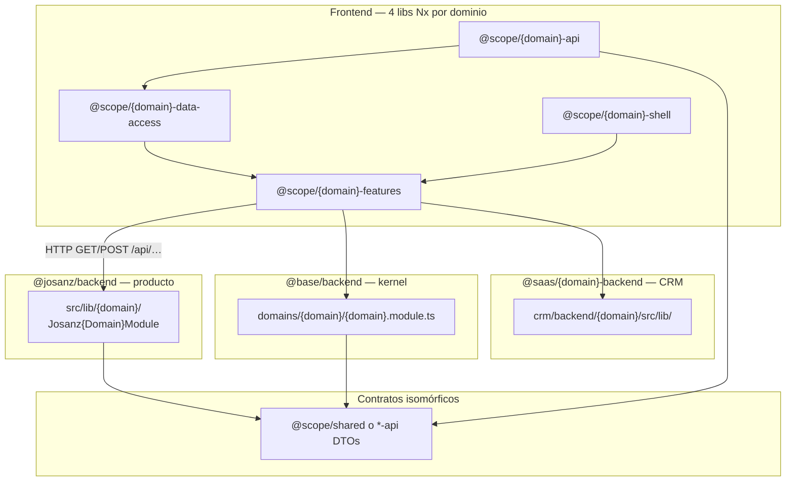

<p align="center">
  
</p>

<h1 align="center">Backend — convención de dominio</h1>

<p align="center">
  
  <a href="../README.md"></a>
</p>


**ID plan:** F7-S6 (`F7-S6.backend-convention`)

Regla general: el **slug de dominio** del frontend (`{domain}` en `@scope/{domain}-*`) debe coincidir con el segmento HTTP (`/api/{domain}`) y con la carpeta o lib backend que expone ese dominio. El backend **no** replica las 4 capas Nx del frontend (`api`, `data-access`, `shell`, `features`).

---

## Apps vs libs

Las apps bajo `apps/*/backend/` son **composition roots** NestJS delgados (`main.ts` → `AppModule`). El código de dominio reutilizable vive en **`libs/{scope}/backend/`** (o en libs por dominio en SaaS CRM).

```
apps/clientes/josanz/backend/          → importa @josanz/backend + @base/backend
apps/arquetipos/backend/monolith/api/  → importa @arquetipos/arquetipos-backend → @base/backend
apps/arquetipos/backend/microservices/clients-ms/ → ClientsModule + bootstrap-env (BD por app)
apps/productos-saas/verifactu-crm-api/ → importa @saas/*-backend
```

Rutas solo de la app (no dominio compartido): `apps/.../backend/src/app/features/` — p. ej. `health`, `auth` (wiring Josanz), `tenant-catalog-theme`.

---

## Base de datos por app (contrato)

Las **libs** exponen dominio y puertos (`REPOSITORY_TOKENS`, `FLEET_VEHICLE_REPOSITORY`, …); los adaptadores Prisma viven en `infrastructure/`. **Nunca** eligen a qué instancia de Postgres conectarse.

Las **apps** son composition roots: importan módulos Nest, fijan `TENANT_MODE` cuando aplica, y en `bootstrap-env.ts` (importado desde `main.ts` **antes** de `AppModule`) llaman a `applyProductDatabaseUrl()` de `@base/backend` para mapear la env del despliegue → `DATABASE_URL`. Así `PrismaModule` sigue usando una sola variable dentro del proceso.

### Topologías

| Topología | Cuándo | Cómo |
|-----------|--------|------|
| **BD común** | Monolito o varios microservicios con el mismo esquema | Misma URL en el deploy (`DATABASE_URL` o la específica de app apuntando al mismo host/DB) |
| **BD por servicio** | Bounded context aislado | Cada app define su env (`CLIENTS_MS_DATABASE_URL`, …); migraciones contra esa BD |

El gateway (`api-gateway`) **no importa** `PrismaModule` — sin persistencia.

### Matriz app × despliegue × BD

| App (Nx) | Forma | Bootstrap | Env (prioridad) | Topología típica |
|----------|-------|-----------|-----------------|------------------|
| `josanz-api` | Monolito producto | `apps/clientes/josanz/backend/src/bootstrap-env.ts` | `JOSANZ_DATABASE_URL` → `DATABASE_URL` | BD única (todos los dominios Josanz + kernel) |
| `api` | Monolito plantilla multi | *(sin bootstrap dedicado)* | `DATABASE_URL` | `arquetipos_multi` |
| `api-single` | Monolito plantilla single | `apps/arquetipos/backend/monolith/api-single/src/bootstrap-env.ts` | `ARQUETIPOS_DATABASE_URL` → `DATABASE_URL` | BD única single-tenant |
| `clients-ms` | Microservicio (gRPC + health) | `apps/arquetipos/backend/microservices/clients-ms/src/bootstrap-env.ts` | `CLIENTS_MS_DATABASE_URL` → `DATABASE_URL` | Compartida con monolith **o** BD dedicada `clients` |
| `api-gateway` | Gateway HTTP | — | — | Sin BD |
| `verifactu-crm-api` | Monolito SaaS | `resolveCrmDatabaseUrl()` | `VERIFACTU_DATABASE_URL` → `DATABASE_URL` | `generic_crm` |

`TENANT_MODE` (single vs multi) es independiente de la topología de BD: lo fija el bootstrap de producto/plantilla (`josanz-api`, `api-single` → `single` por defecto; `api` multi usa `DATABASE_URL` hacia `arquetipos_multi`).

### Prisma: schema artifacts vs Nest runtime

**No son dos Prisma duplicados.** Hay dos *roles* bajo `@base/backend`:

| Path | Rol | Contiene |
|------|-----|----------|
| [`libs/base/backend/prisma/{single,multi}/`](../../libs/base/backend/prisma/) | **Artefactos de schema** | `schema.prisma`, `migrations/`, client generado (`@base/prisma-single` / `@base/prisma-multi`) |
| [`libs/base/backend/src/lib/platform/kernel/prisma/`](../../libs/base/backend/src/lib/platform/kernel/prisma/) | **Runtime Nest** | `PrismaModule`, `PrismaSingleService` / `PrismaMultiService`, token `PRISMA_SERVICE`, `resolve-database-url`, extensiones (PII/audit) |



- **`TENANT_MODE=single|multi`** elige servicio en runtime (`isMultiTenant()`); los repos inyectan `PRISMA_SERVICE`, no el client generado directamente.
- **Dual schema** (`single` vs `multi`) es decisión de modelos/migraciones, no de carpetas runtime — ver [adr-0002](../adr/adr-0002-prisma-multi-single-tenancy.md).
- Migraciones: [database-migrations.md](../runbooks/database-migrations.md).

### Añadir un microservicio nuevo

1. Lib de dominio en `@base/backend` o `@josanz/backend` con puerto + adaptador Prisma.
2. App en `apps/.../backend/microservices/{domain}-ms/` con `AppModule` que importa solo los módulos necesarios + `PrismaModule`.
3. `src/bootstrap-env.ts` con `applyProductDatabaseUrl({ keys: ['{DOMAIN}_MS_DATABASE_URL', 'DATABASE_URL'], label: '{domain}-ms' })`.
4. `main.ts`: `import 'dotenv/config'` → `import './bootstrap-env'` → resto.
5. Documentar fila en esta matriz y en [database-migrations.md](../runbooks/database-migrations.md).

Piloto de puertos en producto: `JosanzFleetModule` (`FLEET_VEHICLE_REPOSITORY` / `PrismaFleetVehicleRepository`). Kernel hexagonal: `ClientsModule` (`REPOSITORY_TOKENS.Client`).

---

## Correspondencia frontend ↔ backend



| Capa frontend | Rol | Backend equivalente |
|---------------|-----|---------------------|
| `{domain}-api` | Tipos/contratos UI | DTOs en `@base/shared`, `@josanz/shared`, `@saas/shared-model` |
| `{domain}-data-access` | Cliente HTTP, store | `*Controller` + `*Service` en módulo Nest del dominio |
| `{domain}-features` / `shell` | UI y rutas | *(sin equivalente — solo cliente)* |

---

## Tres empaquetados backend

### 1. `@base/backend` — kernel hexagonal (excepción histórica)

**Path:** `libs/base/backend/src/lib/`

Solo dos raíces con responsabilidad clara:

```
lib/
  domains/                # bounded contexts (CQRS + ports/adapters)
  crosscutting/           # auth, messaging, sagas, http helpers
  shared/                 # kernel primitives
  integration/            # int-spec scaffolds
  platform/
    kernel/               # runtime Nest imprescindible
      common/             # auth HTTP, tenancy, guards, redis, resilience
      security/           # secrets, encryption, PII
      prisma/             # clientes DB single/multi
    ops/                  # operabilidad
      observability/      # health, metrics, tracing, Sentry
      jobs/               # BullMQ
    adapters/             # outbound tech
      email/
      reports-export/
```

Dominios de negocio (slices verticales bajo `domains/`):

```
domains/<domain>/
  domain/                # entity, errors, mappers (no repository)
  ports/                 # repository port
  application/
    commands/ | queries/ | handlers/
    {domain}.service.ts  # facade → CommandBus / QueryBus
  adapters/
    persistence/         # *.prisma.repository.ts
    http/                # *.controller.ts (+ Nest companions)
  {domain}.module.ts     # composition root
crosscutting/
  auth/                  # HexAuthModule
  messaging/             # event bus, kafka, outbox
  sagas/                 # orquestación multi-dominio
  http/                  # CrudController, AuthedRequest
shared/
  domain/                # Entity, ValueObject, DomainEvent, Repository port
  application/           # UseCase, CrudService, Saga
  adapters/              # PrismaRepository, DomainEventBus
  cqrs/                  # CqrsInfraModule, AI gateways, UnitOfWork
  di/                    # tokens
integration/
  persistence/           # int-specs DB (PrismaRepository tenant scope…)
  messaging/             # int-specs Kafka/outbox
  sagas/                 # int-specs multi-dominio
```

Dominios kernel: `audit`, `billing`, `clients`, `inventory`, `projects`, `roles`, `settings`, `tenants`, `users`.

#### Repositorios Prisma: "thin + include" (F40-B5)

`PrismaRepository` centraliza CRUD + paginación + tenant scoping + soft-delete
vía `TenantQueryBuilder`. Los dominios **no reimplementan** `findPage`/`findById`:
solo aportan `delegate`, `mappers` y, opcionalmente, un `include` y/o lookups por
columna business-key.

- **Hidratar una relación** (p.ej. `users` → `role`): pasa el `include` como
  último argumento del `super(...)`; la base lo aplica en `findAll`, `findPage`,
  `findById`, `findOneByEmail` y `findOneByUnique`. El repo queda "thin":

  ```typescript
  super(prisma.user as PrismaDelegate, toUserDto, toUserCreate, toUserUpdate, ctx, { role: true });
  ```

- **Lookup por columna única** (p.ej. `clients.findByEmail`,
  `settings.findByKey`): delega en el helper genérico `findOneByUnique(column,
  value, tenantId)` de la base, que es siempre tenant-scoped + soft-delete aware
  (F37-H1). No reescribas `scopedWhere` a mano:

  ```typescript
  findByEmail(tenantId: string, email: string) {
    return this.findOneByUnique('email', email, tenantId);
  }
  ```

Regla: ningún repositorio de dominio reimplementa paginación/filtros que ya tiene
la base; solo añade `include` o lookups por columna.

Cross-cutting Nest de plataforma (no hex) sigue en `platform/kernel/common/`:

```
platform/kernel/common/
  auth/            # JWT/OIDC Nest (HexAuth es crosscutting/auth/)
  multi-tenant/    # TenantGuard, context, TENANT_MODE runtime
  roles/           # RolesGuard
  permissions/     # PermissionsGuard, rate-limit
  decorators/      # @Public @Roles @RequirePermission (Nest metadata)
  idempotency/ resilience/ redis/
```

Contratos FE↔BE (Angular + React + Nest) viven en **`@base/shared`**, no aquí:

| Carpeta shared | Audiencia |
|----------------|-----------|
| `tenancy/` | FE ↔ BE (`TenantMode`, `SINGLE_TENANT_SCOPE`) |
| `rbac/` | FE shells + BE guards |
| `shell/` | solo Angular/React (template nav) |
| `contracts/` | HTTP/API shapes FE ↔ BE |
| `{domain}/` | DTOs por bounded context |

Validación: `pnpm check:domain-conventions:strict`. Ver [ai-cqrs-policy.md](../guides/ai-cqrs-policy.md).

**Frontend:** un paquete Nx por dominio (`@base/clients-*`, …) apunta al **mismo** `@base/backend`.

### 2. `@josanz/backend` — extensión producto (patrón canónico)

**Path:** `libs/clientes/josanz/backend/src/lib/{domain}/`

Archivos típicos por dominio producto:

```
{domain}.controller.ts
{domain}.service.ts
{domain}.dto.ts          # opcional si usa @josanz/shared
josanz-{domain}.module.ts  → export Josanz{Domain}Module
```

Re-exporta todo `@base/backend` desde `src/index.ts`. La app `josanz-api` importa módulos base (clients, billing, …) + módulos Josanz.

| Dominio frontend `@josanz/{domain}-*` | Backend |
|---------------------------------------|---------|
| `staff`, `fleet`, `receipts`, `rentals`, `services`, `catalog`, `documents` | `src/lib/{domain}/` |
| `reports` | `platform/adapters/reports-export/` ⚠ slug distinto |
| `clients`, `billing`, `inventory`, `projects`, `settings` | `@base/backend` hex |
| `audit`, `users` | `@base/backend` (frontend thin / directo base) |
| `events`, `dashboard` | Sin módulo Nest dedicado (UI agregada o pendiente) |
| `document-generator` (app SaaS) | `src/lib/document-generator/` (PDF); metadata en `documents/` |

### 3. SaaS CRM — una lib Nx por dominio

**Path:** `libs/productos-saas/crm/backend/{domain}/` → `@saas/{domain}` (nombre en `package.json#name`)

Capas internas (`presentation/`, `application/`, `infrastructure/`, `dto/`), no carpeta única plana.

| Dominio | Lib backend (`package.json#name`) | Frontend |
|---------|-----------------------------------|----------|
| `clients` | `@saas/clients` | `@saas/clients-*` |
| `identity` | `@saas/identity` | identity / auth CRM |
| `invoicing` | `@saas/invoicing-backend` | `@saas/invoices-*` ⚠ slug distinto |
| `verifactu` | `@saas/verifactu` | `@saas/verifactu-*` |

**Legacy en migración:** `libs/productos-saas/crm/node/backend/{domain}/backend/` — objetivo F6-S1: consolidar en `crm/backend/{domain}/`.

**Verifactu adicional:** `libs/productos-saas/verifactu/{adapters,core,crm-core}/` — worker y ledger, no bajo `crm/backend/`.

### 4. `@arquetipos/arquetipos-backend`

Thin re-export de `@base/backend`. Sin dominios propios en backend.

---

## Slugs y desvíos documentados

| Frontend slug | Backend slug | Notas |
|---------------|--------------|-------|
| `reports` | `reports-export` | Mismo feature export PDF; no renombrar sin migración coordinada |
| `invoices` | `invoicing` | Convención ERP/SaaS; frontend `invoices`, API `invoicing` |
| `documents` | `documents` + `document-generator` | Metadata vs export PDF |
| *(ninguno)* | `client` singular | **No usado** — rutas en plural (`/clients`) |

Al añadir un dominio nuevo: elegir **un slug** y usarlo en frontend path, `@scope/{domain}-*`, `@Controller('{domain}')` y carpeta backend.

---

## Checklist — nuevo dominio producto (Josanz)

1. **Shared:** tipos en `@josanz/shared` o extender `@base/shared`.
2. **Frontend:** `libs/clientes/josanz/angular/{domain}/{api,data-access,shell,features}/`.
3. **Backend:** `libs/clientes/josanz/backend/src/lib/{domain}/` + `Josanz{Domain}Module`.
4. **App:** registrar módulo en `apps/clientes/josanz/backend/src/app/app.module.ts`.
5. **Ruta app:** `loadChildren` → `@josanz/{domain}-shell`; HTTP → `/api/{domain}`.

Si el dominio es kernel compartido sin reglas Josanz: solo capas `@base/*` + módulo en `@base/backend` hex.

---

## CQRS Facade pattern (F42-B1 / F43-A1)

`CqrsFacade<TDto>` y `TenantScopedCqrsFacade<TDto>` ahora aceptan **4 tipos genéricos**:

```typescript
CqrsFacade<
  TDto,                        // DTO de respuesta
  TCreateDto = Omit<TDto,'id'>,  // payload create
  TUpdateDto = Partial<TDto>,     // payload update
  TQueryDto = { tenantId?: string } & QueryOptions  // query findPage
>
```

- **Thin domains** (`billing`, `inventory`, `projects`, `roles`, `tenants`): usan los defaults → `CqrsFacade<T>` o `TenantScopedCqrsFacade<T>`.
- **Thick domains** (`clients`, `users`, `settings`): inyectan los 4 parámetros con sus DTOs específicos:
  ```typescript
  export class ClientsService extends TenantScopedCqrsFacade<
    ClientDto, CreateClientDto, UpdateClientDto, ListClientsQueryDto
  > { ... }
  ```
- `findPage` acepta un **objeto query** (`{ tenantId, page, pageSize, sort, order, ... }`) en vez de `(tenantId, options)`. Los controllers construyen el objeto y lo pasan completo.
- `update(id, data, tenantId?)`: la firma base recibe `(id, data, tenantId)`; los thick domains delegan con `override update(id, data, tenantId)`.
- Métodos extra del dominio (`findByEmail`, `sendInviteEmail`) se declaran como métodos propios sin relación con la interfaz base.

Esto elimina los `// @ts-expect-error TS2416` que antes eran necesarios para sobreescribir métodos con DTOs específicos.

## Verificación

```bash
# Type-check backend libs
npx tsc -p libs/clientes/josanz/backend/tsconfig.lib.json --noEmit
npx tsc -p libs/base/backend/tsconfig.lib.json --noEmit
npx tsc -p libs/productos-saas/crm/backend/clients/tsconfig.lib.json --noEmit
```

---

## Enlaces

- [README.md](../README.md) — biblia del monorepo
- [architecture/overview.md](../architecture/overview.md) — mapa mental
- [guides/add-backend-domain.md](../guides/add-backend-domain.md) — receta nuevo dominio
- [AGENTS.md](../../AGENTS.md) — resumen en monorepo
- [josanz-product-exceptions.md](../frontend/josanz-product-exceptions.md) — audit/users/UI
- [arquetipos-thin-libs.md](../frontend/arquetipos-thin-libs.md) — plantillas frontend
- [apps/productos-saas/README.md](../../apps/productos-saas/README.md) — mapa `@saas/*`
- [database-migrations.md](../runbooks/database-migrations.md) — migraciones y env por producto
