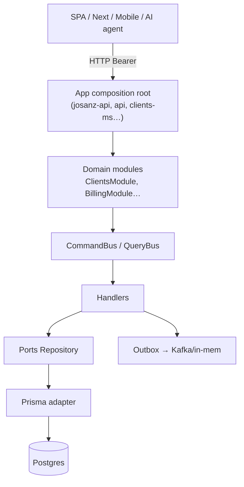

<p align="center">
  
</p>

<h1 align="center">Backend — cómo funciona todo</h1>

<p align="center">
  
  <a href="../README.md"></a>
</p>

Cuándo usarla: entender el camino de una petición y el rol de cada pieza Nest
en este monorepo (no solo “teoría hexagonal”).

---

## 1. Vista de pájaro



| Pieza | Vive en | Responsabilidad |
|-------|---------|-----------------|
| Composition root | `apps/.../backend` | Env, `AppModule`, qué dominios montar |
| Domain module | `libs/.../backend` | Wiring providers del dominio |
| Facade/Service | application edge | Solo `bus.execute` |
| Handler | `application/handlers` | Orquestación + reglas vía domain/ports |
| Port | `ports/` | Interface |
| Adapter Prisma | `adapters/persistence` | SQL |
| Adapter HTTP | `adapters/http` | Controller thin |
| Kernel | `platform/`, `crosscutting/` | Auth, tenant, UoW, messaging, AI gate |

---

## 2. Arranque de una app API

1. `main.ts` / bootstrap Nest.
2. `bootstrap-env.ts` — normaliza `JOSANZ_DATABASE_URL` / `ARQUETIPOS_DATABASE_URL` → `DATABASE_URL`, `TENANT_MODE`, Keycloak realm.
3. `AppModule` importa:
   - `PrismaModule` (single o multi)
   - Dominios `@base/backend` + producto (`@josanz/backend`, …)
   - Auth, health, throttling, etc.
4. Global prefix `/api`.
5. Guards globales: JWT JWKS, tenant (según rutas).

**La app no contiene lógica de “crear cliente”.** Solo compone.

---

## 3. Request autenticada (paso a paso)

Ejemplo: `GET /api/clients?page=1`

1. **Network** — Bearer access token Keycloak.
2. **JwtAuthGuard** — valida firma vía JWKS (fail-closed si no hay claves).
3. **TenantGuard** — resuelve `tenantId` (multi) o no-op (single).
4. **Roles/Permissions** — `@RequirePermission` si aplica.
5. **Controller** — parse query DTO → `clientsService.list(...)`.
6. **QueryBus** → `ListClientsHandler`.
7. **Repository** — `scopedWhere` + Prisma `findMany`/`count`.
8. **Mapper** — entidad → `ClientDto`.
9. **LoggingInterceptor** — JSON con `requestId`, `traceparent`, `tenantId`, `userId`.

Write (`POST`): CommandBus + UoW + Outbox en la misma transacción cuando hay eventos.

Detalle de dominio: [../architecture/domain-lifecycle.md](../architecture/domain-lifecycle.md).

---

## 4. Tres formas de empaquetar backend

| Forma | Path | Cuándo |
|-------|------|--------|
| Kernel monolib | `libs/base/backend` → `@base/backend` | Dominios compartidos |
| Producto flat | `libs/clientes/{slug}/backend/src/lib/{domain}` | Josanz, Ideauto, … |
| SaaS por dominio | `libs/productos-saas/.../{domain}-backend` | CRM Verifactu |

Plantillas: `@arquetipos/arquetipos-backend` thin → base.

Convención slugs/BD: [backend-domain-convention.md](./backend-domain-convention.md).

---

## 5. Infra opcional (resiliencia)

| Dep | Si falta en local |
|-----|-------------------|
| Postgres | Ready 503 — bloqueante |
| Redis | Jobs no-op / idempotencia in-memory |
| Kafka | Outbox reintenta; bus in-memory en monolito |
| Keycloak | 401 en rutas protegidas; health/demo pueden vivir |

Diseña dominios **sin** asumir Redis/Kafka obligatorios para boot.

---

## 6. AI como otro “cliente HTTP”

```
POST /api/ai/query  { "name": "clients.list", "payload": { ... } }
```

- Misma Query que usa el controller humano.
- Agent key + registry por dominio.
- Commands: allow-list vacía por defecto.

Ver [ai-cqrs-policy.md](../guides/ai-cqrs-policy.md) y visión
[platform-vision.md](../architecture/platform-vision.md).

---

## 7. Mapa de apps backend (arquetipos + producto)

| App Nx | Rol |
|--------|-----|
| `josanz-api` | Monolito producto Josanz |
| `api` / `api-single` | Monolito plantilla multi/single |
| `clients-ms` | Microservicio Clients |
| `api-gateway` | Gateway sin BD |
| `verifactu-crm-api` | SaaS CRM |
| `verifactu-worker` | Workers BullMQ |

Catálogo rutas: [SERVICES.md](../../SERVICES.md).  
Plantillas: [../arquetipos/backend-apps.md](../arquetipos/backend-apps.md).

---

## 8. Checklist “entiendo el backend”

- [ ] Sé qué es composition root vs lib de dominio
- [ ] Sé por qué un handler no importa Prisma
- [ ] Sé dónde se elige `DATABASE_URL` y `TENANT_MODE`
- [ ] Sé por qué Nest y no Express en este repo ([why-nest.md](./why-nest.md))
- [ ] Sé cómo un agente AI lee sin poder escribir por defecto

---

## Enlaces

- [why-nest.md](./why-nest.md)
- [../architecture/backend-deep-dive.md](../architecture/backend-deep-dive.md)
- [../guides/local-development.md](../guides/local-development.md)
