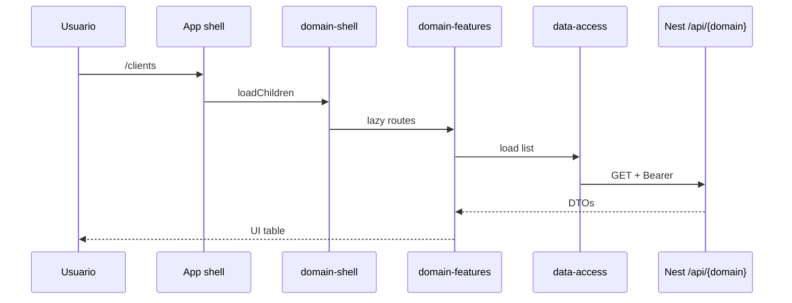

# Frontend — cómo funciona todo

Cuándo usarla: entender capas, apps thin y el flujo de una pantalla sin mezclar
frameworks.

Companion: [../architecture/frontend-deep-dive.md](../architecture/frontend-deep-dive.md),
decisión de stack: [../architecture/framework-decision-guide.md](../architecture/framework-decision-guide.md).

---

## 1. Principio

> Misma **arquitectura de dominio** (api → data-access → features ← ui, shell)
> en Angular, React, Next y mobile. Cambia el runtime, no el mapa mental.

Así la IA y el equipo no reinventan carpetas por framework. Los **arquetipos**
demuestran cada stack; el **producto** elige uno (MVP) u opt-in ([ADR 0008](../adr/adr-0008-platform-scope-vs-mvp-client.md)).

---

## 2. Capas (recordatorio operativo)

| Capa | Pregunta que responde |
|------|----------------------|
| `*-api` | ¿Qué tipos/contratos compartimos? |
| `*-data-access` | ¿Cómo hablamos con HTTP/estado? |
| `*-features` | ¿Qué ve el usuario (pages/layout/smart)? |
| `*-shell` | ¿Cómo se entra por ruta (lazy)? |
| `*-ui` | ¿Qué primitivos visuales usamos? |

Apps (`apps/.../frontend/...`) solo: routes globales, providers, bootstrap.
**No** meten páginas de dominio.

---

## 3. Flujo de una pantalla (CRM)



Errores/auth: kernel `@base/angular-api` o `@base/react-api` (no `alert` en pages).

---

## 4. Stacks presentes en el monorepo

| Stack | Dónde vivir | Rol típico |
|-------|-------------|------------|
| **Angular SPA** | `apps/arquetipos/frontend/angular/*`, Josanz | ERP / backoffice (preferencia fuerte en este motor) |
| **React SPA** | `apps/arquetipos/frontend/react/*` | Misma arquitectura; paridad canario clients |
| **Next.js** | `apps/arquetipos/frontend/nextjs/*` | SSR/SEO/marketing o apps que aprovechen App Router |
| **Ionic** | `apps/arquetipos/mobile/ionic-*` | Híbrido |
| **React Native / Expo** | `apps/arquetipos/mobile/react-native-*` | App nativa (Josanz: mobile > web en algunos casos) |
| **Module Federation** | `mf-host` + remotes | Host Angular + remotes React (opt-in) |

**No hay Vue** en el motor. Añadirlo sería ADR + arquetipo nuevo — no simetría.

Detalle de cuándo elegir qué: [framework-decision-guide](../architecture/framework-decision-guide.md).

---

## 5. UI: tres niveles (importante)

```
@base/native-ui (Lit CE)     ← SoT visual cross-framework (ADR 0010)
        ↓ wrappers Native*
@base/angular-ui / react-ui / next-ui   (+ legacy congelado F53+)
@base/react-native-ui                   ← tokens/API; no Lit
        ↓ marca
@josanz/angular-ui · @arquetipos/*-ui · @saas/shared-ui
```

- **Lit / custom elements** (`@base/native-ui`): una base reutilizable para Angular,
  React, Next, Ionic… sin reimplementar button/input N veces.
- **Wrappers de framework**: API idiomática (inputs Angular, props React) +
  capar/extender el CE (**preferido**).
- **Legacy framework-only en base:** existe, pero **congelado** (F53+); no crecer ahí.
- **Wrappers de producto**: branding ([ui-re-export-vs-wrapper](../guides/ui-re-export-vs-wrapper.md)).

Estrategia + freeze: [ui-strategy.md](./ui-strategy.md). ADRs:
[0010](../adr/adr-0010-native-ui-lit-sot.md),
[0011](../adr/adr-0011-storybook-native-ui-first.md).

---

## 6. Single vs multi tenant (FE)

Las plantillas duplican apps `*-single` / `*-multi`:

- **Single:** una org; branding fijo.
- **Multi:** switcher de tenant / temas por org (demo Helix/Nova style).

El backend elige `TENANT_MODE`; el FE debe alinear realm Keycloak y headers.

---

## 7. Paquetes y dolor típico (paths)

Cada `exports` de paquete FE necesita `paths` en `tsconfig.base.json`:

```bash
pnpm check:exports-paths
```

Sin eso: “raw TS” / module not found en Angular/Vite.  
Doc: [workspace-packages.md](./workspace-packages.md).

---

## 8. Mobile notes

- **Expo + Metro** es el estándar (no RN CLI salvo módulos nativos duros).
- Pin **React 18** en Metro (el monorepo hoist React 19 en web) —
  [add-mobile-domain](../guides/add-mobile-domain.md).
- Si el cliente prioriza mobile (Josanz), el arquetipo RN/Ionic es el modelo;
  la web responsive no sustituye una app.

---

## 9. Checklist “entiendo el frontend”

- [ ] Sé dibujar las 4 capas + shell
- [ ] Sé por qué la app no tiene pages de dominio
- [ ] Sé la diferencia Next vs React SPA en *este* motor
- [ ] Sé qué es `@base/native-ui` vs `@josanz/angular-ui`
- [ ] Sé dónde está el arquetipo del stack que voy a copiar

---

## Enlaces

- [ui-strategy.md](./ui-strategy.md)
- [../arquetipos/README.md](../arquetipos/README.md)
- [design-system.md](./design-system.md)
