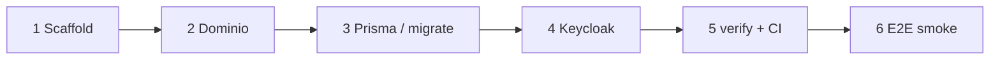

# Walkthrough — nuevo producto de extremo a extremo

Cuándo usarla: primer producto cliente sobre el motor (después de leer
[new-client-product.md](./new-client-product.md) y el checklist).

## Objetivo

En una sola narrativa: scaffold → dominio FE+BE → BD → Keycloak → verify → smoke.



## 1. Scaffold producto

Sigue [nuevo-cliente-checklist.md](../clientes/nuevo-cliente-checklist.md) /
`tools/scripts/scaffold-cliente-product.mjs`.

Resultado esperado: `@acme/shared`, `@acme/backend`, platform FE, app backend + SPA.

## 2. Dominio de negocio

1. Backend hex: [add-backend-domain.md](./add-backend-domain.md) o
   `tools/scripts/new-domain.mjs` / `scaffold-josanz-domain.mjs`.
2. Frontend 4 capas: [add-frontend-domain.md](./add-frontend-domain.md).
3. Slug = carpeta = `@Controller('{slug}')` = ruta `/api/{slug}`.

## 3. Base de datos

1. Elegir `TENANT_MODE=single|multi` ([ADR 0002](../adr/adr-0002-prisma-multi-single-tenancy.md)).
2. Env dedicada en bootstrap (`ACME_DATABASE_URL` o similar).
3. Migrate: [database-migrations.md](../runbooks/database-migrations.md).
4. Seed demo idempotente.

## 4. Auth

1. Realm + client: [keycloak-setup.md](./keycloak-setup.md).
2. Alinear `KEYCLOAK_REALM` app ↔ SPA.
3. Smoke JWKS fail-closed: [auth-jwks-fail-closed.md](./auth-jwks-fail-closed.md).

## 5. Verificación

```bash
pnpm verify:affected
pnpm check:lib-layout
pnpm check:frontend-conventions
pnpm check:ui-ownership
pnpm check:domain-conventions
```

Ver [pr-checklist.md](./pr-checklist.md).

## 6. E2E smoke

Playwright: login + una ruta core del dominio nuevo ([testing-pyramid.md](./testing-pyramid.md)).

## Day-2 (endurecer)

| Tema | Doc |
|------|-----|
| Secrets / PII | [secrets.md](../runbooks/secrets.md) |
| Observabilidad | [observability.md](../runbooks/observability.md) |
| Deploy | [deploy.md](../runbooks/deploy.md) |
| Deprecations | [deprecation-policy.md](./deprecation-policy.md) |
| Microservicio (si aplica) | [add-microservice.md](./add-microservice.md) |

## Verificación final

```bash
pnpm nx serve <acme-api>
pnpm nx serve <acme-spa>
curl -i http://localhost:<api>/api/health/ready
```

## Enlaces

- [architecture/overview.md](../architecture/overview.md)
- ADR [0008](../adr/adr-0008-platform-scope-vs-mvp-client.md)
