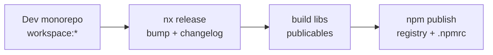

# Publicar libs npm y versionado semver

Cuándo usarla: vas a **versionar o publicar** un paquete `@base/*` (u otro
scope publicable) fuera del monorepo, o a configurar registry / Nx Release.

> **Estado:** en construcción — tooling previsto en **F51-E1** y cierre/carry
> en **F52-A1**. Hasta que existan `.npmrc.example`, config `release` en
> `nx.json` y dry-run documentado, **no publiques** desde CI improvisado.

## Idea / contexto

Dentro del monorepo las libs usan `"version": "0.0.0"`, a menudo `"private": true`
y dependencias `workspace:*`. Eso es correcto para apps internas. Publicar
exige:

1. Decidir qué paquetes son **publishable** vs siempre private (apps, shells de
   producto, Storybook, tooling).
2. Semver alineado con [deprecation-policy.md](./deprecation-policy.md).
3. Sustituir `workspace:*` en el **artefacto** por rangos semver reales
   (Nx Release / pnpm lo hacen en el flujo de publish — no a mano en git).
4. `peerDependencies` para frameworks (Angular, React, RxJS); `dependencies`
   entre `@base/*` publicables.

Diseño de referencia (planes):
[F51-E1](../plans/rounds/plans-51-fifty-one-round/1750000067000-f51-npm-publish-and-lib-versioning.md),
[F52-A1](../plans/rounds/plans-52-fifty-two-round/1750000070000-f52-carry-npm-publish-and-versioning.md).



## Pasos (cuando el tooling exista)

1. Copiar `.npmrc.example` → `.npmrc` local (o secrets CI). **Nunca** commitir tokens.
2. Confirmar tags Nx `publishable` en la oleada canario (`@base/shared`, UI,
   dominio canario — ver plan E1).
3. Dry-run: `pnpm nx release --dry-run` (o el comando que deje el Resultado E1/A1).
4. `npm pack` / inspect del tarball: sin `workspace:*`, `files` correctos.
5. Publish solo al registry acordado (`@base:registry=…`).

Oleada **no** incluye por defecto `@josanz/*` ni `@saas/*` a npm público.

## Verificación

```bash
# Cuando existan scripts/targets:
# pnpm nx release --dry-run
pnpm check:exports-paths
pnpm check:deprecated
# Tras F52-A2:
pnpm check:workspace-deps:strict
```

## Enlaces

- [deprecation-policy.md](./deprecation-policy.md) — semver de paquetes
- [api-versioning.md](./api-versioning.md) — versionado HTTP (distinto)
- [frontend/workspace-packages.md](../frontend/workspace-packages.md) — `workspace:*` interno
- [runbooks/pnpm-layout.md](../runbooks/pnpm-layout.md)
- [plans F51-E1](../plans/rounds/plans-51-fifty-one-round/1750000067000-f51-npm-publish-and-lib-versioning.md)
- [plans F52-A1](../plans/rounds/plans-52-fifty-two-round/1750000070000-f52-carry-npm-publish-and-versioning.md)
