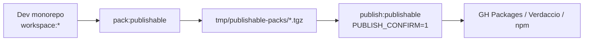

# Publicar libs npm y versionado semver

Cuándo usarla: vas a **versionar o publicar** un paquete `@base/*` (u otro
scope publicable) fuera del monorepo, o a configurar registry / Nx Release.

> **Estado (F51-E1 + F52-A1):** tooling canario listo. Pack dry-run local y
> workflow manual [Release publishable](../../.github/workflows/release-publishable.yml).
> Publish real exige `NPM_TOKEN` (o GH Packages) + `PUBLISH_CONFIRM=1` /
> `confirm=publish`. **Nunca** en `pull_request`.

## Idea / contexto

Dentro del monorepo las libs usan a menudo `"private": true` y deps
`workspace:*`. Eso es correcto para apps internas. Publicar exige:

1. Decidir qué paquetes son **publishable** vs siempre private (apps, shells de
   producto, Storybook, tooling).
2. Semver alineado con [deprecation-policy.md](./deprecation-policy.md).
3. Sustituir `workspace:*` en el **artefacto** por rangos semver reales
   (`pack-publishable.mjs` / Nx Release).
4. `peerDependencies` para frameworks; `dependencies` entre `@base/*` publicables.



## Matriz canario

| Decisión | Valor |
|---------|--------|
| Mode | Independent (`projectsRelationship: independent`) |
| Filtro | `tag:publishable` |
| Oleada | `@base/shared`, `@base/native-ui`, `@base/angular-ui` @ `0.1.0` |
| Peers Angular UI | `@angular/common|core|router` ^21, `rxjs` ^7.8 |
| Peers Ionic UI | `@angular/*` ~21.2, `@ionic/angular` ^8.5 |
| Peers RN UI | `react`/`react-dom` **18.3.1**, `react-native` 0.76.9 |
| Producto | `@josanz/*` / `@saas/*` — **no** publicar sin acuerdo |

## Auth / registry

1. Copiar [`.npmrc.example`](../../.npmrc.example) → `.npmrc` local (gitignored).
2. Secret CI: `NPM_TOKEN` (PAT `write:packages` para GH Packages, o token npmjs).
3. Smoke: `npm whoami --registry <url>`.

### Verdaccio local (smoke sin CI)

```bash
npx --yes verdaccio
# otra terminal, con .npmrc apuntando a http://127.0.0.1:4873
pnpm pack:publishable
PUBLISH_CONFIRM=1 pnpm publish:publishable
```

## Comandos

```bash
pnpm nx show projects --projects=tag:publishable
pnpm check:publishable-deps
pnpm pack:publishable
pnpm publish:publishable              # dry-run (no upload)
PUBLISH_CONFIRM=1 pnpm publish:publishable   # upload real

# GitHub Actions → Actions → "Release publishable"
# dry_run=false + confirm=publish
```

## Reglas deps / peers

| Tipo | Dónde |
|------|--------|
| Framework (`@angular/*`, `react`, `rxjs`, Ionic) | `peerDependencies` |
| Otro `@base/*` publicable | `dependencies` + `workspace:*` en monorepo |
| En el tarball | `workspace:*` → `^versión` |
| Import a private no-publishable | Prohibido (`check:publishable-deps`) |

## CI

| Evento | Comportamiento |
|--------|----------------|
| `pull_request` | Sin publish. Opcional: `check:publishable-deps` en hygiene |
| `workflow_dispatch` Release publishable | Pack + artifact; publish solo con confirm |
| Push de tag / cron | No cableado (evitar publish accidental) |

## Rollback

1. No borrar versiones ya publicadas si hay consumidores.
2. Publicar `patch`/`minor` correctivo o `npm deprecate`.
3. Changelog del paquete.

## Verificación

```bash
pnpm check:publishable-deps
pnpm pack:publishable
pnpm publish:publishable
pnpm check:exports-paths
pnpm check:deprecated
```

## Enlaces

- [F51-E1](../plans/rounds/plans-51-fifty-one-round/1750000067000-f51-npm-publish-and-lib-versioning.md)
- [F52-A1](../plans/rounds/plans-52-fifty-two-round/1750000070000-f52-carry-npm-publish-and-versioning.md)
- [deprecation-policy.md](./deprecation-policy.md)
- [add-mobile-domain.md](./add-mobile-domain.md) — Metro pin React 18
