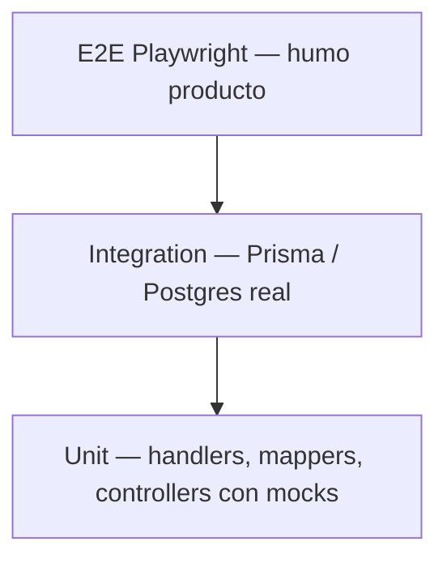

# Pirámide de tests

Cuándo usarla: antes de escribir specs, elegir nivel (unit / integration / e2e) o usar harnesses del backend.

## Pirámide



| Nivel | Dónde | Qué prueba | Bloquea PR diario |
|-------|-------|------------|-------------------|
| **Unit** | `libs/**/*.spec.ts` | Handlers CQRS (ports mock), mappers, controllers (harness), UI logic | Sí |
| **Integration** | `*.int-spec.ts` + `jest.integration.config.ts` | Repos Prisma + tenant anti-fuga | CI opcional / nightly; local con Postgres |
| **E2E** | `*-e2e/playwright.config.*` | Login + 1–2 rutas core por producto | Smoke en CI |

Detalle de handlers: [backend-use-case-tests.md](./backend-use-case-tests.md).

---

## Backend — qué testear dónde

| Capa hexagonal | Test | Herramienta |
|----------------|------|-------------|
| `domain/` | Specs puros (sin Nest) | Jest |
| `application/handlers/` | Unit con **ports mock** | Jest + mocks |
| `adapters/http/` | Controller thin vía **harness** | `buildControllerTestModule` |
| `adapters/persistence/` | Unit con delegate mock + **anti-fuga**; int con BD | `makeCrudDelegate` / `describeAntiFuga` |

**Handlers no importan Prisma** — gate `pnpm check:domain-conventions`.

### Harness de controllers

Exportado desde `@base/backend`:

```ts
import { buildControllerTestModule } from '@base/backend';

const { controller, req, service } = await buildControllerTestModule({
  controller: ClientsController,
  providers: {
    ClientsService: { list: jest.fn(), create: jest.fn() },
  },
  guards: { jwt: JwtAuthGuard, tenant: TenantGuard },
});
```

Overrides de guards → `canActivate: () => true`. El `req` trae `tenantId` de demo.

### Harness de repos Prisma

```ts
import { makeCrudDelegate, describeAntiFuga } from '@base/backend';

describeAntiFuga('ClientsPrismaRepository', {
  sampleRow: { id: 'r1', tenantId: 'tenant-A', name: 'Acme' },
  repoFactory: (delegate) => new ClientsPrismaRepository(delegate as never, ctx),
});
```

Garantiza que `findById` añade `tenantId` al `where` (multi-tenant).

---

## Frontend

| Tipo | Convención |
|------|------------|
| Unit componentes / features | Jest + Testing Library donde el proyecto ya lo tenga |
| No mockear UI de otra capa | Features usan `@scope/*-ui`; no HTML crudo |
| E2E | Playwright por app (`josanz-e2e`, `mf-host-e2e`, …) — login + ruta canario |

---

## Comandos

```bash
# Unit @base/backend
pnpm exec jest -c libs/base/backend/jest.config.cts

# Coverage gate (audit / settings / tenants) — F51-A3
pnpm test:cov
pnpm test:cov:check
pnpm test:cov:domains

# Affected (preferido)
pnpm test:affected

# Integration (requiere Postgres en :5440)
pnpm exec jest -c libs/base/backend/jest.integration.config.ts

# E2E Josanz
pnpm exec playwright test -c apps/clientes/josanz/frontend/josanz-e2e/playwright.config.mts --project=chromium
```

Si `nx test` cuelga: [nx-daemon.md](../runbooks/nx-daemon.md) o jest directo.

---

## Umbrales de cobertura

| Scope | Statements / functions / lines | Branches |
|-------|--------------------------------|----------|
| `@base/backend` domains **audit / settings / tenants** (F51-A3) | ≥ **80%** | ≥ **65%** |
| Resto `@base/backend` (orientativo) | ≥ 70% | — |
| Apps / libs producto (orientativo) | ≥ 60% | — |

**Cómo medir (F51-A3):**

1. Desde la raíz: `pnpm test:cov:check` (usa `libs/base/backend/jest.config.cts`).
2. Resumen en consola (`text-summary`) + `coverage/libs/base/backend/lcov.info`.
3. Si falla el umbral: mirar tabla por archivo; rellenar specs o documentar exclusión
   en el plan / este guide (crypto `audit-hash`, Nest `audit.extension`, entity,
   Prisma repos → int-specs).

Gate CI estricto: diferido a F52 cuando el harness local/CI midan igual.

---

## Anti-patrones

- Copiar el árbol CQRS entero a una plantilla en vez de extender facade / token.
- Integration tests como único gate diario (lentos, frágiles sin BD).
- Controllers gordos sin test de handler (la lógica debe vivir en application/).
- E2E que reimplementan reglas de negocio ya cubiertas en unit.

## Verificación

```bash
pnpm exec jest -c libs/base/backend/jest.config.cts --passWithNoTests=false
pnpm test:cov:check
pnpm check:domain-conventions
```

## Enlaces

- [backend-use-case-tests.md](./backend-use-case-tests.md)
- [pr-checklist.md](./pr-checklist.md)
- ADR [0009 CQRS](../adr/adr-0009-cqrs-nest.md)
