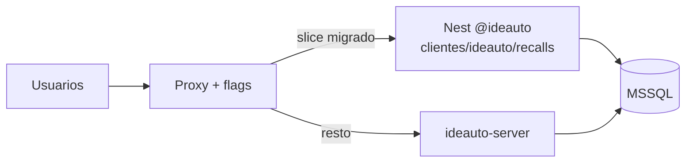

  

<h1 align="center">Strategy — strangler fig</h1>

  
  

> **Resumen de producto.** Canónico técnico (fases, riesgos, detalle):  
> [architecture/recalls-migration-strategy.md](../../architecture/recalls-migration-strategy.md).

---

## Decisión

Migrar **dominio a dominio** detrás de un proxy / feature flags. El legacy sigue vivo hasta el cutover (M6). Big-bang descartado.

Registrado en [ADR 0013](../../adr/adr-0013-recalls-strangler-migration.md).

---

## Por qué no big-bang

1. DGT es sistema externo (parallel-run obligatorio).  
2. Paridad PDF / cartas es visual y legal.  
3. 59 migraciones + ficheros en disco no caben en un corte.  
4. Rollback debe ser minutos, no restore de fin de semana.

---

## Flujo

### Reglas

1. Un slice = API Nest + FE Next + tests.  
2. Legacy: solo hotfixes.  
3. Sin migraciones destructivas en tablas compartidas sin dual-write/freeze.  
4. Rollback = cambiar flag.

### Fases de negocio

| Fase | Slice |
|------|-------|
| F1 | Auth / users / profiles |
| F2 | Campaigns / waves / VINs |
| F3 | Budgets / invoices / PDF |
| F4 | DGT / addresses |
| F5 | Reports / admin / workers |
| F6 | Cutover |

Milestones técnicos: [milestones.md](./milestones.md).

---

## Enlaces

- [risks-and-rollback.md](./risks-and-rollback.md)  
- [F84-B1](../../plans/rounds/plans-84-eighty-four-round/1764000021000-f84-migration-strategy.md)
