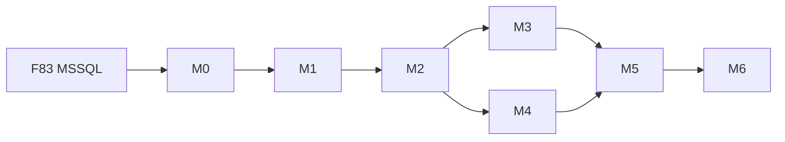

<p align="center">
  
</p>

<h1 align="center">Milestones M0–M6</h1>

<p align="center">
  <b>Ejecución · gates · estado</b>
</p>

<p align="center">
  <a href="./README.md"></a>
  <a href="../../runbooks/recalls-migration.md"></a>
</p>

Operativa detallada: [runbooks/recalls-migration.md](../../runbooks/recalls-migration.md).

---

## Tablero

| M | Nombre | Gate de salida | Estado |
|---|--------|----------------|--------|
| **M0** | Setup Ideauto + apps recalls | stubs `@ideauto/*` + apps Nx; layout check; tags `layer:clientes` | **hecho (scaffold)** |
| **M1** | Auth | Login E2E; sin usuarios anónimos | pendiente |
| **M2** | Campaigns / Waves | CRUD + VIN upload + oleada staging | pendiente |
| **M3** | Budgets / Invoices / PDF | PDF paridad firmada | pendiente |
| **M4** | DGT / Addresses | Parallel-run + fixtures XML | pendiente |
| **M5** | Reports / Admin / Workers | Exports + jobs fuera del API | pendiente |
| **M6** | Cutover | 100% tráfico nuevo; 72h estables | pendiente |

---

## M0 — detalle (actual)

### Objetivo

Dejar el esqueleto del cliente Ideauto y la app Recalls en el monorepo.

### Acciones

```bash
node tools/scaffolds/scaffold-cliente-product.mjs --slug ideauto --scope ideauto
# Composition roots bajo apps/clientes/ideauto/recalls/{backend,frontend}
# paths @ideauto/* en tsconfig.base.json
pnpm install
node tools/checks/check-lib-layout.mjs --strict
```

### Done when

- [x] Doc producto en `docs/ideauto/recalls/`  
- [x] Libs stub: `@ideauto/shared`, `@ideauto/backend`, `@ideauto/angular-ui`, `@ideauto/platform-{api,data-access,shell}`  
- [x] Apps stub: `ideauto-recalls-api`, `ideauto-recalls-web` bajo `apps/clientes/ideauto/recalls/{backend,frontend}`  
- [x] Paths `@ideauto/*`  
- [x] `check-lib-layout` verde · `pnpm install` OK  

> **Nota:** M0 = esqueleto vacío (serve imprime stub). Nest/Next cableados + Prisma→MSSQL entran en M1+.

---

## Dependencias entre milestones



M4 (DGT) puede ir en paralelo a M3 tras M2, con cuidado de no compartir PRs conflictivas.

---

## Enlaces

- [migration-strategy.md](./migration-strategy.md)  
- [m0-m6](../migration/m0-m6-execution.md)  
- [stakeholders/pm.md](./stakeholders/pm.md)
