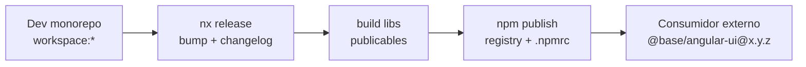

# F51-E1 — Publicación npm, `.npmrc` y versionado de libs (`@base` / UI / dominio)

## Estado

listo para ejecutar

## Objetivo

Hoy las libs viven en monorepo con `"version": "0.0.0"`, `"private": true` y
`workspace:*`. Eso basta para apps internas, pero **no** hay:

1. Registro npm (privado o público) + `.npmrc` / auth CI.
2. Sistema de **versionado semver** coherente con
   [deprecation-policy.md](../../../guides/deprecation-policy.md).
3. Contrato de **dependencias publicables** (qué va en `dependencies` /
   `peerDependencies` / `devDependencies`) para que un build de app o lib
   sepa de qué paquetes depende y a qué rango de versión.
4. Pipeline de **release + publish** (Nx Release o equivalente) para scopes
   publicables: UI (`@base/angular-ui`, `@base/native-ui`, …), dominio
   (`@base/clients-*`, …), kernel (`@base/shared`, `@base/backend`, …).

## Contexto actual

| Pieza | Estado |
|-------|--------|
| Política semver (docs) | Existe (F44) — no cableada a tooling |
| `nx.json` → `release` | Ausente |
| `.npmrc` raíz | Ausente |
| Libs `package.json` | `private: true`, `version: 0.0.0`, `workspace:*` |
| Grafo deps workspace | `check:workspace-deps` + pnpm — solo interno |

## Alcance (qué sí / qué no)

**Sí (esta ronda o F52 si se parte):**

- Inventario de paquetes **candidatos a publicar** vs **siempre private** (apps,
  shells de producto, storybook, tooling).
- Diseño de versionado: **independent** (recomendado en monorepos grandes) vs
  fixed group `@base/*`.
- `.npmrc` + secretos CI (`NPM_TOKEN` / registry URL).
- `publishConfig` + `files` + target `build`/`nx-release-publish` en libs
  publicables.
- Sustitución de `workspace:*` en el **artefacto publicado** por rangos semver
  reales (pnpm/`nx release` lo hacen en publish; documentar el flujo).
- Guía operativa: `docs/guides/npm-publish-and-versioning.md`.
- Tag Nx `publishable` + gate opcional `check:publishable-deps`.

**No (defer):**

- Publicar `@josanz/*` / `@saas/*` a npm público sin decisión de producto.
- Migrar consumidores externos ya existentes (no hay).
- Cambiar política semver de API HTTP (ya en `api-versioning.md`).

## Diseño propuesto (borrador a validar en Resultado)

| Decisión | Recomendación inicial |
|---------|----------------------|
| Versioning mode | Independent por paquete (Nx Release) |
| Primera oleada | `@base/shared`, `@base/native-ui`, `@base/angular-ui`, `@base/react-ui`, 1 dominio FE canario (`clients-api` + `clients-data-access`) |
| Registry | Configurable vía `.npmrc` (`@base:registry=…`); GH Packages o Verdaccio local en smoke |
| Peers | Framework (`@angular/*`, `react`, `rxjs`) → `peerDependencies`; `@base/*` entre sí → `dependencies` con rango |
| Apps | Siguen `workspace:*` en monorepo; no se publican |

## Tareas

### E1.1 — Inventario y política de publicables

1. Listar libs por scope (`@base`, `@arquetipos`, `@josanz`, `@saas`) y marcar
   `publishable | private | defer`.
2. Añadir tag Nx `publishable` (o `npm:public`) en `package.json` / `project.json`.
3. Documentar matriz en la guía nueva.

### E1.2 — `.npmrc` + auth

1. Crear `.npmrc.example` (sin tokens) con:
   - scope → registry
   - `always-auth=true` donde aplique
   - nota de `NPM_TOKEN` / OIDC
2. Documentar `.npmrc` local (gitignored si lleva token) y secrets CI.
3. Smoke: `npm whoami --registry <url>` o login GH Packages en CI dry-run.

### E1.3 — Versionado en `package.json` + Nx Release

1. Configurar `release` en `nx.json` (projects filter `tag:publishable`,
   changelog, conventional commits o conventional bumps).
2. Script root: `pnpm release:version` / `pnpm release:publish` (nombres a fijar).
3. Primera versión canario `0.1.0` (o `1.0.0-alpha.0`) en oleada E1.1.
4. Asegurar que el publish **reescribe** `workspace:*` → versiones concretas
   en el tarball (verificar con `npm pack` + inspeccionar `package.json`).

### E1.4 — Dependencias explícitas para build/publish

1. Auditar libs publicables: toda import de otro `@base/*` declarada en
   `dependencies` o `peerDependencies` (alineado con
   `check:workspace-deps:strict`).
2. Definir regla: frameworks = peers; paquetes del mismo scope publicados =
   deps con `^x.y.z` en el artefacto; en monorepo seguir `workspace:*` en
   source `package.json` (Nx Release actualiza al publicar).
3. Opcional: script `check:publishable-deps` que falle si una lib `publishable`
   importa un paquete sin declaración o importa uno `private` no transitivo.

### E1.5 — Build + publish dry-run

1. Targets `build` (o `package`) en libs de la oleada canario.
2. `nx release publish --dry-run` (o `npm pack` por lib).
3. CI job opcional `release` (manual / tag) — no publicar en cada PR.

### E1.6 — Docs

1. Guía `docs/guides/npm-publish-and-versioning.md` (pasos, registry, bump,
   publish, rollback).
2. Enlazar desde [guides/README.md](../../../guides/README.md),
   [deprecation-policy.md](../../../guides/deprecation-policy.md) y hub.
3. Actualizar F51-D1 / hub al cerrar.

## Orden sugerido

1. E1.1 inventario (bloquea el resto).
2. E1.2 `.npmrc` + secretos.
3. E1.3 Nx Release + versiones iniciales.
4. E1.4 deps / peers / check.
5. E1.5 dry-run pack/publish.
6. E1.6 docs.

## Dependencias de ronda

- **F51-A1** (pnpm install verde) — necesario antes de tocar lockfile / nuevos
  scripts de release.
- Política semver F44 — no reabrir; solo cablear tooling.

## Riesgos

- Publicar con `workspace:*` sin reescritura → consumidores rotos.
- Peers mal puestos → duplicate Angular/React en apps externas.
- Scope `@josanz` / `@saas` en registry público sin acuerdo legal/producto.
- Nx Release independent + muchos paquetes → ruido de changelog; mitigar con
  grupos o primera oleada pequeña.

## Criterios de aceptación

- [ ] Inventario publishable vs private documentado.
- [ ] `.npmrc.example` + guía de auth CI/local.
- [ ] `nx.json` `release` (o alternativa documentada) operativa en dry-run.
- [ ] Al menos **3 libs** de la oleada canario: `npm pack` con versiones semver
      y deps sin `workspace:*` en el tarball.
- [ ] Regla deps/peers escrita y chequeable (script o checklist CI).
- [ ] Guía `npm-publish-and-versioning.md` enlazada desde guides + deprecation.
- [ ] Ningún publish accidental en PRs (job manual / tag).
