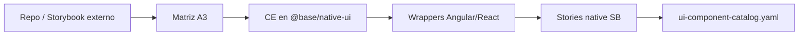

  

<h1 align="center">F54-A2 — Oleadas de import UI externos → Lit (`@base/native-ui`)</h1>

  
  

## Estado

completado

## Objetivo

F53-A3 deja **inventario + piloto**. F54 ejecuta **oleadas** de port a Lit CE
+ wrappers + stories + catálogo YAML.

## Prerrequisitos

- Inventario F53-A3 priorizado (o re-hacer snapshot al día 1).
- Paths/repos fuente accesibles (documentar credenciales/licencia).

## Diseño de oleada

Cada oleada = 3–8 componentes del mismo dominio visual (forms, feedback,
navigation, data-display).

### Definition of Done por componente

1. CE registrado + tipos exportados.
2. Tests smoke (atributos / eventos).
3. Story CSF en SB native-ui.
4. Wrappers Angular + React (salvo exclusión).
5. Fila en catálogo YAML + ownership.
6. Changelog breve en Resultado de oleada.

## Tareas

1. Confirmar top-10 del inventario F53; cortar oleada 1 (P0).
2. Port Lit (Shadow DOM, tokens CSS vars del design system).
3. Wrappers + stories + YAML.
4. Oleada 2 si cabe en la ronda; resto → lista F55.
5. Rechazos documentados (licencia, solape con CE existente, RN-only).

## Criterios de aceptación

- [ ] ≥ 1 oleada completa (DoD × N componentes, N≥3 preferible).
- [ ] Cero primitivos framework-only nuevos en base por este import.
- [ ] Stories visibles en `nx storybook base-native-ui`.
- [ ] Backlog residual listado para F55.
