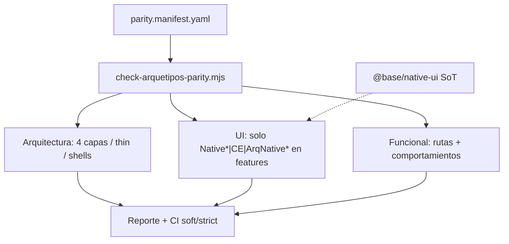

# F54-B4 — Paridad arquetipos entre frameworks + herramientas de control

## Estado

completado

## Objetivo

Las plantillas `apps/arquetipos/**` + libs `@arquetipos/*` (Angular / React /
Next / Ionic / RN × single|multi) deben ser **lo más parecidas posible** en
**tres ejes** (no solo “mismas pantallas”):

| Eje | Qué significa | Cómo se consigue |
|-----|---------------|------------------|
| **1. Arquitectura** | Mismo mapa mental: 4 capas por dominio (`api` → `data-access` → `features` ← `ui`), shells lazy, apps thin, libs thin re-export `@base/*` | Misma forma de carpetas / tags / convenciones; checker de layout+dominios |
| **2. Visual** | Mismos átomos y tokens | **Todos** consumen `@base/native-ui` vía wrappers `Native*` / `ArqNative*` / CE (ADR 0010). No UI inventada por stack |
| **3. Funcional** | Mismos flujos demo, rutas, estados empty/error/loading, mismos DTOs | Manifest de rutas + tests/comportamiento canario |

Si F53/F54 hacen que las features usen native-ui, la paridad **visual** entre
Angular y React (y hosts DOM) es en gran parte **automática**. El trabajo de B4
es (a) **exigir** ese uso en plantillas, (b) **igualar la arquitectura**, y
(c) **medir** drift funcional.

Hoy la paridad es **puntual** (canario clients Angular↔React en
[dual-stack-clients-parity.md](../../../frontend/dual-stack-clients-parity.md)).
Falta un **marco + tooling** continuo (CI soft → strict).

**Fuera de alcance:** forzar Lit en el árbol RN (sí arquitectura 4 capas +
tokens/`@base/react-native-ui` alineado); identidad Josanz/SaaS (solo
arquetipos).

## Principio (contrato)

```
Misma arquitectura (ADR 0006 + thin libs)
        +
Misma SoT visual (@base/native-ui + wrappers)   ← ADR 0010 / F53
        +
Mismos flujos/contratos demo
        =
Plantillas arquetipos intercambiables como “mapa”, distinto solo el runtime
```

**No** es aceptable: Angular con `ButtonComponent` legacy, React con otro
markup, Next con HTML suelto — si el átomo existe en native-ui.

## Contexto / baseline

| Dimensión | Hoy | Gap |
|-----------|-----|-----|
| Capas FE | 4 capas (ADR 0006); thin libs documentadas | No hay matriz “dominio X existe en todos los stacks full” |
| UI | Native SoT + freeze (ADR 0010); wrappers incompletos | Features arquetipos aún pueden usar legacy / no-Native |
| Clients Angular↔React | Specs data-access | Solo un dominio; no rutas ni arquitectura cross-stack |
| Next / Ionic / RN | Demos | Partial; sin checklist arquitectura+UI vs SPA |
| Automatización | `check-lib-layout`, conventions, ownership | No hay `check:arquetipos-parity` |

Relacionado: [arquetipos-thin-libs.md](../../../frontend/arquetipos-thin-libs.md),
F53-A1/A2/C1, F54-A1/B1/B2/C1.

## Diseño propuesto



### 1) Paridad arquitectónica (obligatoria en stacks Full)

Para cada `canary_domain` y cada stack **Full** (Angular/React SPA):

- Existen libs `@arquetipos/{angular|react}-{domain}-{api,data-access,shell,features}`
  (o el naming canónico del stack) con **4 capas**.
- Default thin → `@base/*` ([arquetipos-thin-libs](../../../frontend/arquetipos-thin-libs.md)).
- App: solo routes/providers; `loadChildren` / lazy → shell → features.
- Misma forma `layout/` `pages/` `components/` en features (ADR 0006).

Checker: reutilizar / componer `check-lib-layout` + inventario de dominios del
manifest (fail si falta capa o dominio en un stack Full).

### 2) Paridad visual = native-ui (no “preferir”: **usar**)

En features/shells de plantilla (DOM hosts):

| Permitido | No permitido (nuevo) |
|-----------|----------------------|
| `Native*`, `ArqNative*`, tags `base-*` | Primitivos framework-only de `@base/*-ui` legacy |
| Marca `@arquetipos/*-ui` que wrappea Native/CE | HTML/CSS de átomos ya cubiertos por native-ui |

RN: componentes `@base/react-native-ui` / arquetipos RN-ui con **mismos nombres
de API/tokens** (F54-B2); no Lit.

El checker de imports UI de B4 se alinea con F53-C2 / F54-C1 (misma allowlist
legacy, ratchet).

### 3) Paridad funcional

- Mismos `required_routes` / flujos (auth → clients → …).
- Mismos contratos `@base/shared` / behavior empty-error (dual-stack clients).
- Smoke Playwright opcional (misma secuencia en 2+ stacks).

### Manifest (fuente de verdad)

```yaml
version: 1
canary_domains: [auth, clients, users, audit]
architecture:
  required_layers: [api, data-access, shell, features]
  thin_default: true
  feature_shape: [layout, pages, components]
ui:
  policy: native-first   # ADR 0010 — obligatorio en plantillas
  allowed_import_patterns:
    - "@base/native-ui"
    - "Native*"
    - "ArqNative*"
    - "@arquetipos/arquetipos-*-ui"  # si solo wrappea native
  forbidden_new_in_features:
    - "ButtonComponent"   # ejemplos legacy base — lista desde allowlist F53
stacks:
  angular-single: { parity_level: full, ... }
  react-single: { parity_level: full, ... }
  next-single: { parity_level: core, ... }
  ionic-single: { parity_level: mobile, ... }
  rn-single: { parity_level: token, ... }
required_routes: [...]
parity_rules:
  - { id: arch-four-layers, type: architecture }
  - { id: ui-native-only, type: ui-import }
  - { id: clients-empty-error, type: behavior, ref: dual-stack-clients-parity.md }
```

### Herramientas

| Script / target | Qué controla |
|-----------------|--------------|
| `pnpm check:arquetipos-parity` | Manifest → arch + UI + funcional |
| Capas / dominios | Presencia 4 capas thin por stack Full |
| Imports UI | Features arquetipos → native wrappers/CE |
| Rutas | `*.routes` vs manifest |
| Visual (fase 2) | Playwright multi-stack **o** screenshots (menos crítico si todos usan Lit) |
| Reporte | `docs/arquetipos/parity-report.md` + artifact CI |

### Niveles por stack

| Nivel | Stacks | Arquitectura | UI | Funcional |
|-------|--------|--------------|----|-----------|
| **Full** | Angular/React SPA | 4 capas + thin | Native*/CE | Rutas + UX completas |
| **Core** | Next | 4 capas donde aplique | Native*/CE | Subset rutas |
| **Mobile** | Ionic | Capas mobile canónicas | CE/native | Flujos auth/clients |
| **Token** | RN | Capas RN canónicas | RN-ui ≈ tokens/API | Pantallas análogas |

## Tareas

### B4.1 — Inventario, contrato y manifest

1. Listar apps + dominios reales; tabla “dominio × stack × capas presentes”.
2. `parity.manifest.yaml` v1 (arch + ui.policy + routes).
3. Doc [arquetipos/parity.md](../../../arquetipos/parity.md): los **3 ejes**,
   thin libs, native-ui obligatorio, cómo leer el reporte.

### B4.2 — Checker arquitectura + UI + funcional

1. `tools/scripts/check-arquetipos-parity.mjs`:
   - **Arch:** dominios canario con 4 capas en stacks Full; feature shape.
   - **UI:** imports en features vs allowlist native (ratchet legacy).
   - **Func:** rutas + enlace a specs dual-stack clients.
2. Soft en CI frontend; script root `check:arquetipos-parity`.
3. Si falta wrapper Native para un átomo usado → gap F53-A2, no HTML paralelo.

### B4.3 — Señal visual (complementaria)

1. Con native-ui compartido, el drift visual debería ser bajo; smoke Playwright
   angular-single vs react-single (mismo flujo) sigue siendo útil para **layout
   de página** (no solo el átomo).
2. Soft + artifact; no bloquear B4.1–B4.2.

### B4.4 — Gobernanza

1. PR checklist arquetipos → `check:arquetipos-parity`.
2. Nueva ruta/dominio demo → actualizar manifest (fail si no).
3. Enlaces thin-libs, frontend-apps, mobile-apps, ui-strategy.

## Criterios de aceptación

- [ ] Manifest v1 con ejes **architecture + ui + functional**.
- [ ] Doc `parity.md` explica: native-ui = paridad visual; 4 capas = paridad arch.
- [ ] `check:arquetipos-parity` detecta al menos: dominio incompleto, import UI
      legacy nuevo, ruta faltante (demo).
- [ ] Angular↔React Full: capas canario + UI native policy + clients behavior.
- [ ] Visual smoke soft **o** defer justificado (“native-ui suficiente por ahora”).
- [ ] Índices / ci-gates actualizados.
- [ ] RN: arch + tokens; sin exigir Lit ni pixel-perfect web.

## Riesgos

- Wrappers Native incompletos (F53-A2) bloquean “ui-native-only” → permitir
  allowlist temporal **menguante**.
- Next/Ionic parcial → `parity_level` en manifest, no fail Full.
- Duplicar F53-C2: una sola implementación de reglas UI, dos entrypoints OK.
