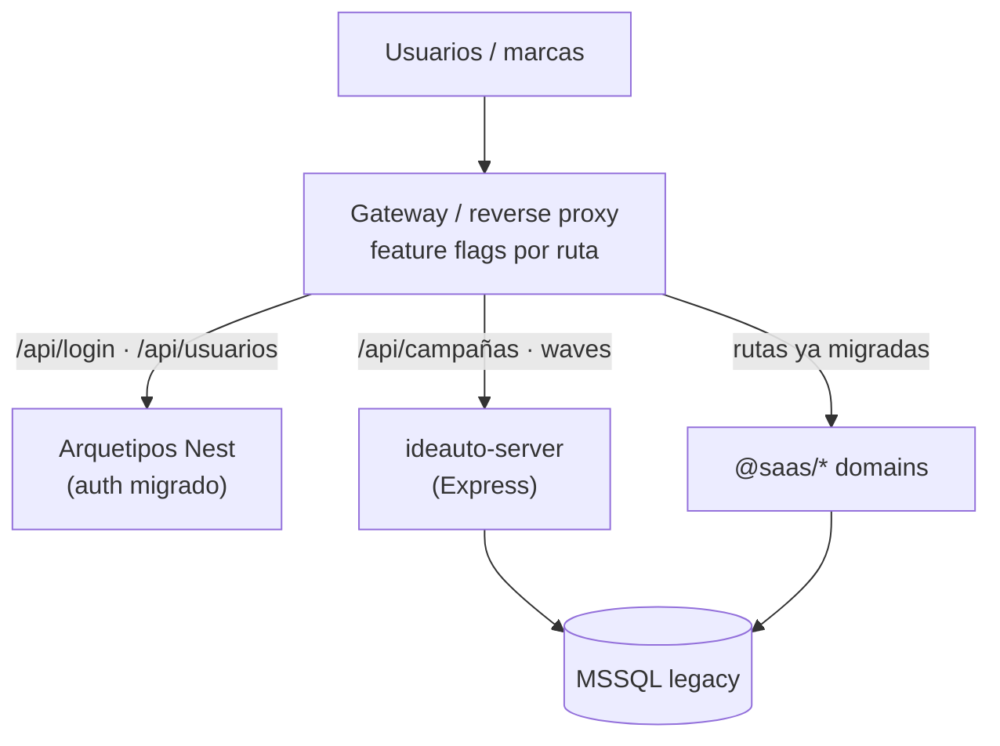

  

<h1 align="center">F84-B1 — Strategy de migración (strangler)</h1>

  
  
  

## Estado

**listo para ejecutar** · contenido canónico en biblia + ADR

> Canónico: [`docs/architecture/recalls-migration-strategy.md`](../../../architecture/recalls-migration-strategy.md) · [ADR 0013](../../../adr/adr-0013-recalls-strangler-migration.md).

---

## Objetivo

Definir **cómo** salir del legacy sin apagar el negocio de recalls (DGT, oleadas, facturación).

---

## Por qué no big-bang

Un corte único (“apagamos Express y encendemos Nest el lunes”) fallaría porque:

1. **DGT es un sistema externo** — no hay staging completo; hace falta parallel-run.
2. **Paridad PDF / cartas / XLSX** es visual y legal; requiere validación humana.
3. **59 migraciones Sequelize** y rutas de ficheros en disco no se reescriben en un sprint.
4. El equipo necesita **rollback en minutos**, no restore de DB.

Big-bang solo tendría sentido en un producto greenfield. Recalls **no lo es**.

---

## Decisión: strangler fig (recomendada)

**Regla:** cada milestone migra un **slice vertical** (API + FE + tests). El legacy sigue sirviendo el resto. El proxy (o BFF) enruta por path / flag. Rollback = revertir el flag.

### Fases

| Fase | Slice | Legacy apaga… |
|------|-------|----------------|
| **F1** | Auth · users · profiles · permissions | Rutas `/api/login`, `/usuarios`, password flows |
| **F2** | Campaigns · waves · VIN upload | Core campañas / oleadas |
| **F3** | Budgets · invoices · PDF/DOCX | Prefacturas / facturas |
| **F4** | DGT · addresses | SOAP + normalización |
| **F5** | Reports · admin home · jobs | Dashboard + schedules |
| **F6** | Cutover | DNS/proxy 100% Arquetipos; legacy off |

---

## Milestones y gates

| M | Entrega | Gate de salida |
|---|---------|----------------|
| **M0** | Apps + libs scaffold; Prisma→MSSQL (F83) | `nx build` / `typecheck` recalls-* verde |
| **M1** | Auth domain | Login + recovery E2E; sin endpoints usuarios públicos |
| **M2** | Campaigns + waves | CRUD + subida VINs + timeline oleadas |
| **M3** | Budgets + invoices + PDF | Presupuesto aprobado + PDF paridad |
| **M4** | DGT adapter | Parallel-run OK; consulta real mockeable en test |
| **M5** | Reports + admin + workers | Exports + jobs fuera del proceso API |
| **M6** | Legacy off | Redirect total + backup PITR validado |

---

## Rollback

| Nivel | Acción |
|-------|--------|
| Feature flag | Proxy vuelve a Express para ese path |
| Release | Revert PR del dominio; DB compartida no se “desmigra” a ciegas |
| Catástrofe | Restore MSSQL point-in-time (procedimiento ops) |

**Invariante:** mientras el strangler viva, **no** hacer migraciones destructivas en tablas legacy sin dual-write o feature freeze.

---

## Riesgos (y mitigación)

| Riesgo | Impacto | Mitigación |
|--------|---------|------------|
| SOAP DGT divergente | Legal / operativo | Parallel-run; adapter único; contract tests XML |
| MSSQL quirks Prisma | Blocker M0 | F83 checklist; introspect + smoke |
| Paridad PDF/cartas | Reclamaciones | Golden files + review negocio |
| Authguard-core features ocultas | Huecos auth | Inventario permisos antes de M1 |
| Doble mantenimiento | Coste equipo | Ventana strangler acotada; no features nuevas en legacy salvo hotfixes |

---

## Criterios

- [x] Strategy documentada (este plan + biblia).
- [x] ADR 0013 propuesto.
- [ ] Producto firma milestones M0–M6.
- [ ] Ops confirma mecanismo de proxy/flags.

## Enlaces

- [README F84](./README.md)
- [F84-C1 mapping](./1764000022000-f84-domain-mapping.md)
- [F84-D1 execution](./1764000023000-f84-technical-execution.md)
