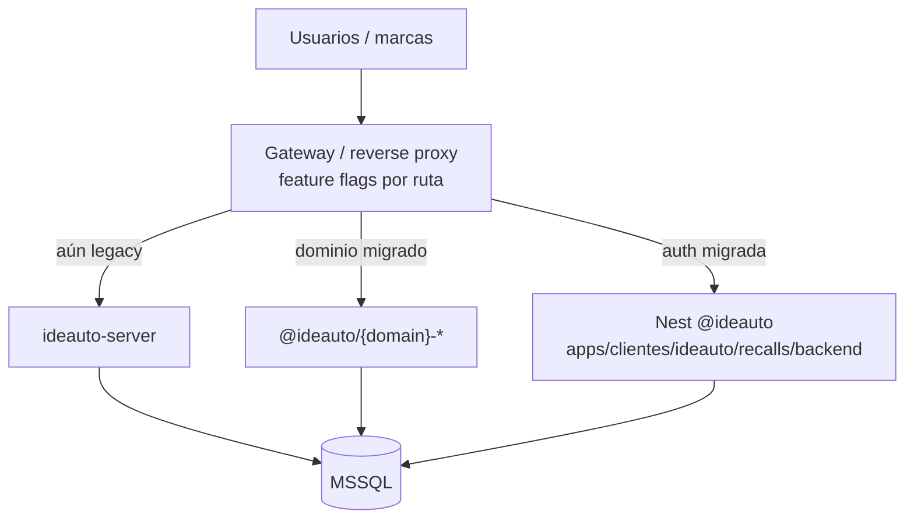

  

<h1 align="center">F84-B1 — Strategy de migración (strangler)</h1>

  
  
  

## Estado

**listo para ejecutar** · destino **`clientes/ideauto/recalls`**

> Canónico: [`recalls-migration-strategy.md`](../../../architecture/recalls-migration-strategy.md) · [ADR 0013](../../../adr/adr-0013-recalls-strangler-migration.md).

---

## Objetivo

Salir del legacy sin apagar el negocio, construyendo el producto en **`@ideauto/*`**.

---

## Por qué no big-bang

DGT externo, paridad PDF/cartas, 59 migraciones Sequelize y necesidad de rollback en minutos. Big-bang solo en greenfield.

---

## Decisión: strangler fig

| Fase | Slice |
|------|-------|
| F1 | Auth · users · profiles |
| F2 | Campaigns · waves · VIN upload |
| F3 | Budgets · invoices · PDF |
| F4 | DGT · addresses |
| F5 | Reports · admin · workers |
| F6 | Cutover — legacy off |

| M | Gate |
|---|------|
| M0 | Apps bajo `clientes/ideauto/recalls` + Prisma MSSQL |
| M1 | Login E2E; sin usuarios anónimos |
| M2 | CRUD campaña + VINs + oleadas |
| M3 | PDF paridad |
| M4 | DGT parallel-run |
| M5 | Reports + jobs fuera del API |
| M6 | 100% tráfico nuevo |

**Rollback:** flag de proxy → Express. Sin migraciones destructivas en tablas compartidas.

## Criterios

- [x] Strategy + ADR (cliente Ideauto, no SaaS).
- [ ] Producto firma milestones.
- [ ] Ops confirma proxy/flags.

## Enlaces

- [F84-C1](./1764000022000-f84-domain-mapping.md) · [F84-D1](./1764000023000-f84-technical-execution.md)
