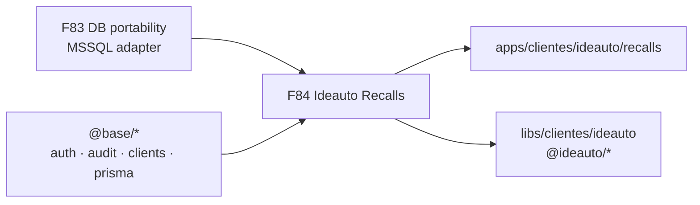

<p align="center">
  
</p>

<h1 align="center">Ronda F84 — Recalls_v2 → cliente Ideauto</h1>

<p align="center">
  <b>Producto cliente</b> · <code>clientes/ideauto/recalls</code> · strangler · MSSQL vía F83
</p>

<p align="center">
  
  
  <a href="../../../README.md"></a>
  <a href="../plans-83-eighty-three-round/README.md"></a>
  <a href="../../../architecture/recalls-v2-assessment.md"></a>
</p>

## Estado

**Activa** · apertura 2026-07-24 · **corrección de colocación 2026-07-24**

> **Eje:** dejar de mantener `Recalls_v2` (ideauto-server + ideauto-client) como dos repos sueltos y **reconstruirlo como producto cliente Ideauto** en este monorepo:
>
> `apps/clientes/ideauto/recalls` + `libs/clientes/ideauto` → npm **`@ideauto/*`**, tag **`layer:clientes`**, sobre kernel `@base/*`.
>
> **No** es producto SaaS (`@saas/*` / `productos-saas`).
>
> **Doc de producto (humana):** [`docs/ideauto/recalls/`](../../../ideauto/recalls/) — porqués, audiencias, milestones.  
> Esta ronda F84 es el **checklist operativo**.

---

## Por qué existe esta ronda

Recalls_v2 **funciona en producción**, pero está construido de una forma que el monorepo ya decidió abandonar:

| Problema legacy | Coste real | Qué ofrece Arquetipos |
|-----------------|------------|------------------------|
| Express monolito + ~166 services planos (JS) | Imposible aislar dominio; onboarding lento | Nest + hex + CQRS por dominio |
| Sequelize atado a MSSQL (`tedious`) | Lock-in de proveedor | Prisma multi-provider (**F83**) |
| Sin capas FE (atomic ≠ dominio) | UI y HTTP mezclados | Contrato `api → data-access → features` |
| Auth ad-hoc + `@ideauto/authguard-core` externo | Superficie de ataque opaca | Keycloak / guards Nest (ADR 0005) |
| Dos workspaces pnpm sin Nx | Sin `affected`, sin boundaries | Nx + tags `layer:clientes` |
| ~52 tests vs ~520 archivos BE | Regresiones en DGT / VINs / PDFs | Jest gates en libs |
| `node-schedule` in-process | Jobs mueren con el proceso | Worker / cola desacoplada |

**Migrar no es moda:** es fabricar el producto Ideauto con las mismas reglas que Josanz (cliente sobre `@base/*`), no inventar un silo ni meterlo en SaaS.

<details>
<summary><b>Inventario legacy (fuente 2026-07-24)</b></summary>

<br/>

| Pieza | Dato |
|-------|------|
| Snapshot | `Recalls_v2_*` (fuera del monorepo; **no** commitear aquí) |
| Backend | Express 5 · Sequelize 6 · MSSQL · JWT · SOAP DGT · PM2 |
| Frontend | Next 16 · React 19 · Redux Toolkit · Tailwind 4 |
| Modelos | 24 Sequelize |
| Rutas API | 17 routers |
| Migraciones | 59 |

</details>

---

## Alcance — colocación correcta

### Destino (canónico)

```
apps/clientes/ideauto/recalls/
├── backend/     # composition root Nest (Prisma → MSSQL vía F83)
└── frontend/    # Next.js (opt-in ADR 0008; paridad con legacy)

libs/clientes/ideauto/
├── shared/                         # @ideauto/shared — DTOs producto
├── backend/                        # @ideauto/backend — módulos Nest por dominio
└── frontend/next/                  # o layout equivalente Next
    └── {campaigns,waves,dgt,…}/    # api · data-access · shell · features
        └── @ideauto/{domain}-*
```

| Regla | Valor |
|-------|-------|
| Slug cliente | `ideauto` |
| App / producto | `recalls` |
| Scope npm | `@ideauto/*` |
| Tag Nx | `layer:clientes` |
| Puede importar | `@base/*`, `@ideauto/*` |
| **No** puede importar | `@arquetipos/*`, `@saas/*`, `@josanz/*` |

Checklist de producto cliente: [nuevo-cliente-checklist.md](../../../clientes/nuevo-cliente-checklist.md) (mismo patrón que Josanz; slug `ideauto`).

### Por qué **no** SaaS

| | Cliente Ideauto | SaaS (`productos-saas`) |
|--|-----------------|-------------------------|
| Quién es | Producto de **cliente** Ideauto (recalls) | Productos vendibles genéricos (p. ej. Verifactu) |
| Path | `apps/clientes/ideauto/…` | `apps/productos-saas/…` |
| npm | `@ideauto/*` | `@saas/*` |
| Marca / dominio | Campañas recall, DGT, oleadas Ideauto | CRM fiscal / ledger propio |
| Regla monorepo | Igual que `@josanz/*` | Capa distinta; **no mezclar** |

Meter Recalls en `@saas/*` mezclaría marca Ideauto con Verifactu, rompería boundaries y contradiría [nuevo-cliente-checklist](../../../clientes/nuevo-cliente-checklist.md).

### En scope (F84)

1. Comparativa y justificación (F84-A1).
2. Strategy strangler (F84-B1 + [ADR 0013](../../../adr/adr-0013-recalls-strangler-migration.md)).
3. Mapeo dominio → `@ideauto/*` / reusos `@base/*` (F84-C1).
4. Plan ejecución M0–M6 (F84-D1).
5. Docs canónicos + hubs sin referencias SaaS erróneas (F84-E1).

### Fuera de scope

- Apagar legacy en prod (eso es **M6**).
- Código Verifactu / Josanz.
- Cambiar contrato de negocio DGT (solo hosting + adapter).

---

## Objetivos clave

1. Documentar el **por qué** con evidencia.
2. Firmar **strangler** + colocación **`clientes/ideauto/recalls`**.
3. Mapear dominios sin huérfanos a `@ideauto/*`.
4. Milestones ejecutables con gates Nx.
5. Biblia sin “Recalls = SaaS”.

---

## Planes detallados

| ID | Plan | Foco | Doc biblia |
|----|------|------|------------|
| **F84-A1** | [Por qué migrar · comparativa](1764000020000-f84-comparative-analysis.md) | Deuda, gaps, P0/P1/P2 | [assessment](../../../architecture/recalls-v2-assessment.md) |
| **F84-B1** | [Strategy strangler](1764000021000-f84-migration-strategy.md) | Fases, rollback, riesgos | [strategy](../../../architecture/recalls-migration-strategy.md) |
| **F84-C1** | [Mapeo de dominio](1764000022000-f84-domain-mapping.md) | Entidades → `@ideauto/*` | [mapping](../../../architecture/recalls-domain-mapping.md) |
| **F84-D1** | [Ejecución técnica](1764000023000-f84-technical-execution.md) | M0–M6 bajo `clientes/ideauto` | [runbook](../../../runbooks/recalls-migration.md) |
| **F84-E1** | [Docs, gates y cierre](1764000024000-f84-docs-gates-close.md) | Hub + ADR + checklist | — |

---

## Dependencias



- **Bloqueante:** F83 (Prisma MSSQL) para DB legacy durante strangler.
- **Reusa:** `@base/users-*`, `@base/audit-*`, `@base/clients-*`, documents/PDF, pagination, Nest guards.
- **No reusa:** Express, Sequelize, Redux 1:1, ni paquetes `@saas/*`.

---

## Checklist de cierre F84

- [ ] F84-A1 assessment publicado (colocación cliente Ideauto)
- [ ] F84-B1 strategy + ADR 0013 (sin SaaS)
- [ ] F84-C1 mapeo `@ideauto/*` firmado
- [ ] F84-D1 runbook M0–M6 bajo `clientes/ideauto/recalls`
- [ ] F84-E1 hubs sin referencias `productos-saas/recalls`

> Cerrar F84 cierra el **plan**; M0–M6 son obra de producto.

---

## Predecesora / enlaces

| | |
|--|--|
| Predecesora | [F83](../plans-83-eighty-three-round/) |
| ADR | [0013 — strangler Recalls](../../../adr/adr-0013-recalls-strangler-migration.md) |
| Nuevo cliente | [nuevo-cliente-checklist.md](../../../clientes/nuevo-cliente-checklist.md) |
| Índice planes | [docs/plans/README.md](../../README.md) |
| Snapshot legacy | fuera del repo |
| **Doc producto** | [`docs/ideauto/recalls/`](../../../ideauto/recalls/) |
