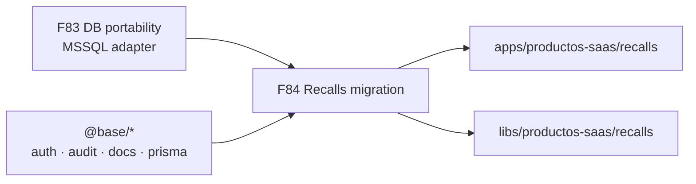

<p align="center">
  
</p>

<h1 align="center">Ronda F84 — Recalls_v2 → monorepo Arquetipos</h1>

<p align="center">
  <b>Migración de producto</b> · strangler · MSSQL vía F83 · Next + Nest
</p>

<p align="center">
  
  
  <a href="../../../README.md"></a>
  <a href="../plans-83-eighty-three-round/README.md"></a>
  <a href="../../../architecture/recalls-v2-assessment.md"></a>
</p>

## Estado

**Activa** · apertura 2026-07-24

> **Eje:** dejar de mantener `Recalls_v2` (ideauto-server + ideauto-client) como dos repos sueltos y **reconstruirlo como producto SaaS** dentro de este monorepo (`@saas/recalls-*` + apps composition roots), reutilizando el kernel `@base/*`.

---

## Por qué existe esta ronda

Recalls_v2 **funciona en producción**, pero está construido de una forma que el monorepo ya decidió abandonar:

| Problema legacy | Coste real | Qué ofrece Arquetipos |
|-----------------|------------|------------------------|
| Express monolito + ~166 services planos (JS) | Imposible aislar dominio; onboarding lento; bugs cruzados | Nest + hex + CQRS por dominio |
| Sequelize atado a MSSQL (`tedious`) | Lock-in de proveedor; migrar motor = reescribir ORM | Prisma multi-provider (**F83**) |
| Sin capas FE (`atoms/molecules` ≠ dominio) | UI y HTTP mezclados; no hay `api → data-access → features` | ADR 0006 + contrato F74 |
| Auth ad-hoc + `@ideauto/authguard-core` externo | Superficie de ataque opaca; endpoints públicos documentados | Keycloak / guards Nest (ADR 0005) |
| Dos workspaces pnpm sin Nx | Sin `affected`, sin cache, sin boundaries | Nx + tags `layer:*` |
| ~52 tests vs ~520 archivos BE | Regresiones en oleadas DGT / VINs / PDFs | Jest gates + coverage en libs |
| `node-schedule` in-process | Jobs mueren con el proceso; sin cola | Workers / BullMQ / `@base/tasks` |
| Overrides de seguridad en cascada | Parches reactivos, no arquitectura | SCA/SBOM + CI del monorepo |

**Migrar no es “por moda”.** Es dejar de pagar deuda que bloquea seguridad, portabilidad de DB, reutilización de auth/auditoría/documentos y la capacidad de fabricar el siguiente producto sobre el mismo motor.

<details>
<summary><b>Inventario legacy (fuente 2026-07-24)</b></summary>

<br/>

| Pieza | Dato |
|-------|------|
| Ruta snapshot | `Recalls_v2_2016-07-24` (Downloads; **no** vive en el monorepo) |
| Backend | Express 5 · Sequelize 6 · MSSQL · JWT · SOAP DGT · Winston · PM2 |
| Frontend | Next.js 16 · React 19 · Redux Toolkit · Tailwind 4 · next-intl · Formik/Yup |
| Modelos Sequelize | 24 (`Campaigns`, `Waves`, `Budgets`, `Invoices`, `Dgt*`, …) |
| Rutas API | 17 routers (`campaign`, `waves`, `dgt`, `budget`, `reports`, …) |
| Migraciones | 59 (`.cjs` + SQL suelto) |
| Tamaño aprox. | ~520 archivos JS server · ~460 TS/TSX client |

</details>

---

## Alcance (qué entra / qué no)

### En scope (F84)

1. **Comparativa y justificación** — por qué el legacy es insostenible (F84-A1).
2. **Strategy strangler** — dominio a dominio, legacy vivo hasta cutover (F84-B1 + [ADR 0013](../../../adr/adr-0013-recalls-strangler-migration.md)).
3. **Mapeo de dominio** — entidades Recalls → paquetes `@saas/*` / reusos `@base/*` (F84-C1).
4. **Plan de ejecución** — milestones M0–M6, gates Nx, DGT parallel-run (F84-D1).
5. **Docs canónicos** en biblia + runbook + cierre de ronda (F84-E1).

### Fuera de scope (F84)

- Reescribir feature-a-feature **en este PR de planes** (solo planificar).
- Apagar legacy en producción (eso es **M6**, post-parity).
- Migrar Verifactu / Josanz (productos distintos).
- Cambiar el contrato de negocio DGT (solo el **adapter** y el hosting).

### Destino en el monorepo

```
apps/productos-saas/recalls/
├── backend/     # composition root Nest (Prisma → MSSQL vía F83)
└── frontend/    # Next.js (opt-in ADR 0008; paridad con legacy SSR)

libs/productos-saas/recalls/
├── shared/                    # DTOs @saas/recalls-shared
├── backend/                   # módulos Nest por dominio
└── frontend/next/             # api · data-access · shell · features
```

Capa npm: **`layer:productos-saas`** → puede importar `@base/*`; **no** `@arquetipos/*`.

---

## Objetivos clave

1. Documentar el **por qué** con evidencia (seguridad, DX, portabilidad, tests).
2. Firmar **strangler** como strategy (no big-bang).
3. Mapear **todos** los dominios legacy sin huérfanos.
4. Dejar milestones ejecutables con gates `typecheck` / `test` / `build`.
5. Alinear biblia (`docs/`) para que no queden referencias a F71/F72 como “activas”.

---

## Planes detallados

| ID | Plan | Foco | Doc biblia |
|----|------|------|------------|
| **F84-A1** | [Por qué migrar · comparativa](1764000020000-f84-comparative-analysis.md) | Deuda, gaps, P0/P1/P2 | [assessment](../../../architecture/recalls-v2-assessment.md) |
| **F84-B1** | [Strategy strangler](1764000021000-f84-migration-strategy.md) | Fases, rollback, riesgos | [strategy](../../../architecture/recalls-migration-strategy.md) |
| **F84-C1** | [Mapeo de dominio](1764000022000-f84-domain-mapping.md) | Entidades → paquetes | [mapping](../../../architecture/recalls-domain-mapping.md) |
| **F84-D1** | [Ejecución técnica](1764000023000-f84-technical-execution.md) | M0–M6, comandos, gates | [runbook](../../../runbooks/recalls-migration.md) |
| **F84-E1** | [Docs, gates y cierre](1764000024000-f84-docs-gates-close.md) | Hub + ADR + checklist | — |

---

## Dependencias



- **Bloqueante:** F83 (Prisma MSSQL) para apuntar a la DB legacy durante el strangler.
- **Reusa:** `@base/users-*`, `@base/audit-*`, `@base/clients-*`, documents/PDF utilities, pagination, Nest guards.
- **No reusa:** Express routers, Sequelize models, Redux slices 1:1 (se rediseñan a capas).

---

## Checklist de cierre F84

- [ ] F84-A1 assessment publicado y enlazado desde biblia
- [ ] F84-B1 strategy + ADR 0013 en estado `proposed` / `accepted`
- [ ] F84-C1 mapeo firmado (sin dominios huérfanos)
- [ ] F84-D1 runbook con milestones y criterios de done
- [ ] F84-E1 hubs actualizados; **F84 cerrada** (o “en ejecución” si solo abre la obra)

> Cerrar F84 **no** implica legacy apagado. Cierra el **plan**; M0–M6 son trabajo de producto posterior.

---

## Predecesora / enlaces

| | |
|--|--|
| Predecesora | [F83](../plans-83-eighty-three-round/) (DB providers) |
| ADR | [0013 — strangler Recalls](../../../adr/adr-0013-recalls-strangler-migration.md) |
| Índice planes | [docs/plans/README.md](../../README.md) |
| SaaS extiende base | [productos-saas-extends-base.md](../../../productos-saas/productos-saas-extends-base.md) |
| Snapshot legacy | fuera del repo (Downloads); no commitear código legacy aquí |
